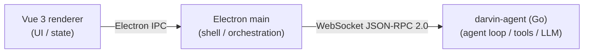

<h1 align="center">
  <br>
  darvin-cowork
</h1>

<p align="center">
  <a href="https://github.com/darven-cs/darvin-cowork/stargazers"></a>
  <a href="LICENSE"></a>
  <br/>
  
  
  
  
  
  
</p>

<p align="center">
  English · <a href="README.zh-CN.md">中文</a>
</p>

<p align="center">
  <strong>A local-first desktop AI assistant.</strong><br/>
  Three processes &mdash; a Vue 3 renderer, an Electron shell, and a Go agent runtime you can read and extend.
</p>

<p align="center">
  <a href="#features"><strong>Features</strong></a>
  &nbsp;·&nbsp;
  <a href="#real-world-prompts"><strong>Real-World Prompts</strong></a>
  &nbsp;·&nbsp;
  <a href="#how-it-works"><strong>How It Works</strong></a>
  &nbsp;·&nbsp;
  <a href="#install"><strong>Install</strong></a>
  &nbsp;·&nbsp;
  <a href="#developing"><strong>Developing</strong></a>
  &nbsp;·&nbsp;
  <a href="#project-map"><strong>Project Map</strong></a>
  &nbsp;·&nbsp;
  <a href="#security-and-data"><strong>Security &amp; Data</strong></a>
  &nbsp;·&nbsp;
  <a href="#license"><strong>License</strong></a>
</p>

<p align="center">
  
</p>

darvin-cowork is a desktop AI assistant that runs in your real working environment: local files, terminal commands, browser tools, documents, spreadsheets, slides, IM channels, scheduled jobs, and project workspaces.

The agent runtime is a Go process you can grep through; the UI is a Vue 3 renderer that talks to it over WebSocket JSON-RPC 2.0 through a thin Electron shell. Business logic lives in Go, the renderer never holds SQLite, and the IM connectors, MCP servers, scheduled tasks, and skills all have first-class management surfaces.

## Features

### Streaming chat with real tool calls

`text_delta` and `thinking_delta` stream in over WebSocket as the agent responds. Tool calls render as collapsible cards; tool results show inline with full output. The agent loop supports multi-turn tool use with per-session concurrency, abort, and background notifications.

### Three-process, single-binary agent

The Go runtime is a static binary spawned by Electron (`CGO_ENABLED=0`) and talked to over WebSocket JSON-RPC 2.0. The UI never touches the database, never sees LLM keys, and never executes tool calls outside the Go-side sandbox.

### 22 built-in tools

File ops (`read_file` / `write_file` / `edit_file` / `multi_edit` / `move_file` / `list_dir` / `glob` / `grep` / `notebook_edit`), sandboxed `shell` with command whitelist, `web_fetch`, code search & indexing (`search` / `code_index` / `delete_symbol`), plus `todo_write` / `complete_step` / `subagent` / MCP bridge.

### TodoPanel with evidence sign-off

`todo_write` opens a two-level checklist in the right-rail **TodoPanel**. `complete_step` is the evidence-backed sign-off: the agent declares a step done with the diff, output, or file path that justifies it.

### Multi-agent workflows

Sub-agents spawn their own sessions, run concurrently within the parent's session-wide concurrency budget, stream progress to a **SubagentPanel** with their own abort button, and return results through `ReplySink` so the parent can compose them into the next turn.

### Skills, expert suite

Skills are frontmatter + prompt + tool hints the agent discovers and loads on demand. The expert suite lets you bind a curated prompt + tool subset + model to a one-click sidebar entry for repetitive workflows.

### MCP servers

Connect external tools and data sources through Model Context Protocol. Register / disconnect / test / enable / retry-resolution — `mcp.Registry` owns every server's connection + tools; `resolver_fingerprint` decides whether a config change is the same server (no relaunch) or a new one.

### Scheduled tasks

Cron-style tasks that fire in the background, run in a brand-new session with no chat history carried over, and post their result back as a `ScheduleFired` push notification. Failed runs keep their last output for inspection.

### IM channel subsystem

QQ / WeCom / WeChat connectors with a real one-shot connectivity probe (structured check report), instance management, QR login for WeChat, per-instance workspace isolation, and `lastError` surfaced directly on the card.

### Sandboxed artifact rendering

10 renderers (Code / Document / Html / Image / LocalService / Markdown / Mermaid / Svg / Text / Video) inside `sandbox` iframes &mdash; AI output never enters the main page DOM.

### Workspaces

Per-workspace file isolation. Switching workspace re-anchors the agent's file tools; sessions stay bound to the workspace they were started in.

### Local memory and data

Sessions, MCP servers, skills, scheduled tasks, IM channels, and memory all live in Go-side SQLite (GORM). No cloud required.

### Theme + i18n

Light / dark theme with three accent colors (orange default; blue and green alt), zh / en dictionaries switchable at runtime, design tokens via Tailwind v4 `@theme`.

## Real-World Prompts

| Scenario | Example prompt |
| --- | --- |
| Triage project failures | "Walk the last 10 commits in this repo, list what each one broke, and propose a single rollback PR." |
| Build a local dashboard | "Use `sales-q3.xlsx` to build a visual dashboard and summarize the main growth drivers." |
| Generate a deck | "Research the IM-channel integration landscape and turn the findings into a presentation." |
| Automate browser checks | "Open the ads dashboard every morning, check spend and conversion anomalies, and summarize likely causes." |
| Screen documents | "Turn the resumes in this folder into a screening sheet and shortlist the strongest candidates against the JD." |
| Run scheduled work | "Every weekday at 9 AM, collect yesterday's AI news and send me a concise digest." |
| Bind IM to a project | "Bind this workspace's sessions to my personal WeChat so I can drive the agent from my phone." |
| Diagnose connector failures | "The WeCom bot stopped responding yesterday. Pull the latest `lastError` for each IM instance and group the failures by cause." |

## How It Works



- **Renderer** &mdash; Vue 3 + Tailwind CSS v4, styles via `@theme` design tokens, zh/en i18n with runtime switching. The renderer never imports `better-sqlite3` and never sees LLM keys.
- **Main** &mdash; Electron lifecycle and Go child-process management only. ~70 `ipcMain.handle` channels proxy typed JSON-RPC traffic through `AgentClient` + `EventRouter`.
- **Agent** &mdash; `darvin-agent` (`internal/runtime.Build`) owns the agent loop, tool registry, context compaction, MCP clients, skills, memory and persistence (SQLite via GORM). Twelve `internal/` packages cooperate through a single assembly entry; the frontend holds only the returned `*Runtime`.

For the full architecture (session lifecycle, single turn sequence, MCP bridge, tool permission gate, IM lifecycle, SQLite schema), see [docs/ARCHITECTURE.md](./docs/ARCHITECTURE.md).

## Install

### Requirements

- Node.js **>= 20** (per `electron 43.2.0` compatibility)
- Go **>= 1.22** (for building the agent)
- Platform: Windows / macOS / Linux

### Run From Source

```bash
git clone https://github.com/darven-cs/darvin-cowork.git
cd darvin-cowork
npm install
npm start     # prestart builds the Go agent + rebuilds better-sqlite3, then launches Electron
```

Configure an API key **inside the app**: `Settings &rarr; Models &rarr; paste key (optional Base URL) &rarr; save`. Saving restarts the Go child process so the new value takes effect immediately.

Or use an environment variable:

```bash
export LLM_API_KEY=sk-ant-...
npm start
```

> Never commit a real key into `src/darvin-agent/config.yaml`. Precedence: `LLM_API_KEY` env var &gt; user-level `config.yaml` &gt; repo `config.yaml`. See [Quickstart &mdash; Configuration](./docs/QUICKSTART.md#configuration).

### Build Installers

```bash
npm run build:agent       # compile Go agent -> bin/darvin-agent-<platform>-<arch>
npm run package           # unpacked app (auto-builds Go first)
npm run make              # installers: deb / rpm (Linux) - squirrel / zip (Windows) - zip (macOS)
```

`extraResources` filters `bin/` to **only** the current-platform binary &mdash; cross-platform binaries from a previous compile will are not in the installer.

## Developing

```bash
npm run lint                          # ESLint over src/*.ts/.vue
npm test                              # Vitest unit tests
npm run smoke                         # headless: spawn binary, exercise JSON-RPC, no API key needed
cd src/darvin-agent && go test ./...  # Go unit tests
```

Renderer dev server runs at `http://localhost:5173`. The Electron main opens `remote-debugging-port=9222` only when `!app.isPackaged` (dev mode), so the bundled [`electron-cdp`](./.claude/skills/electron-cdp/) skill can drive the window without launching a second browser.

For the full dev workflow (Go `fmt` / `vet` / `lint`, recipes for new IPC methods / IM channels / tools / views, code-style pointers), see [docs/DEVELOPMENT.md](./docs/DEVELOPMENT.md).

## Project Map

| Path | Purpose |
| --- | --- |
| `src/main/index.ts` | Electron lifecycle, ~70 `ipcMain.handle` channels, `RuntimeMgr` (subprocess), `AgentClient` (WS JSON-RPC), `EventRouter` (pure forwarder) |
| `src/main/runtime/{manager,client}.ts` | `darvin-agent` child-process lifecycle + WebSocket JSON-RPC 2.0 client |
| `src/preload/index.ts` | `contextBridge` typed surface: `window.darvin` |
| `src/shared/darvin-api.ts` | Single source of truth for IPC channels, push events, streaming events, and message types |
| `src/renderer/views/` | Home / Chat / Im / Skills / Mcp / ExpertSuite / Scheduled / Search / Workspaces / Settings |
| `src/renderer/components/side-panel/` | ArtifactPanel (10 sandboxed renderers) / TodoPanel / SubagentPanel |
| `src/renderer/composables/` | `useIm` / `useMcpServers` / `useSkills` / `useSchedules` / `useSession` / `useArtifacts` / etc. |
| `src/renderer/services/i18n.ts` | Renderer i18n dictionary + `t()` helper; `assertSameKeys` enforces key parity in dev |
| `src/renderer/styles/theme.css` | Tailwind v4 `@theme` design tokens (colors / spacing / radii / typography / shadows / animation) |
| `src/darvin-agent/cmd/app/` | 15-line entry: `os.Exit(runApp(os.Args[1:]))` |
| `src/darvin-agent/internal/runtime/` | `Build(ctx, Options) (*Runtime, error)` &mdash; config + DB + provider + tools + AgentFactory + skills + MCP + handler + server + schedule + IM + active session |
| `src/darvin-agent/internal/gateway/` | WebSocket JSON-RPC server, per-session handler dispatch, `EventLedger`, `SessionManager` (lazy `SessionRuntime` build, LRU idle) |
| `src/darvin-agent/internal/sessionruntime/` | `Loop` (per-session turn queue, steer priority) + `AgentFactory` + `hydrate` + `Session` |
| `src/darvin-agent/internal/agents/` | `Agent` + `Controller` (Idle / Running state machine) + `Queue` + `Dispatcher` + `DeltaHook` + `ArtifactHook` + `Store` |
| `src/darvin-agent/internal/llm/` | `anthropic` / `openai` / `gemini` providers + streaming protocol + model registry |
| `src/darvin-agent/internal/tools/` | Built-in tools + `permission` (pattern-based classifier) + `sandbox` (path containment, byte cap) + MCP bridge + todo + subagent |
| `src/darvin-agent/internal/mcp/` | `Registry` + `launcher` + `transport` (http / sse / stdio) + `resolver_fingerprint` + `redact` + `notifier` |
| `src/darvin-agent/internal/skills/` | Scanner + loader + frontmatter + registry + runner + plugin |
| `src/darvin-agent/internal/im/` | QQ / WeCom / WeChat connectors with `Prober` (one-shot connectivity check) |
| `src/darvin-agent/internal/scheduledtask/` | Cron-style timer engine with run history + `ScheduleFired` push |
| `src/darvin-agent/internal/subagent/` | Sub-agent orchestration + `ReplySink` for headless integrations |
| `src/darvin-agent/internal/memory/` | Lightweight memory manager |
| `src/darvin-agent/internal/database/` | GORM + `glebarez/sqlite` single `globalDB` + 11 SQLite stores |
| `forge.config.ts` | Electron Forge makers (squirrel / zip / deb / rpm) + Vite plugin + Fuses |
| `docs/` | ARCHITECTURE &middot; QUICKSTART &middot; GUIDE &middot; IM &middot; DEVELOPMENT + `pkg-document/` |
| `specs/` | Feature design specs (one directory per feature) |

## Security and Data

- Renderer windows use context isolation, disabled Node integration, and a sandboxed renderer.
- Renderer-to-main access goes through preload IPC APIs (`window.darvin.*`); the renderer never imports `electron`.
- All tool calls run in the Go process so the renderer cannot bypass permissions or sandbox; the tool permission gate (`internal/tools/permission.go`) is pattern-based for `shell` and `DangerClassifier`-aware for plugins.
- App data is stored locally in `sessions.db` under Electron `userData` (`~/.config/darvin-cowork/` on Linux, `~/Library/Application Support/darvin-cowork/` on macOS, `%APPDATA%\darvin-cowork\` on Windows). The Go path (`config.UserConfigPath()`) and Electron path (`app.getPath('userData')`) agree on every platform.
- LLM keys are read by Go viper from `LLM_API_KEY` env / user-level `config.yaml` / repo-level `config.yaml`. The main process never sees the raw key.
- IM channels use transport-specific auth (QQ app access token, WeCom botId + secret, WeChat iLink bot token). The one-shot `imTest` probe is safe to expose to the UI; it does not persist any session state.
- `.env`, `*.db`, `*.log` and built binaries are git-ignored. A real key in a local `.env` is not committed &mdash; but never `git add -f` it. Consider a pre-commit secret scanner (e.g. [gitleaks](https://github.com/gitleaks/gitleaks)).

## License

[MIT License](LICENSE)

Built and maintained by [darven](https://github.com/darven-cs).