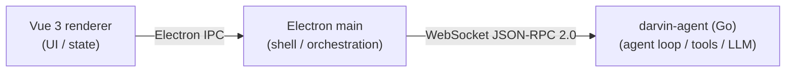

<p align="center">
  
</p>

<h1 align="center">darvin-cowork</h1>

<p align="center">
  <strong>English</strong>
  &nbsp;·&nbsp;
  <a href="./README.zh-CN.md">简体中文</a>
  &nbsp;·&nbsp;
  <a href="./docs/QUICKSTART.md">Quickstart</a>
  &nbsp;·&nbsp;
  <a href="./docs/ARCHITECTURE.md">Architecture</a>
  &nbsp;·&nbsp;
  <a href="./docs/GUIDE.md">Guide</a>
  &nbsp;·&nbsp;
  <a href="./docs/IM.md">IM Channels</a>
  &nbsp;·&nbsp;
  <a href="./docs/DEVELOPMENT.md">Development</a>
  &nbsp;·&nbsp;
  <a href="./CHANGELOG.md">Changelog</a>
</p>

<p align="center">
  <a href="https://github.com/darven-cs/darvin-cowork/blob/main/LICENSE"></a>
  <a href="https://www.electronjs.org/"></a>
  <a href="https://vuejs.org/"></a>
  <a href="https://go.dev/"></a>
  <a href="https://tailwindcss.com/"></a>
  <a href="https://modelcontextprotocol.io/"></a>
</p>

<br/>

<p align="center"><strong>MIT &middot; Local-first &middot; Streaming chat, tools, MCP, skills, scheduled tasks and IM channels in one desktop app.</strong></p>
<p align="center">Three processes &mdash; a Vue 3 renderer, an Electron shell, and a Go agent runtime you can read and extend. Business logic lives in Go; the UI never holds SQLite.</p>

---

## What is it

**darvin-cowork** is a personal, local-first desktop AI assistant. It looks like a chat shell, but the agent runtime is a Go process you can grep through. It is a working prototype focused on a clean three-process architecture, streaming conversations, structured tool execution, and AI-artifact previews that never touch the main page DOM.

Three processes, one conversation:



- **Renderer** — Vue 3 + Tailwind CSS v4, styles via `@theme` design tokens, zh/en i18n with runtime switching.
- **Main** — Electron lifecycle and Go child-process management only. Business logic is deliberately pushed down to Go.
- **Agent** — `darvin-agent` owns the agent loop, tool registry, context compaction, MCP clients, skills, memory and persistence (SQLite via GORM).

## Features

- **Three-process, single-binary agent.** The Go runtime is a static binary spawned by Electron and talked to over WebSocket JSON-RPC 2.0. The UI never touches the database.
- **Streaming chat with real tool calls.** `text_delta` / `thinking_delta`, multi-turn tool loop, per-session concurrency, abort, background notifications, todo evidence sign-off.
- **22 built-in tools.** File ops (`read_file` / `write_file` / `edit_file` / `multi_edit` / `move_file` / `list_dir` / `glob` / `grep` / `notebook_edit`), sandboxed `shell` with command whitelist, `web_fetch`, code search & indexing (`search` / `code_index` / `delete_symbol`), plus `todo_write` / `complete_step` / `subagent` / MCP bridge.
- **MCP out of the box.** Server register / connect / test, transports `http` / `sse` / `stdio`, fingerprint resolution, per-server enable.
- **Skills, sub-agents, scheduled tasks.** Scan / install / toggle skills, delegate / parallel / abort sub-agents with their own side panel, cron-style scheduled tasks firing in the background.
- **IM channel subsystem.** QQ / WeCom / WeChat connectors with a real one-shot connectivity probe, structured check reports, instance management, QR login for WeChat.
- **Sandboxed artifact rendering.** 10 renderers (Code / Document / Html / Image / LocalService / Markdown / Mermaid / Svg / Text / Video) inside `sandbox` iframes — AI output never enters the main page DOM.
- **Workspaces, experts, search.** Per-workspace file isolation, expert suite presets, full-text session search.
- **Theme + i18n.** Light / dark theme with three accent colors, zh/en dictionaries (~800 keys) switchable at runtime, design tokens via Tailwind v4 `@theme`.
- **Local-first persistence.** Go-side SQLite (GORM) owns sessions, messages, MCP servers, skills, scheduled tasks, IM channels, memory — no cloud required.

## Install

### Requirements

- Node.js **>= 20** (per `electron 43.2.0` compatibility)
- Go **>= 1.22** (for building the agent)
- Platform: Windows / macOS / Linux

### Path A: Build from source

```sh
git clone https://github.com/darven-cs/darvin-cowork.git
cd darvin-cowork
npm install
npm start                 # prestart builds the Go agent + rebuilds better-sqlite3, then launches Electron
```

Configure an API key **inside the app**: `Settings → Models → paste key (optional Base URL) → save`. Saving restarts the Go child process automatically.

Or use an environment variable:

```sh
export LLM_API_KEY=sk-ant-...
npm start
```

> Do **not** commit a real key into `src/darvin-agent/config.yaml` — it ships with an empty `llm.api_key` on purpose. Precedence: `LLM_API_KEY` env var > user-level `config.yaml` > repo `config.yaml`. See [Quickstart](./docs/QUICKSTART.md#configuration).

### Path B: Build installers

```sh
npm run build:agent       # compile Go agent → bin/darvin-agent-<platform>-<arch>
npm run package           # unpacked app (auto-builds Go first)
npm run make              # installers: deb / rpm (Linux) · squirrel / zip (Windows) · zip (macOS)
```

`extraResources` filters `bin/` to the **current platform** binary — cross-platform binaries in `bin/` are not shipped.

## Development & tests

```sh
npm run lint                          # ESLint over src/*.ts/.vue
npm test                              # Vitest unit tests
npm run smoke                         # headless: spawn binary, exercise JSON-RPC, no API key needed
cd src/darvin-agent && go test ./...  # Go unit tests
```

See [`docs/DEVELOPMENT.md`](./docs/DEVELOPMENT.md) for the dev workflow, Go `fmt`/`vet`/`lint` targets, and the project-specific engineering rules in `CLAUDE.md`.

## Project layout

```
darvin-cowork/
├─ src/
│  ├─ main/                 Electron main process (IPC handlers, runtime manager, event router)
│  ├─ preload/              contextBridge → window.darvin
│  ├─ renderer/             Vue 3 UI (components / composables / services / styles / views)
│  ├─ shared/darvin-api.ts  single source of truth for IPC channels, events & message types
│  └─ darvin-agent/         Go agent (gateway / agents / tools / llm / mcp / skills / memory / ...)
├─ bin/                     built Go binaries (git-ignored, current platform only)
├─ docs/                    ARCHITECTURE · QUICKSTART · GUIDE · IM · DEVELOPMENT + pkg-document/
├─ specs/                   design docs (one dir per feature)
├─ scripts/                 build-go.js · smoke.sh
├─ forge.config.ts          Electron Forge makers (squirrel / zip / deb / rpm) + Vite plugin + Fuses
├─ package.json
└─ README.md
```

Go runtime layout (one-line summary of each `internal/` package):

| Package | Responsibility |
|---|---|
| `agents` | per-session controller, agent loop, dispatcher, executor, store, ctx engine, permissions |
| `config` | viper-backed config loading |
| `database` | GORM + SQLite, schema migrations |
| `gateway` | WebSocket JSON-RPC server, per-session handlers |
| `harness` | agent harness abstraction, capability registration |
| `im` | QQ / WeCom / WeChat connectors with per-instance lifecycle |
| `llm` | providers (`anthropic` / `openai` / `gemini`), model registry, streaming protocol |
| `logger` | zap + lumberjack log rotation |
| `mcp` | MCP client (registry / launcher / http / sse / stdio transports) |
| `memory` | lightweight memory manager |
| `runtime` | assemble gateway + harness + providers + workspace bootstrap |
| `scheduledtask` | cron-style task engine |
| `sessionruntime` | per-session agent runtime, lifecycle container |
| `skills` | scanner, loader, frontmatter, registry, runner |
| `subagent` | sub-agent orchestration |
| `todos` | todo storage |
| `tools` | built-in tool set (fs / shell / search / web_fetch / code_index / sandbox / todo / subagent / notebook_edit / mcp bridge) |

## Documentation

- [Quickstart](./docs/QUICKSTART.md) — install, configure, build, troubleshoot.
- [Architecture](./docs/ARCHITECTURE.md) — three-process architecture, Go data ownership, IPC contract.
- [Guide](./docs/GUIDE.md) — sessions, tools, todos, sub-agents, MCP, skills, memory, artifact sandbox, expert suite, scheduled tasks, IM overview, settings.
- [IM Channels](./docs/IM.md) — QQ / WeCom / WeChat connectors, real connectivity probe, instance management.
- [Development](./docs/DEVELOPMENT.md) — dev workflow, lint / test / smoke, Go `fmt` / `vet` / `lint`, code-style pointers.
- [Changelog](./CHANGELOG.md) — release notes.
- [`docs/pkg-document/`](./docs/pkg-document/) — third-party library references kept for traceability (viper · zap · WeCom AI Bot protocol · WeChat iLink protocol).

Feature design specs live under [`specs/`](./specs/), one directory per feature.

## Security

- `.env`, `*.db`, `*.log` and built binaries are git-ignored. A real API key in a local `src/darvin-agent/.env` will not be committed — but never `git add -f` it.
- Consider a pre-commit secret scanner (e.g. [gitleaks](https://github.com/gitleaks/gitleaks)) before pushing.
- IM channels use transport-specific auth (QQ app access token, WeCom botId+secret, WeChat iLink bot token). The one-shot `imTest` call is safe to expose to the UI; it does not persist any session state.
- To report a security issue, open a [GitHub issue](https://github.com/darven-cs/darvin-cowork/issues) or contact the author directly. Do **not** post secrets in a public issue.

## License

[MIT](LICENSE) &copy; 2026 [darven](https://github.com/darven-cs)