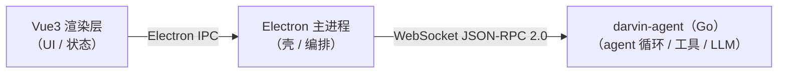

<h1 align="center">
  <br>
  darvin-cowork
</h1>

<p align="center">
  <a href="https://github.com/darven-cs/darvin-cowork/stargazers"></a>
  <a href="LICENSE"></a>
  <br/>
  
  
  
  
  
  
</p>

<p align="center">
  <a href="README.md">English</a> · 中文
</p>

<p align="center">
  <strong>本地优先的桌面 AI 助手。</strong><br/>
  三进程 —— Vue 3 渲染层、Electron 壳、Go agent 运行时，源码可读、可扩展。
</p>

<p align="center">
  <a href="#%E5%8A%9F%E8%83%BD%E4%BA%AE%E7%82%B9"><strong>功能亮点</strong></a>
  &nbsp;·&nbsp;
  <a href="#%E5%AE%9E%E9%99%85%E4%BD%93%E9%AA%8C%E7%A4%BA%E4%BE%8B"><strong>实际体验示例</strong></a>
  &nbsp;·&nbsp;
  <a href="#%E6%9E%B6%E6%9E%84%E5%8E%9F%E7%90%86"><strong>架构原理</strong></a>
  &nbsp;·&nbsp;
  <a href="#%E5%AE%89%E8%A3%85"><strong>安装</strong></a>
  &nbsp;·&nbsp;
  <a href="#%E6%9C%AC%E5%9C%B0%E5%BC%80%E5%8F%91"><strong>本地开发</strong></a>
  &nbsp;·&nbsp;
  <a href="#%E9%A1%B9%E7%9B%AE%E7%BB%93%E6%9E%84"><strong>项目结构</strong></a>
  &nbsp;·&nbsp;
  <a href="#%E5%AE%89%E5%85%A8%E4%B8%8E%E6%95%B0%E6%8D%AE"><strong>安全与数据</strong></a>
  &nbsp;·&nbsp;
  <a href="#%E8%AE%B8%E5%8F%AF%E8%AF%81"><strong>许可证</strong></a>
</p>

<p align="center">
  
</p>

darvin-cowork 是一款能进入真实工作环境的桌面 AI 助手：本地文件、终端命令、浏览器工具、文档、表格、幻灯片、IM 通道、定时任务和项目工作区。

agent 运行时是源码可读的 Go 进程；UI 是 Vue 3 渲染层，通过 WebSocket JSON-RPC 2.0 走极薄的 Electron 壳与它通信。业务逻辑全部在 Go，UI 不持 SQLite，IM 连接器、MCP 服务器、定时任务、技能都有专门的管理界面。

## 功能亮点

### 流式对话 + 真实工具调用

`text_delta` 与 `thinking_delta` 走 WebSocket 流式到达；工具调用渲染为可折叠卡片，工具结果内联展示完整内容。Agent 循环支持多轮 tool loop、per-session 并发、可中止、后台通知完成。

### 三进程 + 单二进制 agent

Go 运行时是静态二进制（`CGO_ENABLED=0`），由 Electron 拉起并走 WebSocket JSON-RPC 2.0 与之通信。UI 永不接触数据库、永不见 LLM key、永不在 Go 侧沙箱外执行工具调用。

### 22 个内置工具

文件操作（`read_file` / `write_file` / `edit_file` / `multi_edit` / `move_file` / `list_dir` / `glob` / `grep` / `notebook_edit`）、沙箱化 `shell`（命令白名单）、`web_fetch`、代码搜索与索引（`search` / `code_index` / `delete_symbol`），以及 `todo_write` / `complete_step` / `subagent` / MCP 桥接。

### TodoPanel + 证据签收

`todo_write` 打开一个两级清单，显示在右侧 **TodoPanel**。`complete_step` 是带证据的签收——agent 用能支撑结论的 diff / 输出 / 文件路径声明完成。

### 多 Agent 工作流

Sub-agent 在自己的 session 跑，在父任务的 session-wide 并发预算内并发执行，进度流到 **SubagentPanel**（带 abort 按钮），通过 `ReplySink` 把结果回给父任务合入下一轮。

### 技能与专家套件

技能是 frontmatter + prompt + 工具提示的 bundle，agent 按需发现加载。专家套件把精选 prompt + 工具子集 + 模型绑成一个一键侧栏入口，用于重复性工作流。

### MCP 服务

通过 Model Context Protocol 接入外部工具与数据源。注册 / 断开 / 测试 / 启用 / 重试解析——`mcp.Registry` 持有每个 server 的连接 + 工具；`resolver_fingerprint` 判断配置变化是同一 server（不重启）还是新 server（关 + 重启）。

### 定时任务

cron 风格后台任务，在全新 session 跑（不带 chat 历史），完成后以 `ScheduleFired` 推送事件回主 session。失败的 run 保留最后一次输出供检查。

### IM 通道子系统

QQ / 企业微信 / 个人微信连接器，带**真实一次性连通性探测**（结构化 check 报告）、实例管理、个人微信扫码登录、每实例工作区隔离、`lastError` 直接展示在卡片上。

### 沙箱化的产物渲染

10 个渲染器（Code / Document / Html / Image / LocalService / Markdown / Mermaid / Svg / Text / Video）跑在 `sandbox` iframe 里——AI 产物**永不**进入主页面 DOM。

### Workspaces

按工作区文件隔离。切换工作区会重新锚定 agent 的文件工具；session 仍绑在开始时的工作区。

### 本地记忆与数据

会话、MCP 服务器、技能、定时任务、IM 通道、记忆全部在 Go 侧 SQLite（GORM）。无需联网。

### 主题 + 国际化

浅 / 深色主题 + 3 种 accent 色（默认 orange；可选 blue / green）；zh / en 字典运行时可切换；设计 token 走 Tailwind v4 `@theme`。

## 实际体验示例

| 场景 | 示例 prompt |
| --- | --- |
| 排查项目故障 | | "走读最近 10 个 commit，列出每个破坏了什么，并提一个回滚 PR。" |
| 本地数据看板 | | "用 `sales-q3.xlsx` 做一个可视化 dashboard，并总结主要增长驱动。" |
| 生成演示文稿 | | "研究 IM 通道集成的格局，把发现整理成一份 presentation。" |
| 浏览器巡检 | | "每天早上打开广告投放后台，检查消耗和转化异常，并总结可能原因。" |
| 文档筛选 | | "把这个文件夹里的简历转成筛选表，按 JD 挑出最强候选。" |
| 定时任务 | | "每个工作日 9 点收集昨天的新闻，整理成简短的摘要发我。" |
| IM 绑项目 | | "把这个工作区的 session 绑到我的个人微信，让我能用手机驱动 agent。" |
| 排查连接器 | | "WeCom bot 昨天开始不响应了。拉一下每个 IM 实例的 `lastError`，按原因分组。" |

## 架构原理



- **渲染层** &mdash; Vue 3 + Tailwind CSS v4，样式走 `@theme` 设计 token；zh / en 双语，运行时可切换。渲染层永不 import `better-sqlite3`，永不接触 LLM key。
- **主进程** &mdash; 仅负责 Electron 生命周期 + Go 子进程管理；~70 个 `ipcMain.handle` 通道通过 `AgentClient` + `EventRouter` 代理强类型 JSON-RPC。
- **Agent** &mdash; `darvin-agent`（`internal/runtime.Build`）持有 agent 循环、工具注册表、上下文压缩、MCP 客户端、技能、记忆、持久化（SQLite via GORM）。12 个 `internal/` 包通过单一装配入口协作；前端只持有返回的 `*Runtime`。

完整架构（session 生命周期、单 turn 时序、MCP 桥接、工具权限门槛、IM 生命周期、SQLite schema）见 [docs/ARCHITECTURE.md](./docs/ARCHITECTURE.md)。

## 安装

### 环境要求

- Node.js **>= 20**（`electron 43.2.0` 兼容性）
- Go **>= 1.22**（构建 agent）
- 平台：Windows / macOS / Linux

### 从源码运行

```bash
git clone https://github.com/darven-cs/darvin-cowork.git
cd darvin-cowork
npm install
npm start     # prestart 自动编译 Go agent + 重建 better-sqlite3，再起 Electron
```

在应用内配置 API key：`Settings &rarr; Models &rarr; 填入 Key（可选 Base URL）&rarr; 保存`。保存后主进程自动重启 Go 子进程，新值即时生效。

或用环境变量：

```bash
export LLM_API_KEY=sk-ant-...
npm start
```

> 仓库内 `src/darvin-agent/config.yaml` 的 `llm.api_key` 刻意留空，**不要**提交真实 key。优先级：`LLM_API_KEY` 环境变量 &gt; 用户级 `config.yaml` &gt; 仓库内 `config.yaml`。详见[快速开始 &mdash; 配置](./docs/QUICKSTART.md#配置)。

### 打包安装包

```bash
npm run build:agent       # Go agent -> bin/darvin-agent-<平台>-<架构>
npm run package           # 生成 unpacked 应用（自动先 build:agent）
npm run make              # 打安装包：deb / rpm（Linux）· squirrel / / zip（Windows）· zip（macOS）
```

`extraResources` 过滤 `bin/` 仅保留**当前平台**的二进制——之前留下的其他平台产物不会被打入安装包。

## 本地开发

```bash
npm run lint                          # ESLint（src/*.ts/.vue）
npm test                              # Vitest 单元测试
npm run smoke                         # 无头：spawn 二进制、跑 JSON-RPC，无需 API key
cd src/darvin-agent && go test ./...  # Go 单元测试
```

renderer dev server 跑在 `http://localhost:5173`。Electron 主进程仅在 dev（`!app.isPackaged`）下开 `remote-debugging-port=9222`，让自带的 [`electron-cdp`](./.claude/skills/electron-cdp/) skill 直接驱动窗口（不另开浏览器）。

完整 dev 流程（Go `fmt` / `vet` / `lint`、新增 IPC 方法 / IM 通道 / 工具 / view 的指南、代码规范指针）见 [docs/DEVELOPMENT.md](./docs/DEVELOPMENT.md)。

## 项目结构

| 路径 | 作用 |
| --- | --- |
| `src/main/index.ts` | Electron 生命周期、~70 个 `ipcMain.handle` 通道、`RuntimeMgr`（子进程）、`AgentClient`（WS JSON-RPC）、`EventRouter`（纯转发） |
| `src/main/runtime/{manager,client}.ts` | `darvin-agent` 子进程生命周期 + WebSocket JSON-RPC 2.0 客户端 |
| `src/preload/index.ts` | `contextBridge` 暴露的强类型 `window.darvin` |
| `src/shared/darvin-api.ts` | IPC 通道、推送事件、流事件、消息类型的单一事实源 |
| `src/renderer/views/` | Home / Chat / Im / Skills / Mcp / ExpertSuite / Scheduled / Search / Workspaces / Settings |
| `src/renderer/components/side-panel/` | ArtifactPanel（10 个沙箱渲染器）/ TodoPanel / SubagentPanel |
| `src/renderer/composables/` | `useIm` / `useMcpServers` / `useSkills` / `useSchedules` / `useSession` / `useArtifacts` 等 |
| `src/renderer/services/i18n.ts` | renderer i18n 字典 + `t()`；`assertSameKeys` 在 dev 强制 key 对齐 |
| `src/renderer/styles/theme.css` | Tailwind v4 `@theme` 设计 token（颜色 / 间距 / 圆角 / 字号 / 阴影 / 动画） |
| `src/darvin-agent/cmd/app/` | 15 行入口：`os.Exit(runApp(os.Args[1:]))` |
| `src/darvin-agent/internal/runtime/` | `Build(ctx, Options) (*Runtime, error)` &mdash; config + DB + provider + tools + AgentFactory + skills + MCP + handler + server + schedule + IM + active session |
| `src/darvin-agent/internal/gateway/` | WebSocket JSON-RPC 服务端、per-session handler 分发、`EventLedger`、`SessionManager`（懒构建 `SessionRuntime`、LRU idle） |
| `src/darvin-agent/internal/sessionruntime/` | `Loop`（per-session turn 队列、steer 优先级）+ `AgentFactory` + `hydrate` + `Session` |
| `src/darvin-agent/internal/agents/` | `Agent` + `Controller`（Idle / Running 状态机）+ `Queue` + `Dispatcher` + `DeltaHook` + `ArtifactHook` + `Store` |
| `src/darvin-agent/internal/llm/` | `anthropic` / `openai` / `gemini` providers + 流式协议 + model registry |
| `src/darvin-agent/internal/tools/` | 内置工具 + `permission`（基于正则的分类）+ `sandbox`（路径围栏、字节上限）+ MCP 桥接 + todo + subagent |
| `src/darvin-agent/internal/mcp/` | `Registry` + `launcher` + `transport`（http / sse / stdio）+ `resolver_fingerprint` + `redact` + `notifier` |
| `src/darvin-agent/internal/skills/` | scanner + loader + frontmatter + registry + runner + plugin |
| `src/darvin-agent/internal/im/` | QQ / 企业微信 / 个人微信连接器，带 `Prober`（一次性连通性探测） |
| `src/darvin-agent/internal/scheduledtask/` | cron 风格定时任务引擎，含 run history + `ScheduleFired` 推送 |
| `src/darvin-agent/internal/subagent/` | 子代理编排 + 给 headless 集成用的 `ReplySink` |
| `src/darvin-agent/internal/memory/` | 轻量记忆管理器 |
| `src/darvin-agent/internal/database/` | GORM + `glebarez/sqlite` 单例 `globalDB` + 11 个 SQLite 存储 |
| `forge.config.ts` | Electron Forge makers（squirrel / zip / deb / rpm）+ Vite 插件 + Fuses |
| `docs/` | ARCHITECTURE &middot; QUICKSTART &middot; GUIDE &middot; IM &middot; DEVELOPMENT + `pkg-document/` |
| `specs/` | feature 设计 spec（每个 feature 一个目录） |

## 安全与数据

- 渲染层窗口开 context isolation、禁用 Node integration、沙箱化渲染。
- 渲染层到主进程的访问走 preload IPC API（`window.darvin.*`），渲染层永不 import `electron`。
- 所有工具调用都在 Go 进程跑，渲染层无法绕过权限 / 沙箱；工具权限门槛（`internal/tools/permission.go`）对 `shell` 用正则分类，对 plugin 走 `DangerClassifier`。
- 应用数据存在本地 `sessions.db`（Electron `userData` 下，Linux：`~/.config/darvin-cowork/`；macOS：`~/Library/Application Support/darvin-cowork/`；Windows：`%APPDATA%\darvin-cowork\`）。Go 路径（`config.UserConfigPath()`）与 Electron 路径（`app.getPath('userData')`）在所有平台一致。
- LLM key 由 Go viper 从 `LLM_API_KEY` env / 用户级 `config.yaml` / 仓库级 `config.yaml` 读取；主进程永远不见明文 key。
- IM 通道使用各自协议专有鉴权（QQ app access token、企业微信 botId + secret、个人微信 iLink bot token）。一次性 `imTest` 探测对 UI 暴露是安全的，不会持久化任何会话状态。
- `.env`、`*.db`、`*.log`、构建产物已 git-ignore。本地 `.env` 里的真实 key 不会被提交 &mdash; 但切记不要 `git add -f` 强加。push 前建议装 pre-commit 密钥扫描（如 [gitleaks](https://github.com/gitleaks/gitleaks)）。

## 许可证

[MIT License](LICENSE)

由 [darven](https://github.com/darven-cs) 维护。