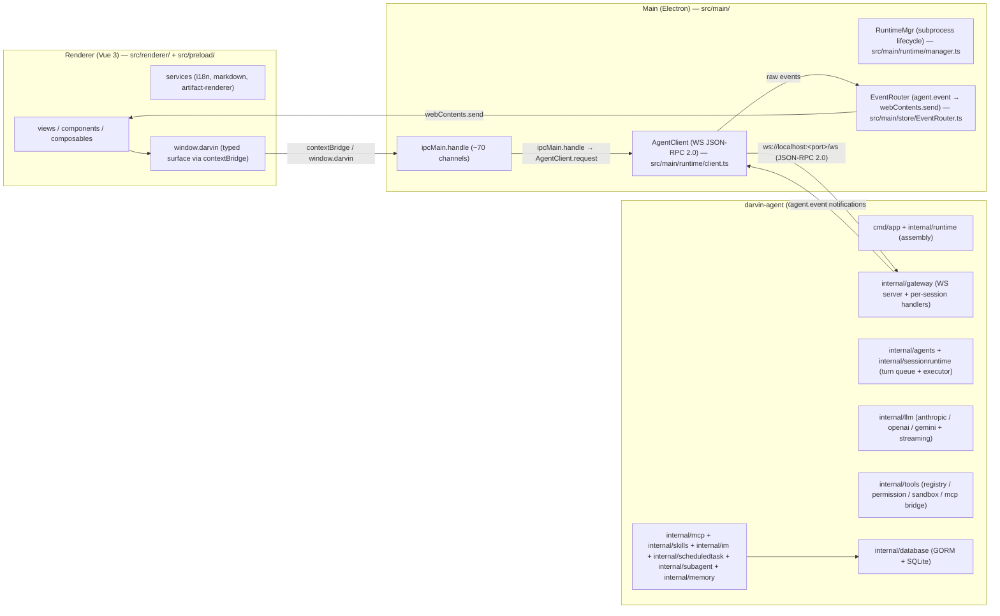
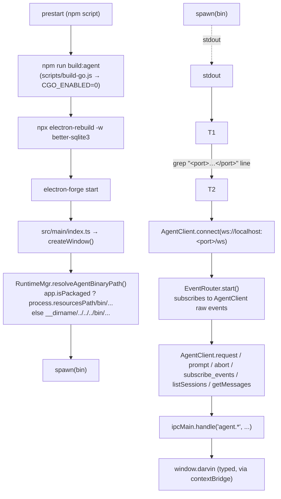
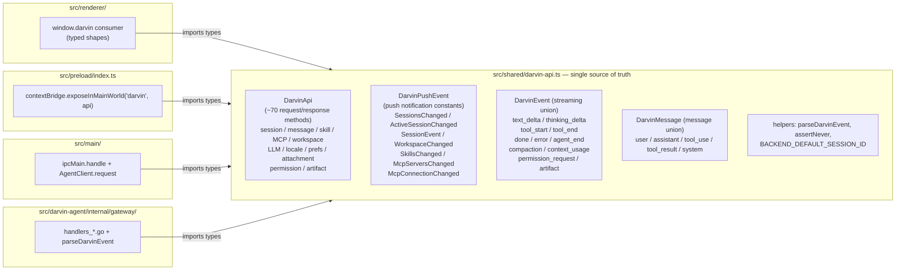
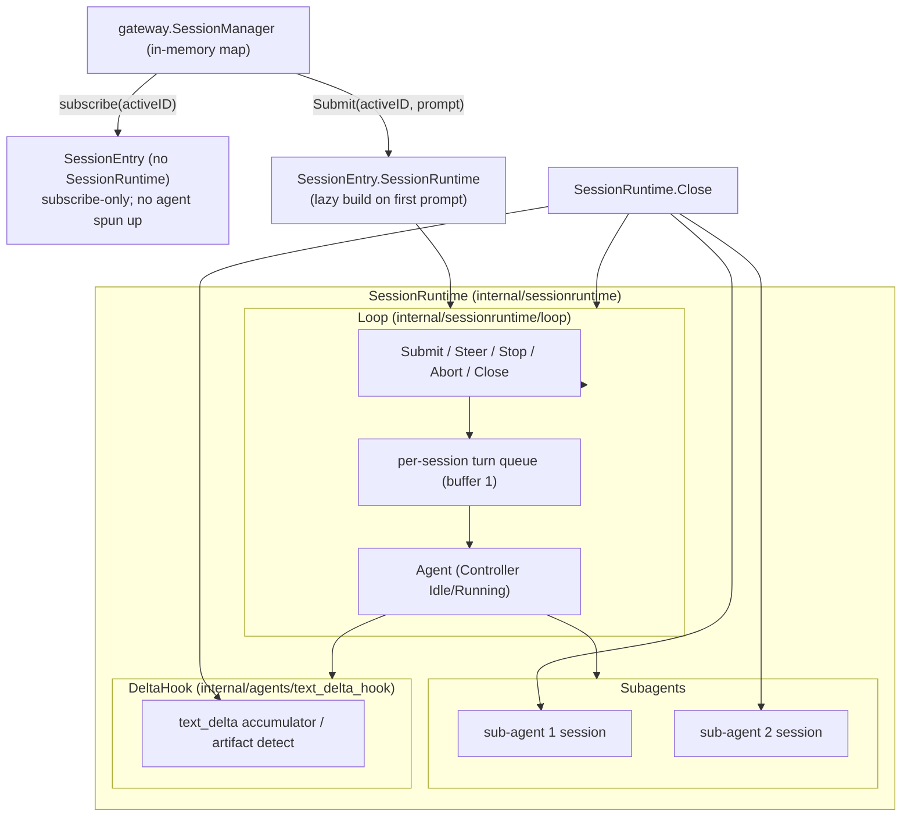
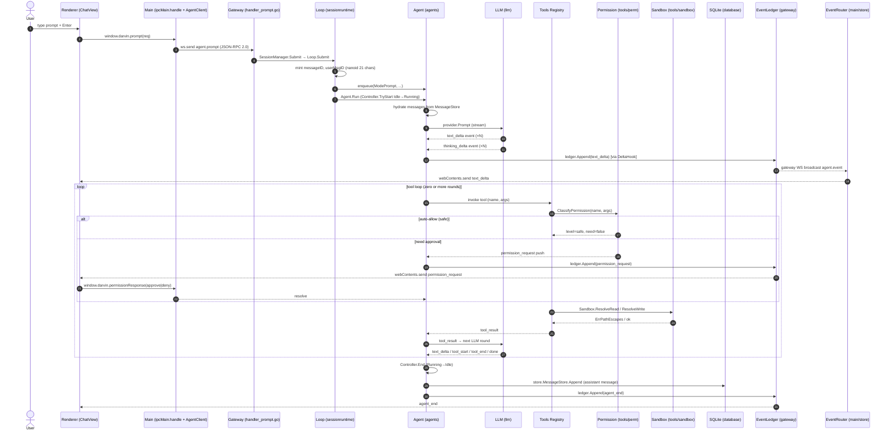
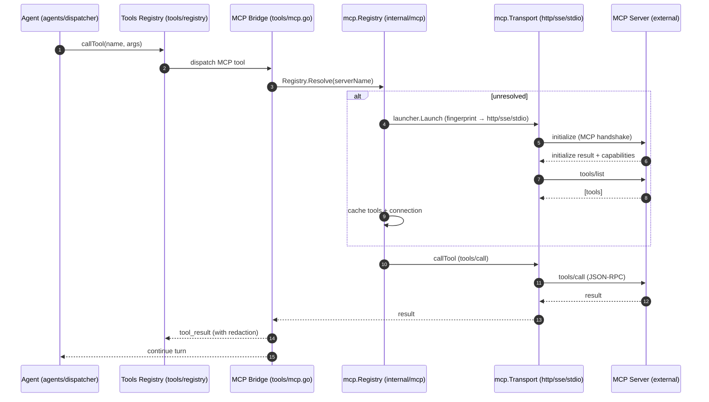
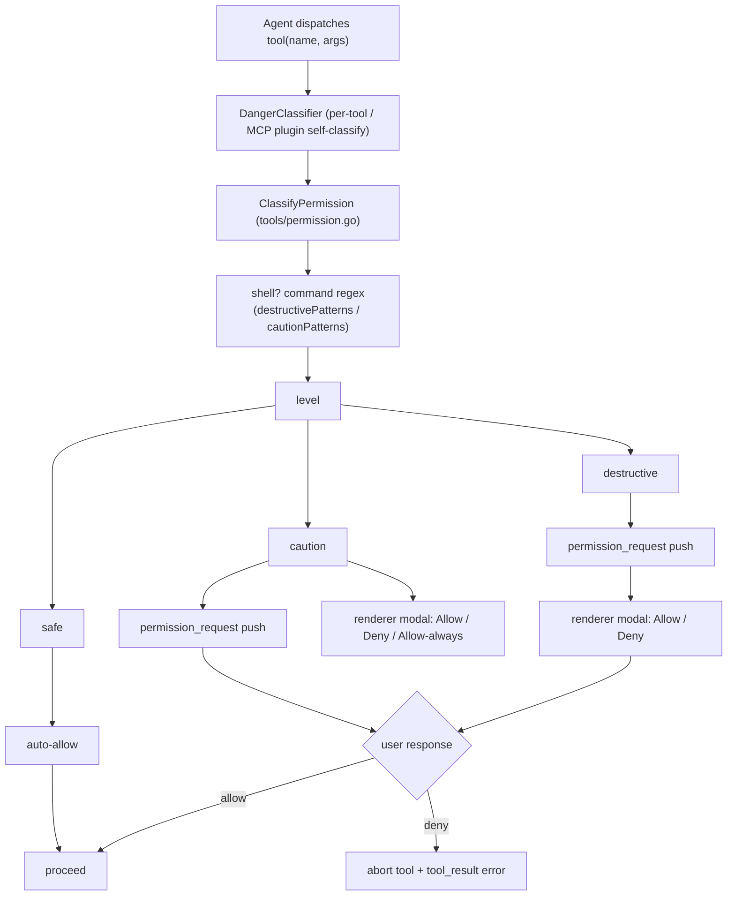
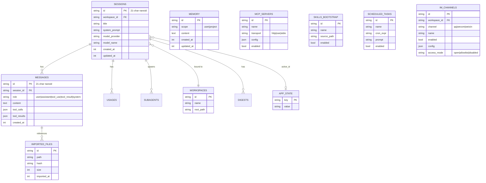

# Architecture

> Three processes, one conversation. Every claim in this document is backed by a file path under `src/`.

darvin-cowork is split into three processes that talk through well-defined boundaries. The renderer is the only process that touches the user. The main process exists only to start the Go child and proxy JSON-RPC traffic. The Go agent is where every piece of business state lives.

## 1. Three processes



The renderer never imports `better-sqlite3`. The main process never sees LLM keys. The Go agent owns the schema, the agent loop, and every capability.

## 2. Go `runtime.Build` assembly

`runtime.Build` (`src/darvin-agent/internal/runtime/runtime.go`) is the single assembly entry. Frontend (cmd/app/main, future TUI) holds only the returned `*Runtime`.

```mermaid
flowchart TD
  S0["frontend: Build(ctx, Options{})"]
  S0 --> S1["resolveConfigPath()<br/>opts.ConfigPath ?? $DARVIN_CONFIG ?? exe-dir/cwd"]
  S1 --> S2["loadConfig + zap logger"]
  S2 --> S3["loadDatabase (database.Open → globalDB)"]
  S3 --> S4["loadProvider (anthropic / openai / gemini registry)"]
  S4 --> S5["resolveWorkspace (cfg.Agent.Workdir ?? opts.WorkspaceRoot)"]
  S5 --> S6["loadTools (NewBuiltins → sandbox + registry)"]
  S6 --> S7["memory.New(workspace)"]
  S7 --> S8["newAgentFactory (Agent + Harness + Loop plugins)"]
  S8 --> S9["bootstrapSkills (scan + load + runner)"]
  S9 --> S10["bootstrapMCP (resolveMCPPackagesDir + registry)"]
  S10 --> S11["EventLedger + SessionManager (with AgentFactory)"]
  S11 --> S12["Wire skill + mcp plugins into factory"]
  S12 --> S13["gateway.NewHandler (sessions, ledger, stores...)"]
  S13 --> S14["mcpReg.SetNotifier (handler hooks)"]
  S14 --> S15["gateway.NewServer.Start(ctx) — binds WS port"]
  S15 --> S16["scheduledtask.NewEngine + Start"]
  S16 --> S17["im.NewManager + Reload(activeWorkspaceID)"]
  S17 --> S18["im.NewHandlers (qr manager)"]
  S18 --> S19["bootstrap active session (sessions.EnsureEntry)"]
  S19 --> S20["return *Runtime (Cfg, Provider, Sessions, Handler, Server, MCP, Skills, Factory, Stores, IMManager, ScheduleEngine...)"]
```



`imBuilders()` (`runtime.go:43`) deliberately lives in `internal/runtime`, **not** in `internal/im`:

```
// imBuilders maps each channel to its live connector constructor. It lives
// here (not in internal/im) so the registry can import the connector
// subpackages without a cycle.
```

`runtime.Shutdown` (`runtime.go:120`) reverses the order independently and `errors.Join`s every error: `ScheduleEngine.Stop` → `IMManager.StopAll` → `Server.Shutdown` → `harness.DisposeAll` → `WorkspaceBootstrap.Dispose` → `Stores.Sessions.Close`.

The `Stores` struct (`runtime.go:102`) aggregates 11 SQLite-backed stores: `Sessions / Workspaces / Messages / AppState / ImportedFiles / Usages / Digests / Subagents / Agents / Schedules / IMChannels`.

`setWorkspace` closure (`runtime.go:248`) re-anchors the active workspace without rebuilding the agent: `toolsReg.SetWorkspaceRoot` → `mcpReg.SetRoots` (so filesystem-aware MCP servers see the new project) → `bootstrapSkills` against the new root → `skillPlugin.SetBootstrapResult` → `handler.Skills / SkillRunner` swap → `sessions.RefreshAllTools()`.

## 3. Main-process resolution



Key files: `src/main/runtime/manager.ts` (`RuntimeMgr` + `resolveAgentBinaryPath`), `src/main/runtime/client.ts` (`AgentClient`), `src/main/store/EventRouter.ts` (pure forwarder: `agent.event` → `webContents.send`). The Electron main opens `remote-debugging-port=9222` only in dev (`!app.isPackaged`) so `electron-cdp` can drive the window without launching a second browser.

`EventRouter` is intentionally thin: it does not read active session, does not consult the store, and does not run any logic beyond `webContents.send`. On `done` it triggers `notifyIfHidden` so a user who switched away sees an OS notification with the title (looked up via `getTitle` callback, FR-10).

## 4. IPC contract layering

`src/shared/darvin-api.ts` is the single source of truth for everything that crosses the process boundary.



Rule (enforced by convention, no automated check): adding a new IPC channel means **three places** — `DarvinApi` in `darvin-api.ts` → `ipcMain.handle` in main → `window.darvin` method in preload. Wire types use `<Domain>Wire` suffix to separate internal business types from IPC protocol types. `parseDarvinEvent` and `assertNever` are the helpers every Go / TS side calls.

## 5. Session lifecycle and `SessionRuntime` container



`SessionManager` (`internal/gateway/sessionmgr.go`) holds an LRU map (`idleElem` linked list, `DefaultIdleTTL = 24h`, soft cap `DefaultMaxSessions = 5000`) of `*SessionEntry`. An entry without `SessionRuntime` can be **subscribed to** but not **submitted to**. First `Prompt` builds the runtime via `AgentFactory` (`internal/sessionruntime/factory.go`).

`Controller` (`internal/agents/controller.go`) owns the per-agent `Idle / Running` state machine and the per-turn cancel function: `TryStart` transitions Idle→Running, `End` cancels + flips back to Idle, `SetCancel` binds the next turn's cancel, `Abort` fires it without changing state.

`Loop` (`internal/sessionruntime/loop.go`) owns one session's turn queue with **strict steer priority** (`internal/agents/queue.go`'s `promptCh` / `steerCh` channels, both buffer 1). `Submit / Steer / SubmitSkill / Stop / Abort / Close` are the only mutators. `PromptRequest` carries `attachments / images / provider / model` per-turn override + `ReplySink` for headless integrations (scheduled tasks, IM channels).

## 6. Single agent turn — sequence diagram



Notes:

- `hydrate` runs **before** the first LLM round (`sessionruntime/hydrate.go`): pulls messages from `MessageStore` so a reloaded session resumes seamlessly.
- DeltaHook (`agents/text_delta_hook.go`) deduplicates `text_delta` events at the gateway boundary so the wire stays small even if the provider streams rapidly.
- `agent_end` (terminal event) carries the final assistant text + usage payload; the renderer swaps the streaming placeholder for the persisted message.
- `Ctrl+C` mid-turn or `window.darvin.abort()` flows as `Controller.Abort()` → context cancel → dispatcher returns → `Controller.End()`.

## 7. MCP bridge — tool call → MCP server → response



- `mcp.Registry` (`internal/mcp/registry.go`) is the single owner of every server's connection + tools.
- `transport` (`internal/mcp/transport/`) speaks `http` / `sse` / `stdio` per the server's launch config.
- `resolver_fingerprint` (`internal/mcp/resolver_fingerprint.go`) determines whether a config change is the same server (no relaunch) or a new one (close + relaunch). `retryResolution` is the user-facing action that runs this fingerprint again.
- `redact.go` strips secrets from server logs.
- `notifier.go` (`OnConnectionChanged / OnResolutionChanged / OnToolsChanged`) calls `handler.OnMcp*` so the renderer refetches via push events.

## 8. Tool permission gate



Shell tool classification (`tools/permission.go`) is pattern-based. `destructivePatterns` (checked first) match: `rm -r / rm -rf`, `git push … --force / -f`, `git reset --hard`, `dd`, `mkfs.*`, `shutdown / reboot / init 0`, fork bomb `:(){`, `chmod -R / chown -R`, `find … -delete`. `cautionPatterns` match: `rm`, `git push`, `git clean`, `chmod / chown`, `kill / pkill`, `sudo`, `mv / cp`.

Non-shell tools fall through with `level=safe, need=false`; plugins that self-classify implement `DangerClassifier` and are consulted by `EvaluatePermission`. Sandbox (`tools/sandbox.go`) enforces path containment (lexical + symlink), read-byte cap (`maxHardReadBytes = 16 MiB`), and the `attach = authorize` semantics.

## 9. IM lifecycle — Create → Start → Inbound → Reply

```mermaid
sequenceDiagram
  autonumber
  actor User
  participant V as Renderer (ImView)
  participant E as Main (imProxy → AgentClient)
  participant G as Gateway (handler_im.go)
  participant M as im.Manager
  participant DB as SQLite (IMChannels store)
  participant C as Connector (qq/wecom/weixin)
  participant SR as SessionRunner (gateway.SessionManager)
  participant LOOP as Loop (headless session)
  participant PEER as IM peer (user)

  User->>V: click "添加实例" + save
  V->>E: window.darvin.imCreate({channel, name, config, enabled})
  E->>G: ws.send agent.im.create
  G->>M: Manager.Create(ctx, ch)
  M->>DB: IMChannelStore.Create
  alt enabled
    M->>M: buildInstance → Connector.Start
    C-->>M: ok / lastError
  end
  M->>G: Broadcast ImChanged (push event)

  Note over C,PEER: connector is now connected; long-poll / WS depending on channel
  PEER->>C: inbound message
  C->>M: Manager.handleInbound (via setInboundHandler)
  M->>M: authorized(peer) (access policy gate)
  M->>SR: SubmitForIM(ctx, imKey, prompt, ReplySink)
  SR->>LOOP: ensure session + Loop.Submit
  LOOP-->>SR: final assistant text via ReplySink
  SR-->>M: sink(reply, runID)
  M->>C: Connector.Send(ctx, target, outbound)
  C-->>PEER: outbound message
```

`Manager.handleInbound` (`internal/im/manager.go`) is registered as the connector's `SetInboundHandler` callback. `SubmitForIM` (`gateway.SessionManager`) creates a dedicated session per IM instance, the agent runs headless (no live WS subscriber), and the `ReplySink` writes back through `Connector.Send`. Each IM instance owns its a dedicated workspace per IM instance (in per `imManager.ensureIMWorkspace`) so the renderer UI groups sessions from the same channel under a stable, named workspace.

## 10. SQLite schema (GORM + `glebarez/sqlite`)



Schema is owned by `internal/agents/store/` (concrete SQLite types in `*_test.go` are exercised by the unit tests). `globalDB` lives in `internal/database/database.go`; main process **never** sees SQLite.

## 11. Why three processes?

- **Renderer stays simple.** It holds UI state and nothing else. No SQLite, no filesystem outside its sandbox, no secrets.
- **Main stays thin.** `~70` `ipcMain.handle` channels proxy typed JSON-RPC to Go. Adding a new IPC channel is a two-place change in `src/shared/darvin-api.ts`.
- **Go owns everything that matters.** The agent loop, tool registry, context compaction, MCP clients, skills, memory and persistence all live in one process you can attach a debugger to, run `go test` against, and grep through. The single static binary (`CGO_ENABLED=0`) makes the desktop app trivially cross-platform.

## 12. What's intentionally not in the main process

- **SQLite** — owned by Go (`globalDB` in `internal/database`). Main only proxies.
- **LLM keys** — read by Go viper from `LLM_API_KEY` env / user `config.yaml` / repo `config.yaml`. Main never sees the raw key.
- **Tool execution** — all tool calls run in the Go process so the renderer cannot bypass permissions or sandbox.
- **IM sessions** — per-channel connectors live in Go, accessed by the renderer through `window.darvin.im*` IPC only.

## 13. Cross-package rules

Enforced by `Makefile`'s `lint-agents-boundaries`:

- `internal/agents/` may NOT import capability packages (`llm / tools / skills / mcp`).
- `internal/im/` interfaces are defined in the consumer package (`contract.go`); connector implementations live in `internal/im/<channel>/`.
- `imBuilders()` lives in `internal/runtime` (not `internal/im`) to avoid a cycle with the connector subpackages.

## Next

- [Quickstart](./QUICKSTART.md) — install, configure, build, troubleshoot.
- [Guide](./GUIDE.md) — sessions, tools, todos, sub-agents, MCP, skills, memory, artifact sandbox, expert suite, scheduled tasks, IM overview, settings.
- [IM Channels](./IM.md) — QQ / WeCom / WeChat connectors, real connectivity probe, instance management.
- [Development](./DEVELOPMENT.md) — dev workflow, lint / test / smoke, Go `fmt` / `vet` / `lint`, project-specific engineering rules.