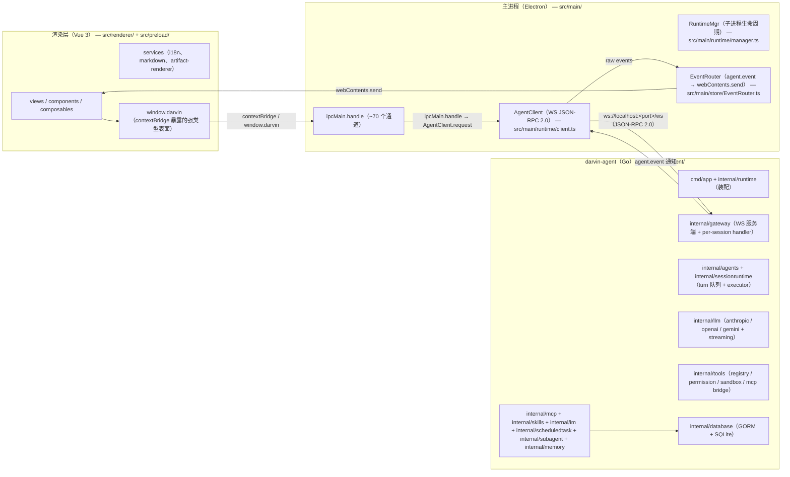
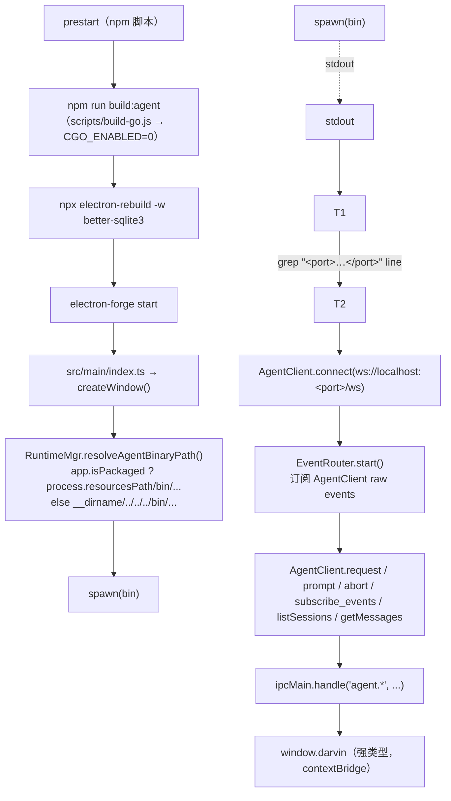
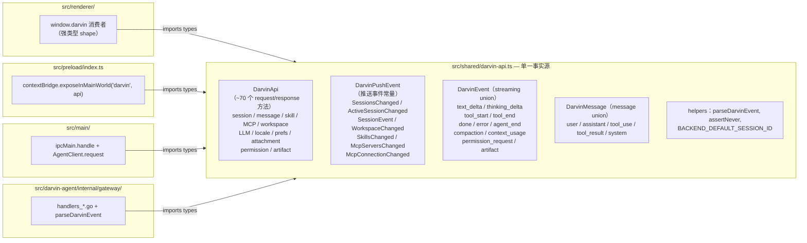
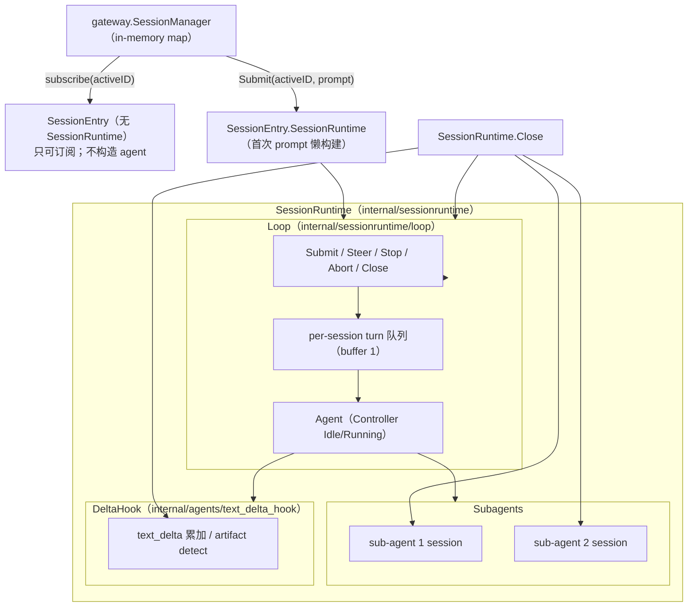
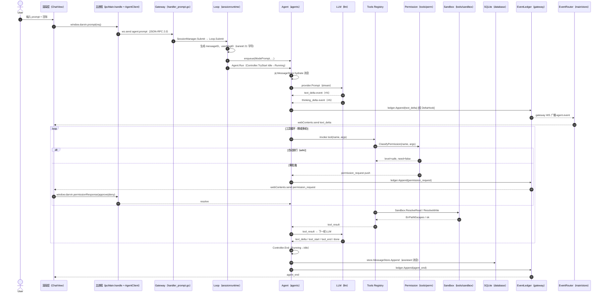
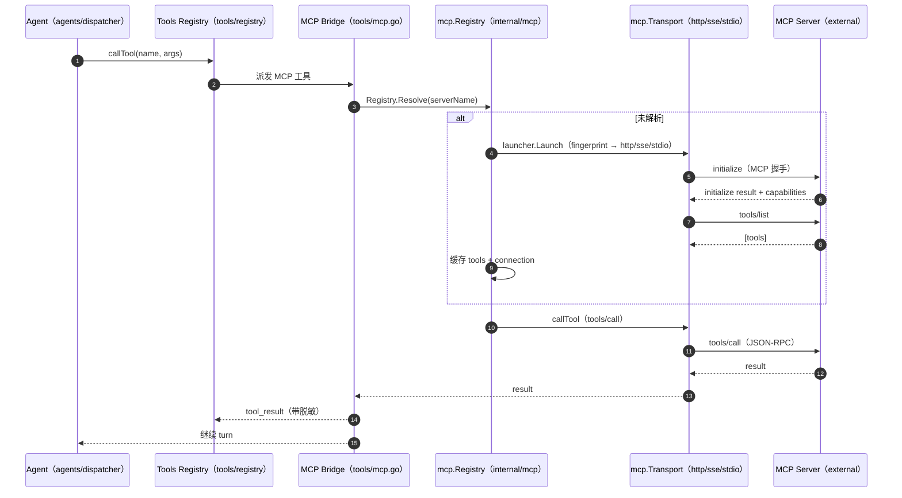
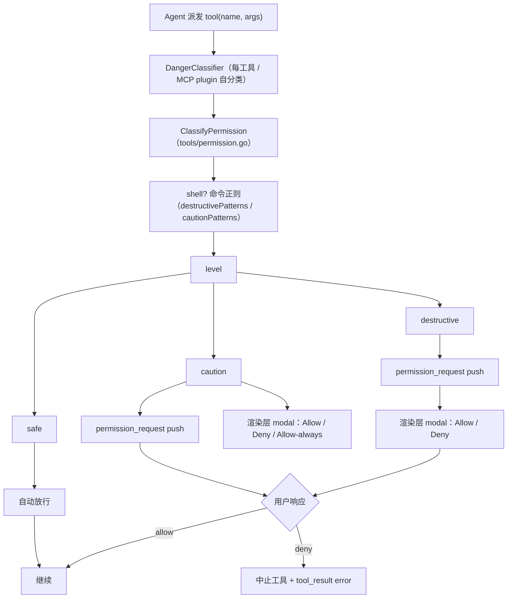
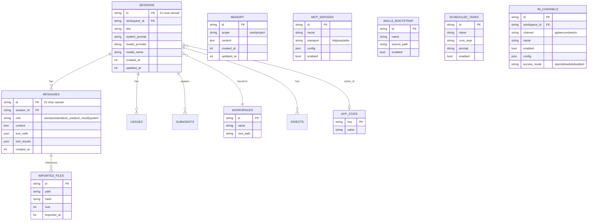

<a href="./ARCHITECTURE.md">English</a>
&nbsp;·&nbsp;
<strong>简体中文</strong>
&nbsp;·&nbsp;
<a href="../README.zh-CN.md">README</a>

# 架构

> 三进程，一次对话。本文的每一条都对应 `src/` 下的真实文件路径。

darvin-cowork 拆成三个进程，通过清晰的边界相互通信。渲染层是唯一与用户打交道的进程。主进程只负责拉起 Go 子进程、转发 JSON-RPC 流量。Go agent 是所有业务状态的所在地。

## 1. 三进程



Renderer 永不 import `better-sqlite3`。主进程永不接触 LLM key。Go agent 持有 schema、agent 循环、所有能力。

## 2. Go `runtime.Build` 装配

`runtime.Build`（`src/darvin-agent/internal/runtime/runtime.go`）是唯一的装配入口。前端（cmd/app/main、未来的 TUI）只持有返回的 `*Runtime`。

```mermaid
flowchart TD
  S0["frontend：Build(ctx, Options{})"]
  S0 --> S1["resolveConfigPath()<br/>opts.ConfigPath ?? $DARVIN_CONFIG ?? exe-dir/cwd"]
  S1 --> S2["loadConfig + zap logger"]
  S2 --> S3["loadDatabase（database.Open → globalDB）"]
  S3 --> S4["loadProvider（anthropic / openai / gemini registry）"]
  S4 --> S5["resolveWorkspace（cfg.Agent.Workdir ?? opts.WorkspaceRoot）"]
  S5 --> S6["loadTools（NewBuiltins → sandbox + registry）"]
  S6 --> S7["memory.New(workspace)"]
  S7 --> S8["newAgentFactory（Agent + Harness + Loop plugins）"]
  S8 --> S9["bootstrapSkills（scan + load + runner）"]
  S9 --> S10["bootstrapMCP（resolveMCPPackagesDir + registry）"]
  S10 --> S11["EventLedger + SessionManager（带 AgentFactory）"]
  S11 --> S12["把 skill / mcp plugin 注入 factory"]
  S12 --> S13["gateway.NewHandler（sessions, ledger, stores...）"]
  S13 --> S14["mcpReg.SetNotifier（handler 钩子）"]
  S14 --> S15["gateway.NewServer.Start(ctx) — 绑 WS 端口"]
  S15 --> S16["scheduledtask.NewEngine + Start"]
  S16 --> S17["im.NewManager + Reload(activeWorkspaceID)"]
  S17 --> S18["im.NewHandlers（qr manager）"]
  S18 --> S19["bootstrap active session（sessions.EnsureEntry）"]
  S19 --> S20["return *Runtime（Cfg, Provider, Sessions, Handler, Server, MCP, Skills, Factory, Stores, IMManager, ScheduleEngine...）"]
```



`imBuilders()`（`runtime.go:43`）刻意放在 `internal/runtime`，**不**在 `internal/im`：

```
// imBuilders maps each channel to its live connector constructor. It lives
// here (not in internal/im) so the registry can import the connector
// subpackages without a cycle.
```

`runtime.Shutdown`（`runtime.go:120`）按相反顺序独立关闭，用 `errors.Join` 聚合每个错误：`ScheduleEngine.Stop` → `IMManager.StopAll` → `Server.Shutdown` → `harness.DisposeAll` → `WorkspaceBootstrap.Dispose` → `Stores.Sessions.Close`。

`Stores` 结构（`runtime.go:102`）聚合 11 个 SQLite 存储：：`Sessions / Workspaces / Messages / AppState / ImportedFiles / Usages / Digests / Subagents / Agents / Schedules / IMChannels`。

`setWorkspace` 闭包（`runtime.go:248`）不重建 agent 即可重新锚定工作区：`toolsReg.SetWorkspaceRoot` → `mcpReg.SetRoots`（让文件系统感知的 MCP 服务器看到新项目）→ `bootstrapSkills` 对新根扫描 → `skillPlugin.SetBootstrapResult` → `handler.Skills / SkillRunner` 替换 → `sessions.RefreshAllTools()`。

## 3. 主进程解析



关键文件：`src/main/runtime/manager.ts`（`RuntimeMgr` + `resolveAgentBinaryPath`）、`src/main/runtime/client.ts`（`AgentClient`）、`src/main/store/EventRouter.ts`（纯转发：`agent.event` → `webContents.send`）。Electron 主进程仅在 dev（`!app.isPackaged`）下开 `remote-debugging-port=9222`，让 `electron-cdp` 直接驱动窗口（不另开浏览器）。

`EventRouter` 故意很薄：不读 active session、不查 store、除了 `webContents.send` 不做别的事。收到 `done` 时触发 `notifyIfHidden`，让切走的用户看到系统级通知（title 通过 `getTitle` 回调从缓存 Map 取，FR-10）。

## 4. IPC 契约分层

`src/shared/darvin-api.ts` 是跨进程边界的单一事实源。



约定（无自动化校验）：新增 IPC 通道意味着**改三处** —— `darvin-api.ts` 里 `DarvinApi` → main 里 `ipcMain.handle` → preload 里 `window.darvin` 方法。wire 投影类型用 `<Domain>Wire` 后缀区分内部业务类型与 IPC 协议类型。`parseDarvinEvent` 与 `assertNever` 是 Go / TS 两侧共用的判别器。

## 5. Session 生命周期与 `SessionRuntime` 容器



`SessionManager`（`internal/gateway/sessionmgr.go`）持有一个 LRU map（`idleElem` 链表，`DefaultIdleTTL = 24h`，软上限 `DefaultMaxSessions = 5000`）的 `*SessionEntry`。没有 `SessionRuntime` 的 entry 只能**订阅**，不能**提交**。首次 `Prompt` 通过 `AgentFactory`（`internal/sessionruntime/factory.go`）构建 runtime。

`Controller`（`internal/agents/controller.go`）持有每 agent 的 `Idle / Running` 状态机和 per-turn cancel 函数：`TryStart` 切换 Idle→Running，`End` 取消并切回 Idle，`SetCancel` 绑下一次 turn 的 cancel，`Abort` 触发 cancel 但不切状态。

`Loop`（`internal/sessionruntime/loop.go`）持有一个 session 的 turn 队列，**严格 steer 优先级**（`internal/agents/queue.go` 的 `promptCh` / `steerCh`，均 buffer 1）。`Submit / Steer / SubmitSkill / Stop / Abort / Close` 是仅有的变更入口。`PromptRequest` 携带 `attachments / images / provider / model` per-turn 覆盖 + `ReplySink`（供 scheduled tasks、IM channels 等 headless 集成用）。

## 6. 单 turn agent —— 序列图



说明：

- `hydrate` 在**第一**轮 LLM 前跑（`sessionruntime/hydrate.go`）：从 `MessageStore` 拉消息，让重载的 session 无缝续接。
- DeltaHook（`agents/text_delta_hook.go`）在 gateway 边界去重 `text_delta`，provider 流式密集时保持线上体积小。
- `agent_end`（终结事件）携带最终 assistant 文本 + usage 负载；渲染层把 streaming 占位换成落库的消息。
- 中途 `Ctrl+C` 或 `window.darvin.abort()` 流为 `Controller.Abort()` → context cancel → dispatcher 返回 → `Controller.End()`。

## 7. MCP 桥接 —— tool call → MCP server → response



- `mcp.Registry`（`internal/mcp/registry.go`）是每个 server 的连接 + tools 的唯一所有者。
- `transport`（`internal/mcp/transport/`）按 server 的启动配置说 `http / sse / stdio`。
- `resolver_fingerprint`（`internal/mcp/resolver_fingerprint.go`）判断配置变化是同一 server（不重启）还是新 server（关 + 重启）。`retryResolution` 是用户行为，重新跑一次 fingerprint。
- `redact.go` 从 server 日志中剥离密钥。
- `notifier.go`（`OnConnectionChanged / OnResolutionChanged / OnToolsChanged`）调 `handler.OnMcp*`，让渲染层通过 push 事件重新拉取。

## 8. 工具权限门槛



Shell 工具的分类（`tools/permission.go`）基于正则。`destructivePatterns`（先匹配）：`rm -r / rm -rf`、`git push … --force / -f`、`git reset --hard`、`dd`、`mkfs.*`、`shutdown / reboot / init 0`、fork bomb `:(){`、`chmod -R / chown -R`、`find … -delete`。`cautionPatterns`：`rm`、`git push`、`git clean`、`chmod / chown`、`kill / pkill`、`sudo`、`mv / cp`。

非 shell 工具直接 `level=safe, need=false`；自分类 plugin 实现 `DangerClassifier`，由 `EvaluatePermission` 调用。Sandbox（`tools/sandbox.go`）强制路径围栏（词法 + symlink）、读取字节上限（`maxHardReadBytes = 16 MiB`）、`attach = authorize` 语义。

## 9. IM 生命周期 —— Create → Start → Inbound → Reply

```mermaid
sequenceDiagram
  autonumber
  actor User
  participant V as 渲染层（ImView）
  participant E as 主进程（imProxy → AgentClient）
  participant G as Gateway（handler_im.go）
  participant M as im.Manager
  participant DB as SQLite（IMChannels store）
  participant C as Connector（qq/wecom/weixin）
  participant SR as SessionRunner（gateway.SessionManager）
  participant LOOP as Loop（headless session）
  participant PEER as IM peer（用户）

  User->>V: 点「添加实例」+ 保存
  V->>E: window.darvin.imCreate({channel, name, config, enabled})
  E->>G: ws.send agent.im.create
  G->>M: Manager.Create(ctx, ch)
  M->>DB: IMChannelStore.Create
  alt enabled
    M->>M: buildInstance → Connector.Start
    C-->>M: ok / lastError
  end
  M->>G: Broadcast ImChanged（push 事件）

  Note over C,PEER: connector 已连接；长轮询 / WS 按通道而定
  PEER->>C: 入站消息
  C->>M: Manager.handleInbound（经 setInboundHandler）
  M->>M: authorized(peer)（访问策略门槛）
  M->>SR: SubmitForIM(ctx, imKey, prompt, ReplySink)
  SR->>LOOP: ensure session + Loop.Submit
  LOOP-->>SR: 最终 assistant 文本（经 ReplySink）
  SR-->>M: sink(reply, runID)
  M->>C: Connector.Send(ctx, target, outbound)
  C-->>PEER: 出站消息
```

`Manager.handleInbound`（`internal/im/manager.go`）注册为 connector 的 `SetInboundHandler` 回调。`SubmitForIM`（`gateway.SessionManager`）为每个 IM 实例创建一个专属 session，agent headless 跑（无活 WS 订阅者），`ReplySink` 通过 `Connector.Send` 回写。每个 IM 实例拥有一个专属 workspace（`imManager.ensureIMWorkspace`），UI 把同一通道的所有会话归到一个稳定、带名字的 workspace 下。

## 10. SQLite schema（GORM + `glebarez/sqlite`）



Schema 由 `internal/agents/store/` 持有；具体 SQLite 类型在 `*_test.go` 单测里跑过。`globalDB` 在 `internal/database/database.go`；主进程**永不**接触 SQLite。

## 11. 为什么是三进程

- **渲染层保持简单**。只持 UI 状态。不持 SQLite、不碰工作区外文件系统、不持密钥。
- **主进程保持薄**。`~70` 个 `ipcMain.handle` 通道把强类型 JSON-RPC 代理到 Go。加一个新 IPC 通道，改两处（在 `src/shared/darvin-api.ts`）。
- **Go 持有所有关键逻辑**。Agent 循环、工具注册表、上下文压缩、MCP 客户端、skills、记忆、持久化全在一个进程里——能挂调试器、能跑 `go test`、能 grep。`CGO_ENABLED=0` 的单静态二进制让桌面端跨平台毫无负担。

## 12. 故意不在主进程的事

- **SQLite**——属于 Go（`internal/database` 的 `globalDB`）。main 只是代理。
- **LLM keys**——由 Go viper 从 `LLM_API_KEY` env / 用户 `config.yaml` / 仓库 `config.yaml` 读取；main 端永远不见明文 key。
- **工具执行**——所有工具调用都在 Go 进程跑，渲染层无法绕过权限 / 沙箱。
- **IM 会话**——各连接器在 Go 端，渲染层只通过 `window.darvin.im*` IPC 访问。

## 13. 跨包规则

由 `Makefile` 的 `lint-agents-boundaries` 强制：

- `internal/agents/` 不可 import 能力包（`llm / tools / skills / mcp`）。
- `internal/im/` 接口放在消费侧契约包（`contract.go`），连接器实现放在 `internal/im/<channel>/`。
- `imBuilders()` 放在 `internal/runtime`（不在 `internal/im`），避免与 connector 子包循环引用。

## 下一步

- [快速开始](./QUICKSTART.md) — 安装、配置、构建、排障。
- [使用指南](./GUIDE.md) — 会话、工具、todo、sub-agents、MCP、skills、memory、artifact 沙箱、专家套件、定时任务、IM 总览、设置。
- [IM 通道](./IM.md) — QQ / 企业微信 / 个人微信连接器，真实连通性探测、实例管理。
- [开发](./DEVELOPMENT.md) — dev 流程、lint / test / smoke、Go `fmt` / `vet` / `lint`、本本仓库工程规范。