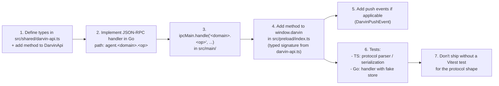

<a href="./DEVELOPMENT.md">English</a>
&nbsp;·&nbsp;
<a href="./DEVELOPMENT.zh-CN.md">简体中文</a>
&nbsp;·&nbsp;
<a href="../README.md">README</a>

# Development

> Dev workflow, lint / test / smoke, Go `fmt` / `vet` / `lint`, project-specific engineering rules, contribution notes.

This page is for anyone modifying darvin-cowork: adding an IM channel, wiring a new IPC method, tweaking the agent loop, or shipping a UI tweak.

## Repository layout

```
darvin-cowork/
├─ src/
│  ├─ main/                 Electron main process
│  ├─ preload/              contextBridge → window.darvin
│  ├─ renderer/             Vue 3 UI
│  ├─ shared/darvin-api.ts  IPC contract — single source of truth
│  └─ darvin-agent/         Go agent
├─ docs/                    ARCHITECTURE · QUICKSTART · GUIDE · IM · DEVELOPMENT + pkg-document/
├─ specs/                   feature design specs (one dir per feature)
├─ scripts/                 build-go.js · smoke.sh
├─ .claude/                 project-local Claude config (skills, settings)
├─ forge.config.ts          Electron Forge makers + Vite + Fuses
├─ vitest.config.ts         Vitest config
├─ eslintrc.json / tsconfig.json / vite.*.config.*
└─ package.json
```

`CLAUDE.md` (project root) is the canonical engineering guide for AI agents and humans alike. It contains the TypeScript and Go coding standards, the i18n rules, the design-token discipline, and a strict "do not commit / do not broad refactor / do not write `Co-Authored-By`" reminder. Read it before any non-trivial change.

## Conventions

### Branch / commit / PR

- **Branches**: `feat/...` / `fix/...` / `chore/...` / `refactor/...`.
- **Commits**: Conventional Commits, English.
  ```
  feat(im): add real connectivity probe + diagnostic/edit UI
  fix(forge): limit extraResources to current platform
  chore: drop stale webpack templates from .bak
  ```
- **No `Co-Authored-By` trailer.** Explicit project rule.
- **No autonomous commit.** The author reviews the diff before committing.
- **PRs**: title + concise description + linked issue (if any) + screenshot (if UI) + Electron-specific notes (IPC / preload / window / Go binary packaging).

### Source-of-truth rules

- All IPC channels, push events, streaming events, message types live in `src/shared/darvin-api.ts`. Adding a new IPC method means three places: `DarvinApi` in `darvin-api.ts` → `ipcMain.handle` in main → `window.darvin` method in preload.
- Renderer never imports `better-sqlite3`. All persistence is in Go.
- Renderer never hardcodes user-visible strings — they go through `t()` from `src/renderer/services/i18n.ts`. The Chinese and English dictionaries share keys; `assertSameKeys` enforces parity in dev.

### Design tokens (Tailwind v4)

Colors / spacing / radii / font sizes / shadows / animations live in `src/renderer/styles/theme.css` `@theme` block. Components use utility classes:

- ✅ `bg-surface` / `text-text-muted` / `rounded-md` / `text-sm`
- ❌ `bg-[#1a1a1a]` / `text-gray-300` / `bg-red-500` / `style={{ color: 'red' }}`

New tokens: declare them in `@theme`; dark overrides go under `html.dark`; accent colors via `<html data-accent="blue|green">`.

### i18n

- Files: `src/renderer/services/i18n.ts` (zh + en, same key set).
- Key naming: `feature.subfeature.label`.
- Value: full sentence, not split substrings (word order changes between languages).
- Variables use placeholders: `t('chat.greet', { name })` not `t('chat.greet') + userName`.
- Numbers / dates go through `formatNumber` / `formatDate` / `formatRelativeTime`; never hardcode `12 个任务` in a template.
- Skip i18n for: DevTools / logs / stack traces / IPC protocol fields / pure technical identifiers (model names, API key prefixes).

### Go

The Go side (`src/darvin-agent/`) has its own rules — see the `### darvin-agent Go 代码规范` section of `CLAUDE.md`. Highlights:

- One file soft cap 800 lines; split by domain, not by syntax (`utils.go` is a smell).
- Interfaces live in the consumer package; implementations in the package they describe.
- Capability interfaces + `init()` self-register (`internal/llm/` is the gold example).
- Naming: exported `PascalCase`, unexported `camelCase`, errors `Err<Entity>`.
- Comments in English only. No stage / version / FR-N / `v0 placeholder` markers.
- `gofmt -s` + `goimports` mandatory. `golangci-lint` aggregates `errcheck + govet + staticcheck + unused + ineffassign`.
- Cross-package rule: `internal/agents/` may NOT import capability packages (`llm / tools / skills / mcp`); enforced by `Makefile`'s `lint-agents-boundaries`.

## Day-to-day

### First checkout

```sh
git clone https://github.com/darven-cs/darvin-cowork.git
cd darvin-cowork
npm install
```

### Run dev

```sh
npm start
```

`prestart` runs `npm run build:agent && npx electron-rebuild -w better-sqlite3`, then `electron-forge start`. Vite HMR handles the renderer; restart for main-process / preload changes.

### Renderer-only iteration

If you're only touching the renderer, `npm install && npm run lint && npm test` is enough — no Go toolchain needed.

### Drive the running app over CDP

The project ships an `electron-cdp` skill that connects to the running Electron window via Chrome DevTools Protocol on `remote-debugging-port=9222` (dev only). Use it for any E2E verification:

```sh
playwright-cli --help                  # the skill relies on a global @playwright/cli install
node .claude/skills/electron-cdp/scripts/edrv.mjs ping
node .claude/skills/electron-cdp/scripts/edrv.mjs click '<selector>'
node .claude/skills/electron-cdp/scripts/edrv.mjs screenshot /tmp/shot.png
```

Do **not** launch a second browser for Electron — `chromium.connectOverCDP` attaches to the window the user already opened. The driver exits `process.exit(0)` after every command; never `browser.close()` inside the script (that closes the user's window).

## Quality gates

### Lint

```sh
npm run lint                  # ESLint over src/*.ts/.tsx/.vue
```

ESLint config (`.eslintrc.json`): `eslint:recommended` + `@typescript-eslint/recommended` + `import/recommended` + `import/electron` + `import/typescript`, plus `plugin:vue/vue3-recommended` for `.vue` (via `vue-eslint-parser`). Pure-typographic rules (`max-attributes-per-line` etc.) are turned off to match the project's compact style.

### Tests

```sh
npm test                                  # Vitest unit tests over src/**/*.test.ts
npm run smoke                             # headless: spawn binary, exercise JSON-RPC, no API key
cd src/darvin-agent && go test ./...      # Go unit tests
```

Test conventions:

- Co-located `*.test.ts` next to the source (e.g. `user-paths.ts` ↔ `user-paths.test.ts`).
- Mock `electron` with `vi.mock('electron', ...)` + `vi.hoisted` to keep mock state — see `src/main/libs/user-paths.test.ts`.
- Don't write integration tests for the Electron main process; the protocol parser / IPC shape / path utilities are the right surface to cover.
- For Go, each `internal/` package has co-located `*_test.go`. `cd src/darvin-agent && go test ./...` runs them all.

### Go quality

```sh
cd src/darvin-agent
make fmt         # gofmt -s -w . && goimports -w -local darvin-cowork/ .
make fmt-check   # gofmt -l . && goimports -l . (must be empty)
make vet         # go vet ./...
make lint-comments   # staticcheck -checks 'ST10*' ./...
make lint            # golangci-lint run ./...
make check           # aggregate (fmt + vet + lint-comments + lint + readability)
make lint-agents-boundaries   # forbids agents/ importing capability packages
```

`scripts/check-agent-readability.sh` is the one-shot script for comment density (target ≤ 0.30), single-file size cap (800), ST10xx, and the violation blacklist (`Phase N` / `FR-N` / `v0 placeholder` etc.).

### Acceptance per change

| Change surface | Verification |
|---|---|
| Docs / config | "Doc / config change only" — lint unnecessary |
| Main / preload / runtime | `npm run lint` + `npm start` (window opens, Go agent resolves expected path) |
| Renderer | `npm run lint` + DevTools console on `npm start` |
| Go | `cd src/darvin-agent && go build ./... && go vet ./... && go test ./...`; if `scripts/build-go.js` changed, also `npm run build:agent` |
| `forge.config.ts` / `vite.*.config.*` | `npm start` first (HMR / build flow intact); `npm run package` only if the change affects installers |
| Hand-off | diff review: no unrelated changes, no risky refactors, no build products (`.vite/` / `out/` / `bin/`), no user-visible string errors |

## Adding a new IPC channel



## Adding a new IM channel

See [`docs/IM.md`](./IM.md#future-channels) for the full recipe.

## Adding a new tool

1. Implement the tool in `src/darvin-agent/internal/tools/<group>/<tool>.go` with the existing tool interface.
2. Register it in the tools registry.
3. Add the tool to the permission allowlist (or the auto-allow set) as appropriate.
4. Document the tool in the relevant agent skill / preset.

## Adding a new renderer view

1. Create `src/renderer/views/<View>.vue`. Sidebar entries are wired in the view shell.
2. Use existing composables (`useIm`, `useMcpServers`, `useSkills`, etc.) where applicable; add a new one only when state is genuinely shared across views.
3. Style with Tailwind utility classes that resolve to `@theme` tokens. No `<style>` blocks, no magic values.
4. i18n: add keys to both `dictZh` and `dictEn` in `src/renderer/services/i18n.ts`. `assertSameKeys` will yell in dev if they drift.

## Things to avoid

- Touching build products (`.vite/build/`, `out/`, `bin/darvin-agent-*`) or local debug residue (`.bak/`, `.claude/`, `.playwright-cli/`, `*.db`).
- Speculative refactors alongside a fix.
- A second concurrent `npm start` window — CDP is already attached to the first.
- `git add -A` after the renderer native rebuild — `.forge-meta` and similar will leak.
- Ad-hoc logging to stdout from the renderer — the renderer cannot reach the user's terminal reliably; use `console.error` and live with it.

## Release flow

- `npm version <bump>` (semver).
- `CHANGELOG.md` gets a new top entry summarizing the user-visible change set.
- `git tag vX.Y.Z`.
- `npm run make` on each platform; collect installers under `out/make/`.
- Upload to GitHub release.

GitHub Actions is not wired yet — releases are run locally today.

## Troubleshooting

**HMR stops updating the renderer.**

Sometimes Vite's HMR socket gets wedged after a long session. Stop `npm start` and restart.

**`npm test` fails with "Module did not self-register: better_sqlite3.node".**

The native binding needs to be rebuilt against the current Node ABI. Run `npm run pretest` (or just `npx node-gyp rebuild --directory=node_modules/better-sqlite3`) and try again. CI does this automatically.

**`go test ./internal/im/...` is slow / hangs.**

Make sure the test environment has no leftover `darvin-agent` binary holding the SQLite file open (`lsof | grep sessions.db` on macOS / Linux). The smoke script does `SIGKILL` on exit, but a `Ctrl+C` mid-run can leave a child behind.

**Renderer warns about an unknown `data-accent` value.**

Only `orange` (default) / `blue` / `green` are supported; any other value gets ignored and the design reverts to the default accent. Add the token in `theme.css` `@theme` block + a matching dark override under `html.dark` first.

## Where to get help

- Project-specific rules: `CLAUDE.md` at repo root.
- Architecture: [`docs/ARCHITECTURE.md`](./ARCHITECTURE.md).
- Feature design specs: [`specs/`](../../specs/) (one directory per feature).
- Renderer skills: [`.claude/skills/`](../../.claude/skills/) — `electron-cdp`, `spec`, `simplify`, `security-review`, etc.
- Third-party library references kept for traceability: [`docs/pkg-document/`](./pkg-document/).