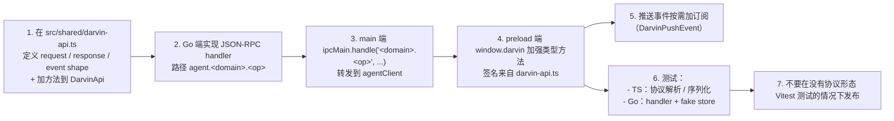

<a href="./DEVELOPMENT.md">English</a>
&nbsp;·&nbsp;
<strong>简体中文</strong>
&nbsp;·&nbsp;
<a href="../README.zh-CN.md">README</a>

# 开发

> dev 流程、lint / test / smoke、Go `fmt` / `vet` / `lint`、本仓库工程规范、贡献注意。

本文面向 darvin-cowork 的修改者：加 IM 通道、接新的 IPC 方法、调 agent 循环、做 UI 微调。

## 仓库布局

```
darvin-cowork/
├─ src/
│  ├─ main/                 Electron 主进程
│  ├─ preload/              contextBridge → window.darvin
│  ├─ renderer/             Vue 3 UI
│  ├─ shared/darvin-api.ts  IPC 契约——单一事实源
│  └─ darvin-agent/         Go agent
├─ docs/                    ARCHITECTURE · QUICKSTART · GUIDE · IM · DEVELOPMENT + pkg-document/
├─ specs/                   feature 设计 spec（每个 feature 一个目录）
├─ scripts/                 build-go.js · smoke.sh
├─ .claude/                 项目本地 Claude 配置（skills、settings）
├─ forge.config.ts          Electron Forge makers + Vite + Fuses
├─ vitest.config.ts         Vitest 配置
├─ eslintrc.json / tsconfig.json / vite.*.config.*
└─ package.json
```

仓库根的 `CLAUDE.md` 是面向 AI agent 和人写的工程规范总集——TypeScript 与 Go 编码规范、i18n 规则、设计 token 纪律、以及「不要主动 commit / 不要 broad refactor / 不要写 Co-Authored-By」的铁律。非平凡改动前先读它。

## 约定

### 分支 / 提交 / PR

- **分支**：`feat/...` / `fix/...` / `chore/...` / `refactor/...`。
- **提交**：Conventional Commits，英文。
  ```
  feat(im): add real connectivity probe + diagnostic/edit UI
  fix(forge): limit extraResources to current platform
  chore: drop stale webpack templates from .bak
  ```
- **不要 `Co-Authored-By` 尾部**（仓库明文规定）。
- **不要自动 commit**——作者审 diff 再提。
- **PR**：标题 + 简述 + 关联 issue（如有）+ UI 截图（若有）+ Electron 特定变更说明（IPC / preload / 窗口 / Go 二进制打包路径等）。

### 单一事实源规则

- 所有 IPC 通道、推送事件、流事件、消息类型集中在 `src/shared/darvin-api.ts`。新增 IPC 方法改三处：`darvin-api.ts` 里 `DarvinApi` → main 里 `ipcMain.handle` → preload 里 `window.darvin` 方法。
- Renderer 永不 import `better-sqlite3`。所有持久化在 Go。
- Renderer 永不写死用户可见字符串——一律走 `t()`（来自 `src/renderer/services/i18n.ts`）。中英字典共享 key，`assertSameKeys` 在 dev 强制对齐。

### 设计 token（Tailwind v4）

颜色 / 间距 / 圆角 / 字号 / 阴影 / 动画集中在 `src/renderer/styles/theme.css` `@theme` 块。组件用 utility class：

- ✅ `bg-surface` / `text-text-muted` / `rounded-md` / `text-sm`
- ❌ `bg-[#1a1a1a]` / `text-gray-300` / `bg-red-500` / `style={{ color: 'red' }}`

新增 token：先在 `@theme` 声明，深色覆盖写在 `html.dark` 下；accent 色通过 `<html data-accent="blue|green">`。

### i18n

- 文件：`src/renderer/services/i18n.ts`（zh + en，同 key 集）。
- 命名：`feature.subfeature.label`。
- value：完整句子，不要拆子串跨 key 拼接（语序因语言而变）。
- 变量用占位符：`t('chat.greet', { name })`，不要 `t('chat.greet') + userName`。
- 数字 / 时间 / 日期走 `formatNumber` / `formatDate` / `formatRelativeTime`；不要在模板里硬写「12 个任务」。
- 跳过 i18n：DevTools / 日志 / 异常堆栈 / IPC 协议字段 / 纯技术标识（模型名、API key 前缀）。

### Go

Go 端（`src/darvin-agent/`）另有规范——见 `CLAUDE.md` 的 `### darvin-agent Go 代码规范` 节。关键点：

- 单文件软上限 800 行；按业务域拆，不按语法元素（`utils.go` 是反例）。
- 接口在消费侧，实现在被调方。
- 能力接口 + `init()` 自注册（`internal/llm/` 是标杆）。
- 命名：导出 `PascalCase`、包内 `camelCase`、错误 `Err<Entity>`。
- 注释全英文。无阶段 / 版本 / FR-N / `v0 placeholder` 标记。
- `gofmt -s` + `goimports` 强制。`golangci-lint` 聚合 `errcheck + govet + staticcheck + unused + ineffassign`。
- 跨包规则：`internal/agents/` 不可 import 能力包（`llm / tools / skills / mcp`）；由 `Makefile` 的 `lint-agents-boundaries` 强制。

## 日常工作

### 首次 checkout

```sh
git clone https://github.com/darven-cs/darvin-cowork.git
cd darvin-cowork
npm install
```

### 跑 dev

```sh
npm start
```

`prestart` 自动跑 `npm run build:agent && npx electron-rebuild -w better-sqlite3`，再 `electron-forge start`。Vite HMR 处理 renderer；main / preload 改动需重启。

### 纯 renderer 迭代

只动 renderer 时，`npm install && npm run lint && npm test` 足够——不需要 Go 工具链。

### 用 CDP 驱动运行中的应用

项目自带 `electron-cdp` skill，通过 Chrome DevTools Protocol 连运行中的 Electron 窗口（`remote-debugging-port=9222`，仅 dev）。E2E 验证用它：

```sh
playwright-cli --help                  # skill 依赖全局 @playwright/cli
node .claude/skills/electron-cdp/scripts/edrv.mjs ping
node .claude/skills/electron-cdp/scripts/edrv.mjs click '<selector>'
node .claude/skills/electron-cdp/scripts/edrv.mjs screenshot /tmp/shot.png
```

**不要**为 Electron 再开第二个浏览器——`chromium.connectOverCDP` 直接接用户已开的窗口。驱动脚本每次 `process.exit(0)`；脚本里**永远不要** `browser.close()`（那会把用户的窗口关掉）。

## 质量门槛

### Lint

```sh
npm run lint                  # ESLint 跑 src/*.ts/.tsx/.vue
```

ESLint 配置（`.eslintrc.json`）：`eslint:recommended` + `@typescript-eslint/recommended` + `import/recommended` + `import/electron` + `import/typescript`，加 `plugin:vue/vue3-recommended`（`.vue` 走 `vue-eslint-parser`）。纯排版类规则已关闭以匹配项目紧凑写法。

### 测试

```sh
npm test                                  # Vitest（src/**/*.test.ts）
npm run smoke                             # 无头：spawn 二进制、跑 JSON-RPC，无需 API key
cd src/darvin-agent && go test ./...      # Go 单元测试
```

约定：

- 测试文件与被测源码并列，`*.test.ts` 同名（如 `user-paths.ts` ↔ `user-paths.test.ts`）。
- mock `electron` 用 `vi.mock('electron', ...)` + `vi.hoisted` 维护 mock 状态——见 `src/main/libs/user-paths.test.ts`。
- 不给 Electron 主进程写集成测试。协议解析 / IPC 形态 / 路径与序列化工具是值得覆盖的边界。
- Go：每个 `internal/` 包并列 `*_test.go`，`cd src/darvin-agent && go test ./...` 一把跑完。

### Go 质量

```sh
cd src/darvin-agent
make fmt         # gofmt -s -w . && goimports -w -local darvin-cowork/ .
make fmt-check   # gofmt -l . && goimports -l .（输出必须为空）
make vet         # go vet ./...
make lint-comments   # staticcheck -checks 'ST10*' ./...
make lint            # golangci-lint run ./...
make check           # 聚合（fmt + vet + lint-comments + lint + readability）
make lint-agents-boundaries   # 禁止 agents/ import 能力包
```

`scripts/check-agent-readability.sh` 是一键脚本：注释密度（≤ 0.30）、单文件大小（800 上限）、ST10xx、违规注释模式黑名单（`Phase N` / `FR-N` / `v0 placeholder` 等）。

### 各改动面验收

| 改动面 | 验证 |
|---|---|
| 文档 / 配置 | 仅改文档 / 配置即可，无需 lint |
| main / preload / runtime | `npm run lint` + `npm start`（窗口能开、Go agent 解析路径符合预期） |
| renderer | `npm run lint` + `npm start` 起 DevTools 看 console |
| Go | `cd src/darvin-agent && go build ./... && go vet ./... && go test ./...`；若改了 `scripts/build-go.js`，补跑 `npm run build:agent` |
| `forge.config.ts` / `vite.*.config.*` | 先 `npm start` 验证 HMR / 构建流程没坏；打包受影响的再考虑 `npm run package` |
| 交接前 | diff 检查：无无关改动 / 无风险性重构 / 无构建产物（`.vite/` / `out/` / `bin/`）/ 无用户可见字符串错误 |

## 新增 IPC 通道



## 新增 IM 通道

完整步骤见 [`docs/IM.md`](./IM.md#未来通道)。

## 新增工具

1. 在 `src/darvin-agent/internal/tools/<group>/<tool>.go` 实现，对齐已有 tool 接口。
2. 在 tools registry 注册。
3. 按需加进 permission allowlist 或 auto-allow 集。
4. 在相关 skill / preset 里加文档。

## 新增 renderer view

1. 新建 `src/renderer/views/<View>.vue`，在视图壳里挂到侧栏。
2. 能用现有 composables 就用（`useIm` / `useMcpServers` / `useSkills` 等）；只在状态真需要跨视图共享时才新写一个。
3. 样式用 Tailwind utility class，落到 `@theme` token。无 `<style>` 块、无 magic value。
4. i18n：双字典（`dictZh` / `dictEn`）同步加 key，`assertSameKeys` 在 dev 强制对齐。

## 不要做的事

- 碰构建产物（`.vite/build/`、`out/`、`bin/darvin-agent-*`）或本地调试残留（`.bak/`、`.claude/`、`.playwright-cli/`、`*.db`）。
- 修 bug 时顺手做机会性重构。
- 开第二个 `npm start` 窗口——CDP 已经接第一个了。
- renderer native rebuild 后用 `git add -A`——`.forge-meta` 之类会漏进去。
- 在 renderer 里写 stdout 日志——renderer 到用户终端不可靠，用 `console.error` 即可。

## 发布流程

- `npm version <bump>`（semver）。
- `CHANGELOG.md` 加新条目，写用户可见改动集。
- `git tag vX.Y.Z`。
- 各平台跑 `npm run make`，收集 `out/make/` 下安装包。
- 上传 GitHub release。

GitHub Actions 暂未接——目前本地发布。

## 排障

**HMR 不更新 renderer。**

长会话后 Vite HMR socket 可能卡住。停 `npm start` 重启。

**`npm test` 报 "Module did not self-register: better_sqlite3.node"。**

native binding 需要按当前 Node ABI 重建。跑 `npm run pretest`（或直接 `npx node-gyp rebuild --directory=node_modules/better-sqlite3`）。CI 自动跑。

**`go test ./internal/im/...` 慢 / 卡。**

确认没有遗留 `darvin-agent` 进程持有 SQLite（macOS / Linux：`lsof | grep sessions.db`）。smoke 脚本退出时 `SIGKILL`，但 `Ctrl+C` 中断可能漏。

**Renderer 警告未知 `data-accent` 值。**

只支持 `orange`（默认）/ `blue` / `green`；其他值被忽略，回落到默认 accent。先在 `theme.css` `@theme` 块加 token + `html.dark` 下加深色覆盖。

## 取帮助

- 项目规范：`CLAUDE.md`（仓库根）。
- 架构：[`docs/ARCHITECTURE.md`](./ARCHITECTURE.md)。
- Feature 设计 spec：[`specs/`](../../specs/)。
- Renderer skills：[`.claude/skills/`](../../.claude/skills/)——`electron-cdp` / `spec` / `simplify` / `security-review` 等。
- 第三方库参考：[`docs/pkg-document/`](./pkg-document/)。