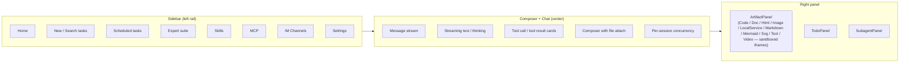
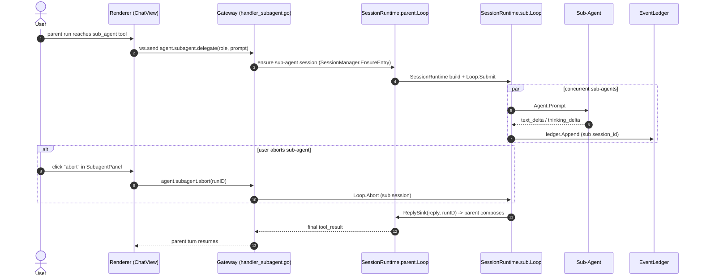

<a href="./GUIDE.md">English</a>
&nbsp;·&nbsp;
<a href="./GUIDE.zh-CN.md">简体中文</a>
&nbsp;·&nbsp;
<a href="../README.md">README</a>

# Guide

> Sessions, tools, todos, sub-agents, MCP, skills, memory, artifact sandbox, expert suite, scheduled tasks, IM overview, settings.

This is a tour of the renderer UI: what every view does, what every panel shows, and what each Go subsystem owns. Use it as a reference after you have [Quickstart](./QUICKSTART.md) up and running.

## Top-level layout



The sidebar entries map to `src/renderer/views/` (Home / Chat / Im / Skills / Mcp / ExpertSuite / Scheduled / Search / Workspaces / Settings).

## Chat — sessions, streaming, tools

A **session** is a single conversation with its own message history, agent loop, and per-session concurrency. Each session owns:

- A message stream rendered as Markdown with KaTeX math + code highlighting (`@vscode/markdown-it-katex` + Shiki).
- A run loop: `text_delta` and `thinking_delta` stream in over WebSocket as the agent responds. Tool calls render as collapsible cards; tool results show inline with full output.
- An artifact panel (right rail) for HTML / SVG / Mermaid / code / document / image / video / markdown that the agent produces. All artifacts render inside `sandbox` iframes — the main page DOM never sees AI output.

Sessions support **create / switch / rename / delete / search**, plus a lazy "draft" mode that creates the session row only after the first user message (so empty drafts don't pollute the sidebar).

## Tools — what the agent can call

The built-in tool set lives in `src/darvin-agent/internal/tools/`:

| Group | Tools |
|---|---|
| File ops | `read_file`, `write_file`, `edit_file`, `multi_edit`, `move_file`, `list_dir`, `glob`, `grep`, `notebook_edit` |
| Shell | `shell` — sandboxed, command whitelist enforced by `internal/tools/perm/` |
| Web | `web_fetch` |
| Code | `search`, `code_index`, `delete_symbol` — workspace-local symbol search & indexing |
| Tasks | `todo_write` (two-level checklist), `complete_step` (evidence-backed sign-off) |
| Composition | `subagent` (delegate / parallel), MCP bridge |

Each tool call has a permission check. The renderer prompts for approval when a tool needs explicit consent; see [`docs/DEVELOPMENT.md`](./DEVELOPMENT.md) for the permission registry shape.

## Todos — the artifact panel's TodoPanel

`todo_write` opens a two-level checklist that surfaces in the right-rail **TodoPanel**. `complete_step` is the evidence-backed sign-off — the agent declares a step done with the diff / output / file path that justifies it. The panel shows running / blocked / completed items; failed items keep the evidence so you can dig in.

## Sub-agents — delegate / parallel

When the agent spawns a sub-agent, you get a sub-agent panel entry with:

- The sub-agent's role and goal.
- Live progress (`text_delta` from the sub-agent's own session).
- A `abort` button that cancels the sub-agent cleanly without touching the parent.

Sub-agents run in their own session; the parent waits for results and incorporates them into the next turn. Parallel sub-agents share the parent's session-wide concurrency budget (configurable).

### Sub-agent delegation — sequence diagram



## MCP — Model Context Protocol

`McpView` lists every registered MCP server with its transport (`http` / `sse` / `stdio`), connection status, and tool count. Actions per server:

- **Register / unregister / update** — persists to Go's MCP store.
- **Connect / disconnect** — Go's MCP client resolves the transport, performs the MCP handshake, and registers the server's tools into the agent's tool registry.
- **Test** — performs a live `initialize` + `tools/list` round-trip; shows handshake duration + tool count.
- **Enable / disable** — temporarily removes a server's tools from the agent without losing registration.
- **Retry resolution** — re-runs the resolver fingerprint when a server's launch config changes.

MCP servers can also contribute prompts and resources; the agent handles them through the standard MCP lifecycle.

### MCP connect / test / enable — flowchart

```mermaid
flowchart TD
  R["Register<br/>(window.darvin.mcpRegister → mcp.Registry.persist)"]
  R --> C["Connect<br/>(resolve transport http/sse/stdio<br/>+ fingerprint")]
  C --> H["MCP handshake<br/>(initialize + tools/list)"]
  H --> T["Test<br/>(live round-trip →<br/>handshake duration + tool count)"]
  T --> E1["Enable<br/>(register server tools<br/>into tool registry)"]
  E1 --> U["Use<br/>(tools call via bridge →<br/>server → result)"]
  E1 --> D1["Disable<br/>(temporarily remove<br/>from registry)"]
  E1 --> U2["Unregister<br/>(persist delete)"]
  D1 -.re-enable.-> E1
  R -.retryResolution.-> C
```

## Skills

Skills are bundles of frontmatter + prompt + tool hints that the agent can discover and load on demand. The Skills view shows everything under the configured skill roots (workspace-local + user-global), with:

- **Scan** — re-walk the roots, reload frontmatter.
- **Install** — drop a new skill (from disk or URL) into the user-global root.
- **Toggle** — hide a skill from the agent without deleting it.

See [`specs/features/`](../../specs/) for individual skill designs.

## Memory

The memory subsystem keeps a small persistent state across sessions: user preferences, project conventions, recurring corrections. The agent can read / write memory entries via a tool, and the renderer surfaces the most-recent memory entries in the chat composer for easy reference. The Go side (`internal/memory`) handles persistence; the renderer never touches the database.

## Artifact sandbox

AI-produced artifacts (HTML / SVG / Mermaid / React / Code / Markdown / Image / Video / Text / Document) render inside `sandbox` iframes keyed by type. The iframe:

- Starts with `sandbox="allow-scripts"`.
- Adds `allow-same-origin` only when the renderer actually needs DOM APIs.
- Talks to the host only through a controlled `mount(artifact, container)` / `update(payload)` / `destroy()` surface — `contentWindow` is never re-exported.

Source payload (from Go agent IPC) is dispatched by type; it is never injected into the main page DOM via `innerHTML`.

## Expert suite

`ExpertSuiteView` lets you bind a curated prompt + tool subset + model to a one-click entry on the sidebar. Use it for repetitive workflows — "summarize this repo", "code review this PR", "draft a release note". Each expert is a named preset that runs as a regular session with the chosen tool filter.

## Scheduled tasks

`ScheduledView` shows cron-style tasks that fire in the background. Each task:

- Has a cron expression (5-field standard).
- Runs in a brand-new session (no chat history carried over).
- Posts its result back to your main session as a `ScheduleFired` notification (with the `runId` for traceability).
- Logs every run to the Go store; failed runs keep their last output.

### Scheduled-task firing — sequence diagram

```mermaid
sequenceDiagram
  autonumber
  participant E as Engine (scheduledtask/engine.go)
  participant SR as SessionRunner (gateway.SessionManager)
  participant L as Loop (headless session)
  participant AG as Agent
  participant B as Broadcaster (EventLedger)
  participant V as Renderer

  E->>E: cron tick → poll store for due tasks
  E->>SR: SubmitForSchedule(scheduleID, prompt)
  SR->>L: ensure fresh session + Loop.Submit
  L->>AG: Agent.Prompt (headless turn)
  AG-->>L: agent_end (final text + usage)
  L-->>SR: ReplySink (or final assistant)
  E->>B: Broadcast ScheduleFired { scheduleId, runId, triggeredAt }
  B-->>V: webContents.send (ScheduleFired push)
  Note over E: engine reconciles "running" run rows against IsRunActive;<br/>failureBadge=5 consecutiveErrors → UI badge
```

## IM channels — overview

`ImView` is the management surface for QQ / WeCom / WeChat instances. For each instance you can:

- Edit credentials (app secret show/hide + clear), access policy (open / allowlist / disabled).
- Run a **one-shot connectivity probe** — a structured check report (`auth_ok` pass / warn / fail) rather than a fake-ok.
- Scan QR (WeChat) to log in.
- See the latest `lastError` directly on the card.

Inbound messages from any IM instance are routed to a bound darvin session; outbound replies go back to the originating peer. See [`docs/IM.md`](./IM.md) for the full design.

## Workspaces

`WorkspacesView` manages the on-disk workspace roots. Each workspace is a folder the agent can read / write inside (subject to per-tool permission checks). Switching workspace re-roots the agent's file tools; sessions stay bound to the workspace they were started in.

## Search

`SearchView` is a full-text search across session titles and message bodies, scoped to the local store. It's the fastest way to find an old conversation without scrolling.

## Settings

`SettingsView` holds:

- **Models** — API key, optional Base URL, model picker, saved per provider. Saving restarts the Go child.
- **Theme** — light / dark + accent color (`orange` default; `blue` and `green` alt). Three accent colors with per-theme overrides via `<html data-accent="…">` so theme switching and accent switching are independent.
- **Language** — `zh` / `en` runtime switch. Both dictionaries live in `src/renderer/services/i18n.ts`; `assertSameKeys` enforces key parity in dev.
- **Permissions** — per-tool permission overrides for the current workspace.
- **Runtime status** — live read of the Go child: PID, port, last log, uptime.

## Keyboard shortcuts

The renderer ships a small set of bindings (see `keybindings.json`). Common ones:

| Shortcut | Action |
|---|---|
| `Cmd/Ctrl + K` | Open the command bar (search sessions, jump to view) |
| `Cmd/Ctrl + N` | New session |
| `Cmd/Ctrl + ,` | Settings |
| `Esc` | Close the active modal (delete-confirm / test-report) |

## What's intentionally not in the renderer

- Database access. The renderer never imports `better-sqlite3`. All persistence is in Go.
- LLM API keys. The renderer can read the configured providers but never the raw key.
- Network egress. The renderer cannot fetch arbitrary URLs — only via the agent's `web_fetch` tool (with permission) or through the preview server for local artifacts.
- Real-time IM transport. The renderer talks to Go via `window.darvin.im*` IPC; the actual WS / long-poll lives in `internal/im/`.