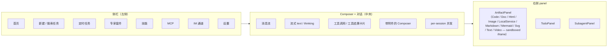
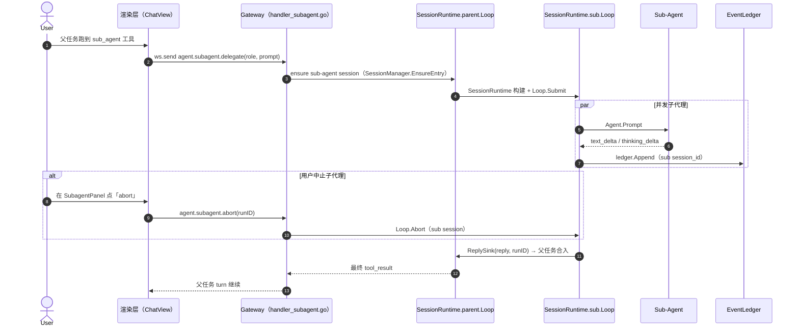
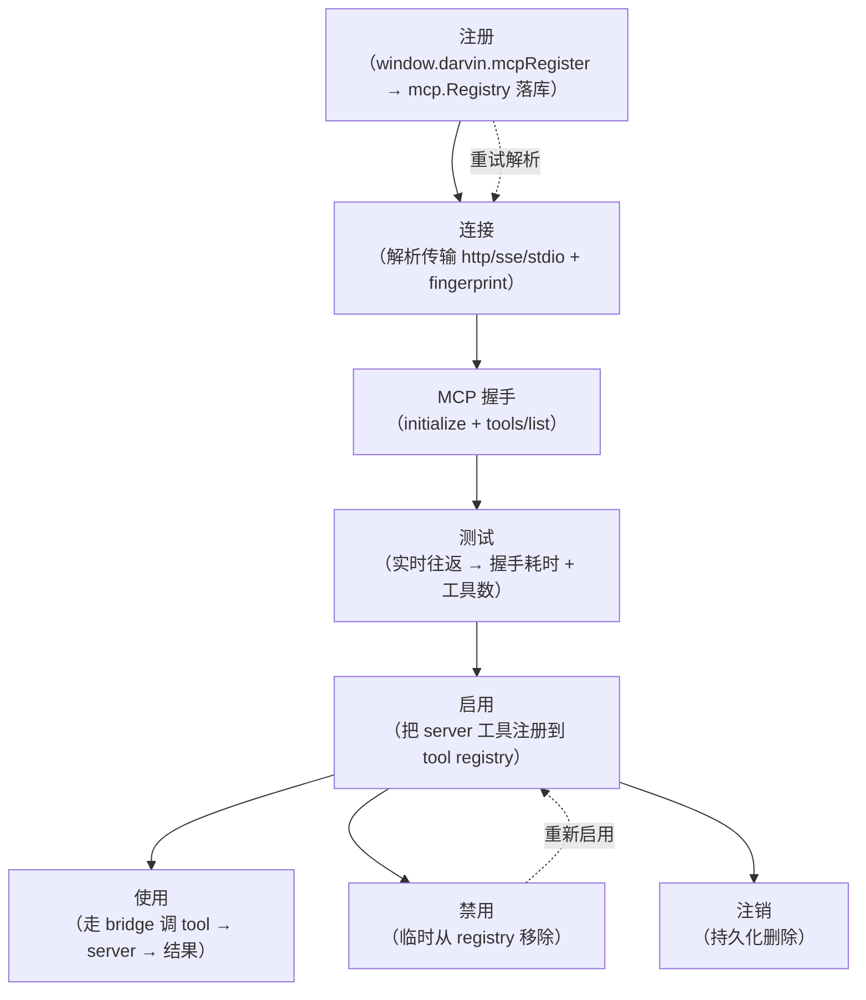
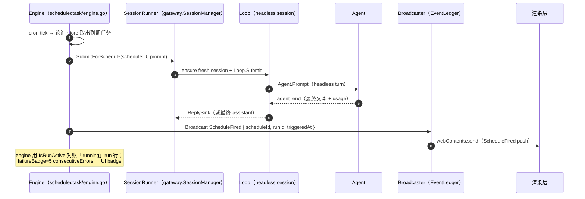

<a href="./GUIDE.md">English</a>
&nbsp;·&nbsp;
<strong>简体中文</strong>
&nbsp;·&nbsp;
<a href="../README.zh-CN.md">README</a>

# 使用指南

> 会话、工具、todo、sub-agents、MCP、skills、memory、artifact 沙箱、专家套件、定时任务、IM 总览、设置。

本文带你看一遍 renderer 侧的 UI——每个 view 做什么、每个侧栏 panel 显示什么、各 Go 子系统持有什么。在你已经按[快速开始](./QUICKSTART.md)把项目跑起来后，把它当参考。

## 整体布局

侧栏条目对应 `src/renderer/views/`（Home / Chat / Im / Skills / Mcp / ExpertSuite / Scheduled / Search / Workspaces / Settings）。

## 对话——会话、流式、工具

**会话（session）** 是一次独立的对话，拥有自己的消息历史、agent 循环、per-session 并发。每个会话持有：

- 消息流以 Markdown 渲染，KaTeX 数学公式 + 代码高亮（`@vscode/markdown-it-katex` + Shiki）。
- 运行循环：`text_delta` / `thinking_delta` 走 WebSocket 流式到达；工具调用渲染为可折叠卡片；工具结果内联展示完整内容。
- 右侧 **artifact panel** 用于 agent 产出的 HTML / SVG / Mermaid / code / document / image / video / markdown。**全部跑在 `sandbox` iframe 里**——主页面 DOM 永不接触 AI 产物。

会话支持 **创建 / 切换 / 重命名 / 删除 / 搜索**，以及懒「draft」模式（只在第一条用户消息后才创建会话行——空 draft 不会污染侧栏）。

## 工具——agent 能调什么

内置工具集在 `src/darvin-agent/internal/tools/`：

| 组 | 工具 |
|---|---|
| 文件 | `read_file`、`write_file`、`edit_file`、`multi_edit`、`move_file`、`list_dir`、`glob`、`grep`、`notebook_edit` |
| Shell | `shell`——沙箱化，命令白名单由 `internal/tools/perm/` 强制 |
| Web | `web_fetch` |
| 代码 | `search`、`code_index`、`delete_symbol`——工作区内符号搜索与索引 |
| 任务 | `todo_write`（两级清单）、`complete_step`（带证据签收） |
| 编排 | `subagent`（委派 / 并行）、MCP 桥接 |

每次工具调用都有权限检查。Renderer 在工具需要明确同意时弹确认；权限注册表的形态见 [`docs/DEVELOPMENT.md`](./DEVELOPMENT.md)。

## Todos——artifact 面板里的 TodoPanel

`todo_write` 打开一个两级清单，显示在右侧 **TodoPanel**。`complete_step` 是带证据的签收——agent 用能支撑结论的 diff / 输出 / 文件路径声明完成。面板展示 running / blocked / completed；失败项保留证据便于排查。

## Sub-agents——委派 / 并行

当 agent 派生 sub-agent 时，你会得到一个 sub-agent 面板条目：

- sub-agent 的角色与目标。
- 实时进度（来自 sub-agent 自己 session 的 `text_delta`）。
- 一个 `abort` 按钮，能干净取消 sub-agent 而不影响父任务。

Sub-agent 在自己的 session 跑；父任务等待结果并合入下一轮。**并行 sub-agent** 共享父任务的 session-wide 并发预算（可配置）。

### 子代理委派 —— 序列图

## MCP——Model Context Protocol

`McpView` 列出每个已注册的 MCP 服务器：传输（`http / sse / stdio`）、连接状态、工具数。每服务器操作：

- **注册 / 注销 / 更新**——持久化到 Go 的 MCP store。
- **连接 / 断开**——Go 的 MCP client 解析传输、走 MCP 握手、把服务器的工具注册进 agent 的工具注册表。
- **测试**——真实跑一次 `initialize` + `tools/list` 往返；显示握手耗时与工具数。
- **启用 / 禁用**——临时把服务器的工具从 agent 拿掉，不丢注册。
- **重试解析**——服务器启动配置变更后重新跑 resolver fingerprint。

MCP 服务器还能贡献 prompts / resources；agent 走标准 MCP 生命周期处理它们。

### MCP 连接 / 测试 / 启用 —— 流程图

## Skills

Skills 是 frontmatter + prompt + 工具提示的 bundle，agent 可以按需发现并加载。Skills view 显示所有配置的 skill 根（工作区本地 + 用户全局）下的条目，操作：

- **扫描**——重新走根、加载 frontmatter。
- **安装**——把新 skill（本地或 URL）放进用户全局根。
- **开关**——从 agent 视图里隐藏 skill，不删除。

各 skill 设计见 [`specs/features/`](../../specs/)。

## Memory

记忆子系统跨 session 保留少量持久状态：用户偏好、项目惯例、反复出现的纠错。Agent 通过工具读写 memory 条目；renderer 在 chat composer 旁显示最近几条方便引用。Go 侧（`internal/memory`）负责持久化；renderer 永不碰数据库。

## Artifact 沙箱

AI 产物（HTML / SVG / Mermaid / React / Code / Markdown / Image / Video / Text / Document）按类型在 `sandbox` iframe 里渲染。iframe：

- 起步 `sandbox="allow-scripts"`。
- 仅当 renderer 真需要 DOM API 时再加 `allow-same-origin`。
- 只通过受控的 `mount(artifact, container)` / `update(payload)` / `destroy()` 接口与宿主通信——`contentWindow` 永不直接透出。

源 payload（来自 Go agent IPC）按类型分派；**永不**通过 `innerHTML` 注入主页面 DOM。

## 专家套件

`ExpertSuiteView` 把精选 prompt + 工具子集 + 模型绑成一个一键入口，挂在侧栏。适合重复 workflow——「给本仓库写摘要」「给这个 PR 做代码评审」「起草 release note」。每个专家是一个命名预设，作为普通 session 跑、套用选定的工具过滤。

## 定时任务

`ScheduledView` 显示以 cron 风格在后台触发的任务。每个任务：

- 一条 cron 表达式（5 字段标准）。
- 在全新 session 里跑（不带 chat 历史）。
- 完成后以 `ScheduleFired` 通知推回主 session（带 `runId` 便于追溯）。
- 每次 run 都记到 Go store；失败的 run 保留最后一次输出。

### 定时任务触发 —— 序列图

## IM 通道——总览

`ImView` 是 QQ / 企业微信 / 个人微信实例的管理面。每个实例可：

- 编辑凭据（secret 明文/隐藏 + 清空）、访问控制（open / allowlist / disabled）。
- 跑**一次性连通性探测**——返回结构化检查报告（`auth_ok` pass / warn / fail），不是假 ok。
- 扫码登录（个人微信）。
- 卡片上直接看最近 `lastError`。

各 IM 实例的入站消息路由到绑定的 darvin session；出站回给原 peer。完整设计见 [`docs/IM.md`](./IM.md)。

## Workspaces

`WorkspacesView` 管理工作区根目录（磁盘上的文件夹）。每个 workspace 是 agent 可读写的根（受每工具权限检查约束）。切换 workspace 重新锚定 agent 的文件工具；session 仍绑在开始时的 workspace 上。

## 搜索

`SearchView` 跨会话标题和消息正文做全文搜索，作用域为本地 store。找旧对话最快的办法，不必滚动。

## 设置

`SettingsView` 包括：

- **Models**——API key、可选 Base URL、模型选择器，按 provider 保存。保存会重启 Go 子进程。
- **主题**——浅 / 深色 + accent 色（默认 `orange`；可选 `blue` / `green`）。三种 accent 通过 `<html data-accent="…">` 覆盖，互不干扰。
- **语言**——`zh` / `en` 运行时切换。字典在 `src/renderer/services/i18n.ts`；`assertSameKeys` 在 dev 强制 key 对齐。
- **权限**——当前 workspace 的每工具权限覆盖。
- **运行时状态**——Go 子进程的实时读数：PID、端口、最近日志、运行时长。

## 键盘快捷键

Renderer 自带少量快捷键（见 `keybindings.json`）。常用：

| 快捷键 | 动作 |
|---|---|
| `Cmd/Ctrl + K` | 打开命令条（搜索会话、跳转到 view） |
| `Cmd/Ctrl + N` | 新建会话 |
| `Cmd/Ctrl + ,` | 设置 |
| `Esc` | 关闭当前 modal（删除确认 / 测试报告） |

## 故意不在 renderer 的事

- **数据库访问**。Renderer 永不 import `better-sqlite3`。所有持久化都在 Go。
- **LLM API key**。Renderer 可读配置的 provider，但永不读明文 key。
- **网络出口**。Renderer 不可任意发 URL——只能通过 agent 的 `web_fetch` 工具（带权限），或本地 artifact 预览服务。
- **实时 IM 传输**。Renderer 只走 `window.darvin.im*` IPC 与 Go 通信；真实的 WS / 长轮询在 `internal/im/`。