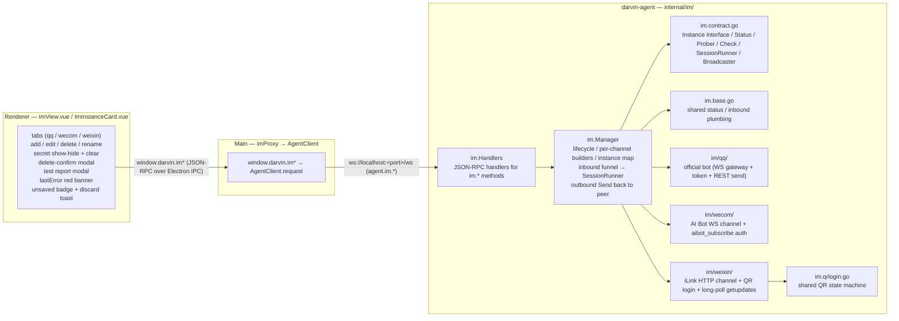
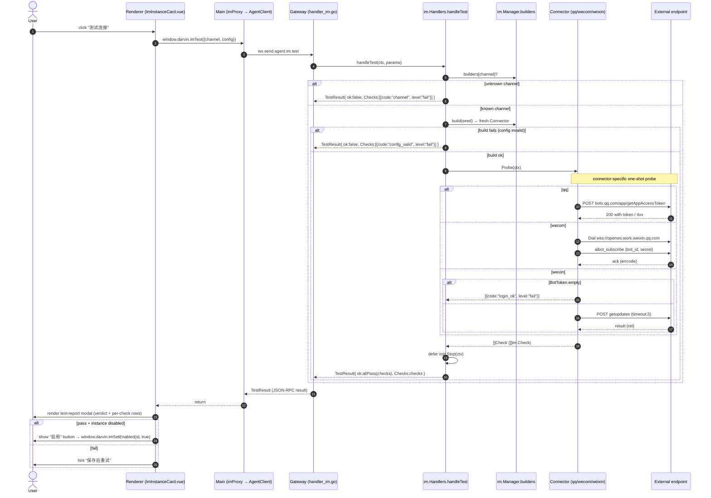
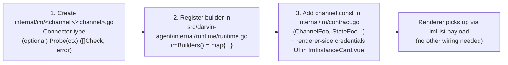

<a href="./IM.md">English</a>
&nbsp;·&nbsp;
<a href="./IM.zh-CN.md">简体中文</a>
&nbsp;·&nbsp;
<a href="../README.md">README</a>

# IM Channels

> QQ / WeCom / WeChat connectors with real one-shot connectivity probes, structured check reports, instance management, and QR login for WeChat.

The IM subsystem lives in `src/darvin-agent/internal/im/`. It is a pluggable transport that bridges external IM bots to darvin sessions: an inbound message from any of the three supported channels is normalized and dispatched to a bound session, the agent runs a headless turn, and the reply is routed back to the originating peer through the same channel.

## Architecture



## Channels

### QQ — official bot

- **Transport**: Discord-style WebSocket gateway against `https://api.sgroup.qq.com`. REST for sends.
- **Auth**: app access token, refreshed on demand against `https://bots.qq.com/app/getAppAccessToken`. Cached for ~1 minute before expiry to avoid a hot-token edge case.
- **Send**: `POST /v2/users/{peerID}/messages` for C2C, `POST /v2/groups/{peerID}/messages` for groups. Every send carries a fresh `msg_seq` for idempotency / ordering.
- **Receive**: WS gateway pump; op `0` (Dispatch) is decoded into `InboundMessage`. Heartbeat-driven keepalive; reconnect with exponential backoff. Fatal codes (e.g. 4014) stop the loop rather than retry.
- **Probe**: real `ensureToken` round-trip against the QQ token endpoint — never reads the cached token. Cached-token path does not fire because `handleTest` builds a fresh connector with no cache state.

### WeCom — enterprise WeChat AI Bot

- **Transport**: WebSocket against `wss://openws.work.weixin.qq.com`.
- **Auth**: `aibot_subscribe` with `bot_id` + `secret`. Wait for the `aibot_subscribe` ack; non-zero `errcode` is a fatal failure.
- **Send**: `aibot_send_msg` over the same socket. Active sends support markdown / template_card / media; text is sent as markdown (matching the official `@wecom/aibot-node-sdk`).
- **Receive**: `aibot_msg_callback` frames for inbound messages, dispatched to the bound session.
- **Probe**: independent one-shot dial + `aibot_subscribe` + `waitAuth` + `Close` session. The probe has its own `probeTimeout` (`20s`) on top of `waitAuth`'s own read deadline (`10s`); `waitAuth` does not observe ctx, so the outer ctx is a belt-and-braces cap.

### WeChat — personal (iLink)

- **Transport**: HTTP against the fixed iLink base `https://ilinkai.weixin.qq.com`.
- **Login**: `GET /ilink/bot/get_bot_qrcode?bot_type=3` returns a QR image + scan key; `GET /ilink/bot/get_qrcode_status?qrcode=…` long-polls the status (`waiting / scanned / confirmed / expired`). On `confirmed` the renderer auto-saves the instance with the returned `bot_token` + `ilink_bot_id`.
- **Send**: `POST /ilink/bot/sendmessage` with the message envelope the openclaw-weixin plugin uses (`base_info.channel_version`, `text_item.text`, a fresh `client_id` per send).
- **Receive**: long-poll `POST /ilink/bot/getupdates` with `timeout: 50`. iLink `ret == -14` means session timeout — the connector clears local cursor + cached `context_token` and reconnects.
- **Probe**: independent probe-only `getupdates` with `timeout: 3` — **does not** touch the cursor, **does not** cache `context_token`, **does not** dispatch inbound. The `BotToken` is required; a missing token short-circuits with a `login_ok: fail` check, no network call.

## Prober — one-shot connectivity check

The legacy `imTest` handler only called `build()` and returned `{ok: true}` — fake-ok. The new `Prober` interface is the consumer-side contract that gives the renderer a structured check report.

`internal/im/contract.go`:

```go
// Prober performs a one-shot connectivity check for the candidate config
// without persisting or staying connected. Connectors able to probe implement
// it; others fall back to a build-only pass.
type Prober interface {
    Probe(ctx context.Context) ([]Check, error)
}

// Check is one granular connectivity check inside a probe report.
type Check struct {
    Code   string `json:"code"`
    Title  string `json:"title"`
    Level  string `json:"level"` // pass | warn | fail
    Detail string `json:"detail,omitempty"`
}
```

Behavior:

- Each connector implements `Probe(ctx) ([]Check, error)`.
- The handler in `internal/im/handlers.go` runs `Probe` against a freshly-built instance, then `defer inst.Stop`. The instance never becomes part of the manager's instance map.
- Errors merge into `Checks` (`level:"fail"`). An empty report is treated as unresolved (not pass).
- All errors funnel through the single `TestResult` shape — `Checks` carries every judgement, `Error` is a fallback; `imTest` no longer returns JSON-RPC errors for "unknown channel" or "bad config" — those fold into `{code: "channel" / "config_valid", fail}`.

### `imTest` / `Prober` — sequence diagram



Stable `code` values emitted by the connectors (renderer i18n maps each `code` to a user-visible title):

| Code | Title | Used by |
|---|---|---|
| `auth_ok` | App access token (QQ) / Gateway auth (WeCom) / Get updates (WeChat) | All three connectors |
| `login_ok` | Bot token (WeChat) / Session (WeChat on `-14`) | WeChat |
| `config_valid` | Config | handler (build failure) |
| `channel` | Connector | handler (unknown channel) |
| `build_ok` | Build | handler (fallback when connector doesn't implement `Prober`) |
| `probe` | Probe | handler (probe returned error with empty checks) |

## Instance management

`manager.go` owns the live instance set: one per IM channel per registered config. The manager:

- Builds connectors from persisted config via the channel-specific builder (registered in `runtime.go: im.ChannelQQ → qq.NewConnector`, etc.).
- Wires the inbound handler to the session runner (`SubmitForIM(ctx, imKey, prompt, sink)`).
- Routes outbound replies back through `inst.Send(ctx, target, outbound)`.
- Hot-reloads on config update (`Update(ctx, id, patch)` rebuilds and restarts).
- Pushes notifications (`ImChanged` / `ImStatusChanged`) through the WebSocket Broadcaster so the renderer refetches.

Each instance reports a `Status`:

```go
type Status struct {
    Channel    string `json:"channel"`
    InstanceID string `json:"instanceId"`
    Enabled    bool   `json:"enabled"`
    State      string `json:"state"` // connected | disconnected | error | login_expired | stopped
    LastError  string `json:"lastError,omitempty"`
    StartedAt  int64  `json:"startedAt,omitempty"` // unix ms
    SentCount  int64  `json:"sentCount"`
    RecvCount  int64  `json:"recvCount"`
}
```

The renderer surfaces `lastError` directly on the card (red banner) so connection failures don't have to be diagnosed after running the test again.

## RPC surface

`agent.im.*` methods the renderer can call (`src/shared/darvin-api.ts`):

| Method | Purpose |
|---|---|
| `imList` | List all instances + status snapshot |
| `imGet` | One instance |
| `imCreate` | Create an instance; persists config + starts if `enabled=true` |
| `imUpdate` | Patch update; hot-reloads if running |
| `imDelete` | Stop + remove |
| `imSetEnabled` | Toggle enabled flag (start or stop) |
| `imTest` | Run the `Prober` against a candidate config |
| `imLoginStart` | Begin a QR login session (WeChat) |
| `imLoginPoll` | Poll a QR login session |

Push events:

- `ImChanged` — config mutation (create / update / delete / enable toggle).
- `ImStatusChanged` — connection state transition.

## Renderer UI

`src/renderer/components/im/ImInstanceCard.vue` (per-channel list view, `src/renderer/views/ImView.vue`):

- One card per instance, with status pill + lastError banner.
- Edit panel: name / credential / access policy fields; secret inputs have eye toggle + ✕ clear.
- Delete button opens a confirmation modal that names the instance before destroying it.
- Inline rename: click the name to enter edit, `Enter` or blur saves; empty falls back to the channel name.
- Unsaved-changes badge appears the moment any edit-panel field changes; switching tabs / closing the edit while dirty fires a discard toast.

The test report modal:

- Verdict: green (all `pass`), yellow (some `warn`), red (any `fail`).
- Per-check rows: level icon + title + detail (when present).
- On `pass` for a currently-disabled instance, an **Enable** button is offered manually (no silent auto-enable).
- On `fail`, the modal hints "save and retry".

## Design notes

- **Prober is optional.** Connectors without a `Probe` method still respond to `imTest` with a single `build_ok: pass` check. The interface is opt-in by design — it costs nothing to skip and earns a lot when implemented.
- **No silent auto-enable on probe pass.** LobsterAI flips enabled after `auth_check`; darvin-cowork surfaces a manual confirmation button in the modal to avoid accidental enable.
- **Per-session IM workspaces.** The manager ensures one dedicated workspace per IM instance so the UI can group all sessions from the same channel under a stable, named workspace.
- **Probe timeout strategy is layered.** Each connector picks a reasonable upper bound for its own probe (`Probe` ctx timeout). When the underlying transport doesn't observe ctx (e.g. WeCom `waitAuth` uses a WS read deadline), the probe ctx is still a belt-and-braces cap.
- **`-14` handling is channel-specific.** QQ doesn't have it. WeCom doesn't have it. WeChat does — the probe surfaces it as a `login_ok: fail` check so the user knows to re-scan, not "save and retry".

## Future channels

Adding a new IM channel (e.g. Feishu, DingTalk) is intentionally a three-step change:

