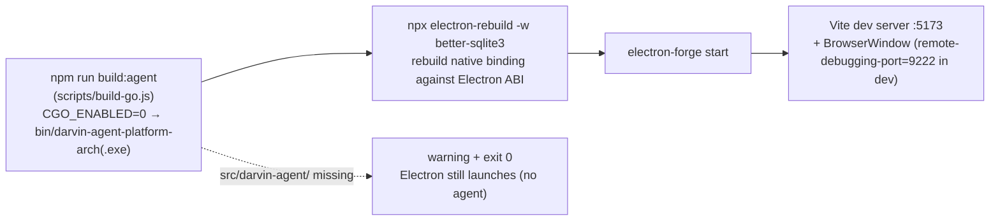
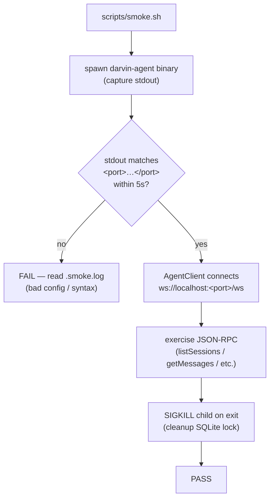

<a href="./QUICKSTART.md">English</a>
&nbsp;·&nbsp;
<a href="./QUICKSTART.zh-CN.md">简体中文</a>
&nbsp;·&nbsp;
<a href="../README.md">README</a>

# Quickstart

> Install, configure, build, troubleshoot.

## Requirements

- **Node.js** `>= 20` (the project pins `electron 43.2.0`).
- **Go** `>= 1.22` (for building the agent).
- **Platform**: Windows / macOS / Linux.

If you don't have a Go toolchain, see [Building without Go](#building-without-go) below — `npm install` is enough for the renderer side, but `npm start` will skip the Go agent.

## Install

```sh
git clone https://github.com/darven-cs/darvin-cowork.git
cd darvin-cowork
npm install
```

`npm install` brings down Electron, Vite, Tailwind, Vitest, ESLint, plus native dependencies (`better-sqlite3`) which `prestart` rebuilds against the local Electron ABI.

## Run

```sh
npm start
```

What `prestart` does for you, in order:



1. `npm run build:agent` — compiles the Go agent to `bin/darvin-agent-<platform>-<arch><.exe?>` with `CGO_ENABLED=0`. If `src/darvin-agent/` is missing, this step prints a warning and exits 0 — `npm start` still launches Electron (the agent just won't run).
2. `npx electron-rebuild -w better-sqlite3` — rebuilds `better-sqlite3` against the bundled Electron headers.
3. `electron-forge start` — opens the Vite dev server (renderer on `:5173`) and the Electron window pointed at it.

The Electron main process opens `remote-debugging-port=9222` only when `!app.isPackaged` (dev mode) so tools like `electron-cdp` can drive the window without launching a new browser.

## Configure an API key

The Go runtime reads the key from three places, in this order:

1. `LLM_API_KEY` environment variable.
2. The user-level `config.yaml` (set via the in-app `Settings → Models` page).
3. The repo-level `src/darvin-agent/config.yaml` (intentionally empty by default).

Path of the user-level `config.yaml`:

| Platform | Path |
|---|---|
| Linux | `~/.config/darvin-cowork/config.yaml` |
| macOS | `~/Library/Application Support/darvin-cowork/config.yaml` |
| Windows | `%APPDATA%\darvin-cowork\config.yaml` |

The Go path is computed by `config.UserConfigPath()`; the Electron path uses `app.getPath('userData')`. They agree on every platform.

### In-app setup (recommended)

`Settings → Models → paste key (optional Base URL) → save`. Saving restarts the Go child process so the new value takes effect immediately.

### Environment variable

```sh
export LLM_API_KEY=sk-ant-...
npm start
```

> Never commit a real key into `src/darvin-agent/config.yaml`. The repo ships with an empty `llm.api_key` on purpose.

To clear the key and start fresh, delete the user-level `config.yaml`. The next launch falls back to the repo file / env var.

## Build & package

```sh
npm run build:agent    # Go binary → bin/darvin-agent-<platform>-<arch><.exe?>
npm run package        # unpacked app (auto-runs build:agent first)
npm run make           # installers: deb / rpm (Linux) · squirrel / zip (Windows) · zip (macOS)
```

`extraResources` filters `bin/` to **only** the current-platform binary. Cross-platform binaries sitting in `bin/` from a previous build will not be shipped into the installer.

## Verify

```sh
npm run smoke                      # headless: spawn binary, exercise JSON-RPC, no API key needed
node .claude/skills/electron-cdp/scripts/edrv.mjs ping   # drive the running app over CDP
```

`npm run smoke` (in CI) verifies that the packaged binary starts, prints `<port>` within the timeout, answers JSON-RPC, and shuts down cleanly. It does **not** touch any LLM endpoint.



## Troubleshooting

**`npm start` says it can't find `darvin-agent-<platform>-<arch>`.**

Run `npm run build:agent` and read the Go compile error. The expected output filename depends on the current `process.platform` / `process.arch`. Binaries copied from another OS will not be recognized.

**Smoke stalls waiting for `<port>` line.**

Read `.smoke.log`. If the Go child exits before printing `<port>`, config loading is usually the cause (e.g. the user-level `config.yaml` has a syntax error). Delete that file and retry.

**`npm start` rebuilds `better-sqlite3` every time.**

This is intentional — the native binding must match the local Electron ABI. If you really want to skip it, run the build first (`npm run build:agent` + `npx electron-rebuild`) and then invoke `electron-forge start` directly. Not recommended.

**`pnpm` / `yarn` / other lockfiles.**

The repo only ships `package-lock.json`. Using another lockfile works at your own risk — native rebuild steps assume `npm`.

**Windows: installer takes a long time / hangs.**

The `squirrel` maker packs the app for the first time on each fresh tag. Subsequent `npm run make` runs reuse the cached workdir in `out/make/squirrel.windows/x64/`.

**Renderer layout breaks after a HMR reload.**

Tailwind v4 reads tokens at build time; a stale `index.css` import or a removed `@theme` token can leave orphaned utilities. Restart `npm start`.

**GitHub repo URL in the README badge looks wrong.**

The README currently points at `https://github.com/darven-cs/darvin-cowork` as a placeholder. Replace with your fork's URL once you publish.

## Building without Go

If you don't have Go installed but want to look at the renderer:

```sh
npm install
npm run lint
npm test
```

Renderer-only work does not need the Go agent. To open the Electron window, install Go and run `npm start` — there is no renderer-only quickstart.

## Next steps

- [Architecture](./ARCHITECTURE.md) — three-process architecture, IPC contract.
- [Guide](./GUIDE.md) — sessions, tools, todos, sub-agents, MCP, skills, artifact sandbox.
- [IM Channels](./IM.md) — QQ / WeCom / WeChat connectors.
- [Development](./DEVELOPMENT.md) — dev workflow, Go `fmt` / `vet` / `lint`, project-specific engineering rules.