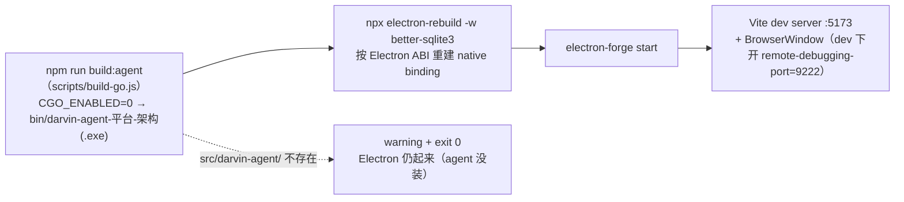
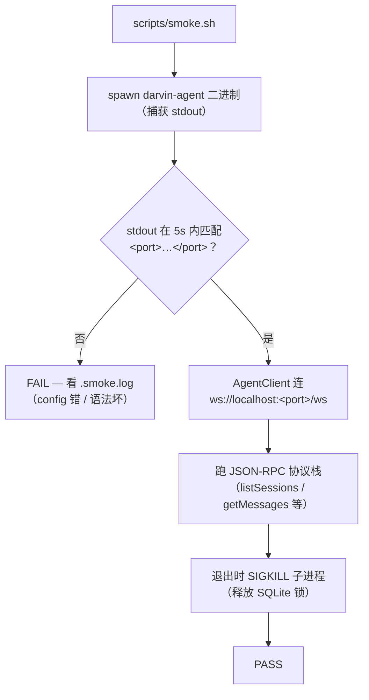

<a href="./QUICKSTART.md">English</a>
&nbsp;·&nbsp;
<strong>简体中文</strong>
&nbsp;·&nbsp;
<a href="../README.zh-CN.md">README</a>

# 快速开始

> 安装、配置、构建、排障。

## 环境要求

- **Node.js** `>= 20`（项目固定 `electron 43.2.0`）。
- **Go** `>= 1.22`（构建 agent 用）。
- **平台**：Windows / macOS / Linux。

没有 Go 工具链也能跑（仅渲染层），但 `npm start` 会跳过 Go agent——见下方「[无 Go 构建](#无-go-构建)」。

## 安装

```sh
git clone https://github.com/darven-cs/darvin-cowork.git
cd darvin-cowork
npm install
```

`npm install` 拉下 Electron、Vite、Tailwind、Vitest、ESLint，以及 native 依赖 `better-sqlite3`，`prestart` 会按本地 Electron ABI 重建它。

## 运行

```sh
npm start
```

`prestart` 自动顺序执行：



1. `npm run build:agent`——把 Go agent 编到 `bin/darvin-agent-<平台>-<架构><.exe?>`，`CGO_ENABLED=0`。若 `src/darvin-agent/` 不存在，这步打 warning 后 `exit 0`，Electron 仍会起来（只是 agent 没装）。
2. `npx electron-rebuild -w better-sqlite3`——按 Electron 内置 headers 重建 `better-sqlite3`。
3. `electron-forge start`——起 Vite dev server（renderer 在 `:5173`）并打开 Electron 窗口。

主进程仅在 `!app.isPackaged`（dev）下开 `remote-debugging-port=9222`，方便 `electron-cdp` 之类工具直接驱动运行中的窗口（不另开浏览器）。

## 配置 API key

Go 运行时按以下优先级读取 key：

1. `LLM_API_KEY` 环境变量。
2. 用户级 `config.yaml`（通过应用内 `Settings → Models` 设置）。
3. 仓库内 `src/darvin-agent/config.yaml`（默认留空）。

用户级 `config.yaml` 路径：

| 平台 | 路径 |
|---|---|
| Linux | `~/.config/darvin-cowork/config.yaml` |
| macOS | `~/Library/Application Support/darvin-cowork/config.yaml` |
| Windows | `%APPDATA%\darvin-cowork\config.yaml` |

Go 端路径由 `config.UserConfigPath()` 计算；Electron 端用 `app.getPath('userData')`。两个值在所有平台一致。

### 在应用内设置（推荐）

`Settings → Models → 填入 Key（可选 Base URL）→ 保存`。保存后主进程自动重启 Go 子进程使新值即时生效。

### 环境变量

```sh
export LLM_API_KEY=sk-ant-...
npm start
```

> 仓库内 `src/darvin-agent/config.yaml` 的 `llm.api_key` 刻意留空，**不要**提交真实 key。

想清空 key 重来？删除用户级 `config.yaml`，下次启动自动回落。

## 构建与打包

```sh
npm run build:agent    # Go 二进制 → bin/darvin-agent-<平台>-<架构><.exe?>
npm run package        # 生成 unpacked 应用（自动先 build:agent）
npm run make           # 打安装包：deb / rpm（Linux）· squirrel / zip（Windows）· zip（macOS）
```

`extraResources` 过滤 `bin/` 仅保留**当前平台**的二进制——之前留下的其他平台产物不会被打入安装包。

## 验证

```sh
npm run smoke                      # 无头：spawn 二进制、跑 JSON-RPC，无需 API key
node .claude/skills/electron-cdp/scripts/edrv.mjs ping   # 通过 CDP 驱动运行中的应用
```

`npm run smoke`（在 CI 中）验证打包后的二进制能起来、在超时内打出 `<port>`、能响应 JSON-RPC、干净关闭。它**不**碰任何 LLM 接口。



## 排障

**`npm start` 报找不到 `darvin-agent-<平台>-<架构>`。**

单独跑 `npm run build:agent` 看 Go 编译错误。预期文件名由 `process.platform` / `process.arch` 决定；从其他系统复制过来的二进制不会被识别。**

**smoke 卡在等 `<port>` 行。**

看 `.smoke.log`。如果 Go 子进程在打印 `<port>` 之前就退出，通常是配置加载失败（用户级 `config.yaml` 语法坏了）。删掉它重试。

**`npm start` 每次都重建 `better-sqlite3`。**

正常——native binding 必须匹配本地 Electron ABI。实在要跳过：先 `npm run build:agent` + `npx electron-rebuild`，然后直接 `electron-forge start`。不推荐。

**`pnpm` / `yarn` / 其他 lockfile。**

仓库只发 `package-lock.json`。用别的 lockfile 自担风险——native 重建步骤假设的是 `npm`。

**Windows：installer 时间长 / 卡住。**

`squirrel` maker 第一次打新 tag 时全量打包；之后的 `npm run make` 复用 `out/make/squirrel.windows/x64/` 的缓存 workdir。

**HMR reload 后渲染层布局坏掉。**

Tailwind v4 在构建时读 token；`index.css` 引用过期或 `@theme` token 被删会留下孤儿 utility。重启 `npm start`。

**README badge 里的 GitHub repo URL 不对。**

README 当前指向 `https://github.com/darven-cs/darvin-cowork` 作为占位，发布后换成自己的 fork URL。

## 无 Go 构建

没装 Go 但想看渲染层：

```sh
npm install
npm run lint
npm test
```

纯 renderer 工作不需要 Go agent。要打开 Electron 窗口，请装 Go 后跑 `npm start`——没有「renderer-only quickstart」。

## 下一步

- [架构](./ARCHITECTURE.md) — 三进程架构、IPC 契约。
- [使用指南](./GUIDE.md) — 会话、工具、todo、sub-agents、MCP、skills、artifact 沙箱。
- [IM 通道](./IM.md) — QQ / 企业微信 / 个人微信连接器。
- [开发](./DEVELOPMENT.md) — dev 流程、Go `fmt` / `vet` / `lint`、本仓库工程规范。