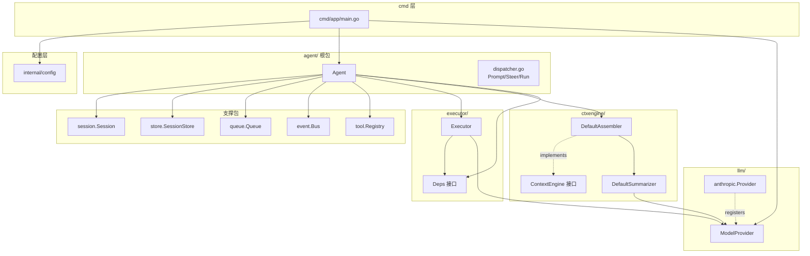
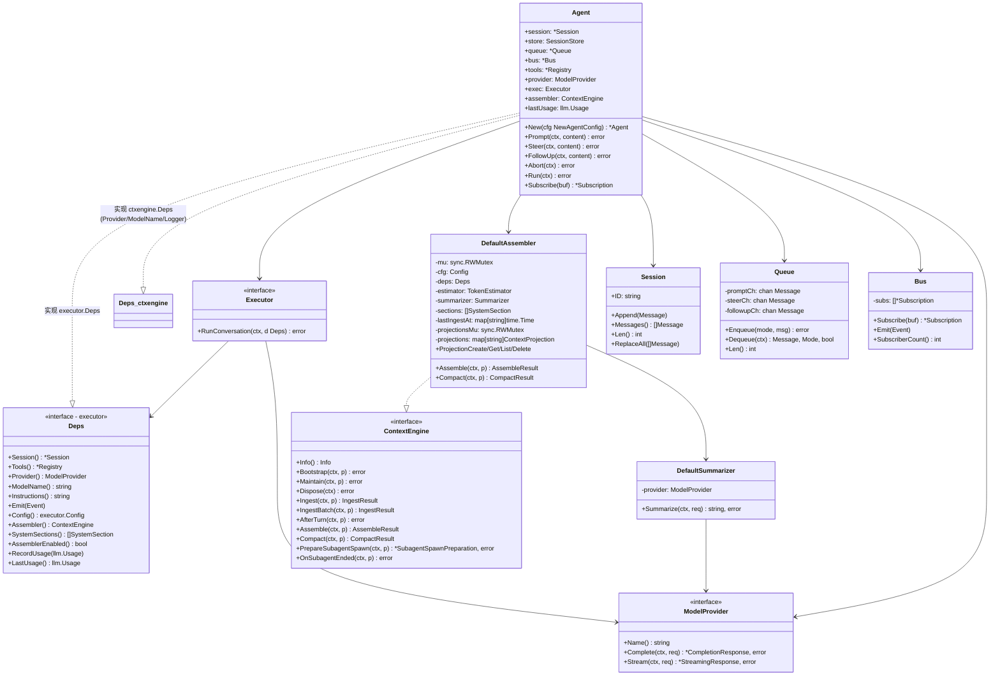
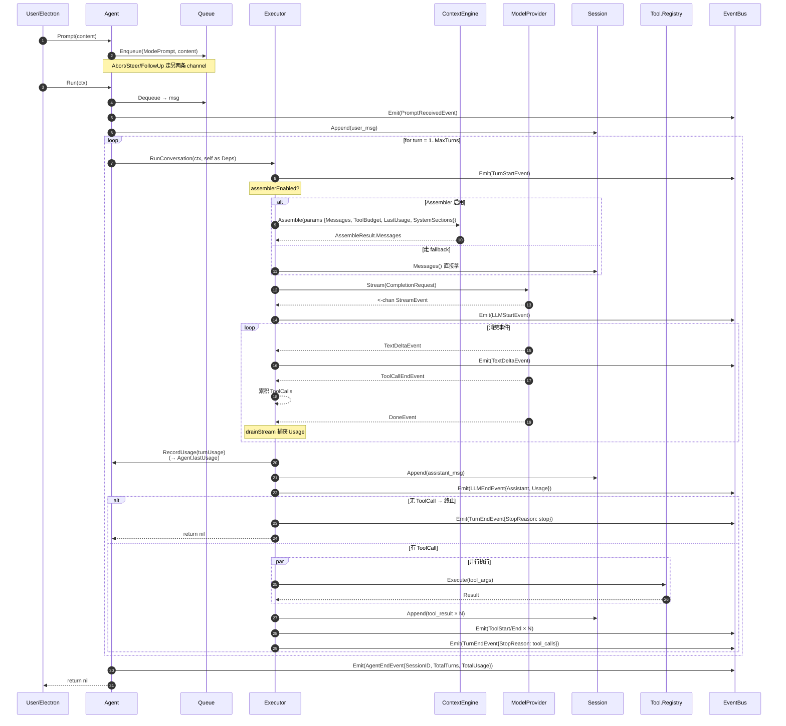
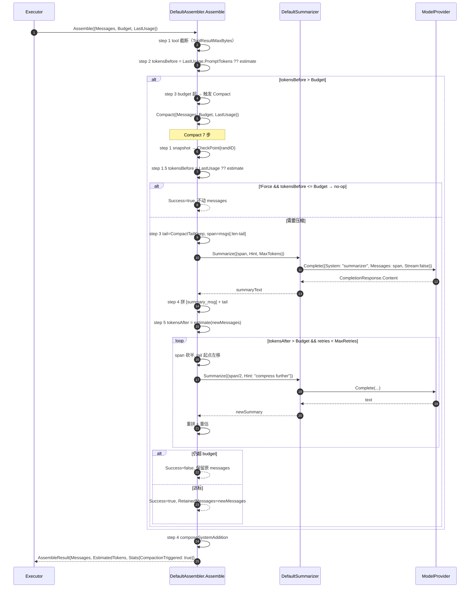
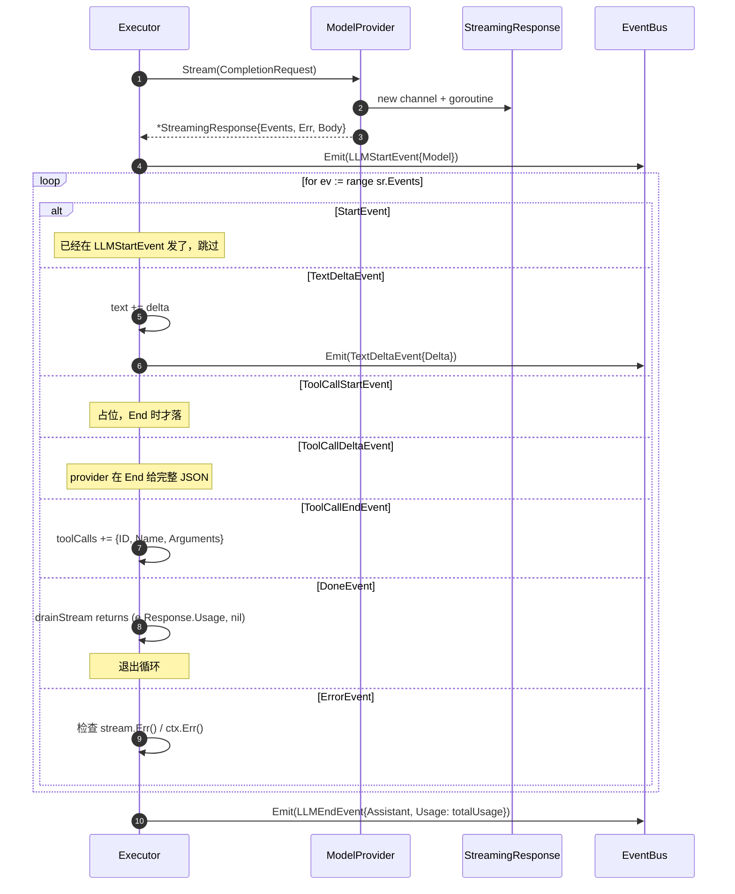

# Agent 包当前状态

> 范围：`src/darvin-agent/`。本包作为 Electron 主进程 spawn 的子进程二进制运行。
> 配套文档：`agent-package-roadmap.md`（前瞻路线图）。

---

## 一、已完成（2026-07 截止）

### ContextEngine 规范 7 个里程碑全链路打通

| Milestone | 内容 | 关键文件 |
|-----------|------|---------|
| **M1** pkg 骨架 + 接口契约 | `ContextEngine` 10 方法接口 + `*DefaultAssembler` compile-time assertion + 全 stub | `ctxengine/ctxengine.go`, `params.go` |
| **M2** token 估算 + tool 截断 | `EstimateCharsOver4`（rune/4） + Assemble step 1 超大 tool 输出截断 | `ctxengine/tokens.go`, `assemble.go` |
| **M3** DefaultSummarizer + Compact LLM | 7 步管线：snapshot → no-op → tail/span 切分 → 摘要 → retry-half → 失败安全 | `ctxengine/compact.go` |
| **M4** executor seam + Deps 扩展 + API token 适配 | `Usage.PromptTokens` 通过 `LastUsage` 喂回 assembler/compact 优先于估算 | `executor/executor.go`, `agent/agent.go`, `ctxengine/params.go` |
| **M5** Agent 集成 + NewAgentConfig | Config 增 7 ctxengine 字段；`New` 自动构造 DefaultAssembler | `agent/agent.go` |
| **M6** Ingest/AfterTurn/Bootstrap/Maintain/Dispose + Projection | 4 个 stub no-op + ProjectionCreate/Get/List/Delete 内存注册 | `ctxengine/{ingest,after_turn,lifecycle,projection}.go` |
| **M7** 配置 + cmd 文档同步 | `config.AgentConfig` 增 7 ctxengine 字段 + `config.yaml` 默认值 + `cmd/app/main.go` 装配 agent | `internal/config/config.go`, `config.yaml`, `cmd/app/main.go` |

### 其他已完成模块

| 模块 | 内容 | 关键文件 |
|------|------|---------|
| **LLM 抽象** | `ModelProvider` 接口 + `NewProvider` 工厂 + ProviderFactory 注册表 + Anthropic 完整实现（HTTP client + 重试 + 指数退避） | `llm/{provider,registry,events,types,errors,httpclient}.go`, `llm/anthropic/` |
| **流式事件协议** | 7 类 `StreamEvent`：Start / TextDelta / ToolCallStart·Delta·End / Done / Error | `llm/events.go` |
| **Executor 单 turn 编排** | `RunConversation` 循环 + `drainStream` 捕获 Usage + 工具并行执行 + panic 隔离 | `executor/executor.go` |
| **Agent 主入口** | `Run/Prompt/Steer/FollowUp/Abort/Subscribe` 公共 API + 状态机 + 总 usage 累加 | `agent/agent.go`, `dispatcher.go` |
| **3 通道优先级队列** | steer > prompt > followup，非阻塞 Enqueue，ctx-cancel Dequeue | `queue/queue.go` |
| **Event Bus** | 14 种 `Event` 类型，订阅-发布，channel 满丢 oldest | `event/event.go` |
| **Session** | 内存消息历史 + 深拷贝 + Append/ReplaceAll/Meta | `session/session.go` |
| **SessionStore (内存)** | `MemoryStore` 占位 + `SQLiteStore` TODO | `store/{store,memory}.go` |
| **5 个内置工具** | read_file / write_file / edit_file / list_dir / shell + 工作目录沙箱 + shell 命令 allowlist | `tool/{tool,registry,builtins,fs,shell,sandbox,params}.go` |
| **配置** | viper 加载 + `Config{App, Database, Log, LLM, Agent}` + AgentConfig 13 字段 | `internal/config/config.go` |
| **测试** | 12 个包，race 干净，gofmt 干净 | 各包 `_test.go` |

---

## 二、实体关系

### 包结构依赖图



### 核心实体 class 图



---

## 三、运行时数据流

### 3.1 用户消息 → 助手响应（一次完整 turn）



### 3.2 Assemble 超预算 → Compact 全链路



### 3.3 一次 LLM 流式调用的事件时序



---

## 四、IPC 边界（网关接入点）

当前 `cmd/app/main.go` 在 init 完 logger/db/agent 后直接 `log.Info("application started successfully")` 然后退出。

**接入路径已调整**：Electron 主进程**不直连** agent 子进程，通信统一经 `internal/gateway/` 承接。
因此 IPC 协议是"网关 ↔ agent 子进程"的私有契约，与网关合并设计（见 `agent-package-roadmap.md` P0 + P8，已延后）。

```mermaid
graph LR
    subgraph Electron主进程
        UI[Vue UI]
        Bridge[HTTP/WS 客户端]
    end
    subgraph Go网关[internal/gateway 待实现]
        GW[HTTP/WS server<br/>鉴权 / 会话注册表]
    end
    subgraph Go子进程[internal/agent]
        Stdio[stdin/stdout]
        IPC_GO[IPC server<br/>待实现]
        A[Agent]
    end

    UI <-->|invoke/on| Bridge
    Bridge <-->|HTTP / WS| GW
    GW <-->|spawn + stdio JSON| Stdio
    Stdio --> IPC_GO
    IPC_GO --> A
    A -.event.EventBus.-> IPC_GO
    IPC_GO -.stream.-> Stdio
```

---

## 五、当前能力 vs 最终目标对照

| 能力 | 当前 | OpenClaw 目标 | 差距 |
|------|------|---------------|------|
| LLM provider | anthropic 1/9 | 9 个 | 8 缺（P6） |
| 流式事件 | 7 类 | 11 类（缺 thinking_*3） | 4 缺（P7） |
| ContextEngine | 10 方法全实现 | 同 | 一致 |
| Memory | stub | 三层 + dreaming | 全缺（P2） |
| Skills | 0 | 完整系统 | 全缺（P3） |
| MCP | 0 | 完整 | 全缺（P4） |
| SubAgent | ErrSubAgentUnsupported | 完整 | 全缺（P5） |
| IPC | 无 | stdio JSON-RPC | 缺（P0，与 P8 网关合并，已延后） |
| 会话持久化 | 内存 | SQLite | 缺（P1） |
| 工具 | 5 个内置 | 内置 + MCP + skill | 部分 |
| Usage | 基础 3 字段 | 含 cache + cost | 缺（P7） |