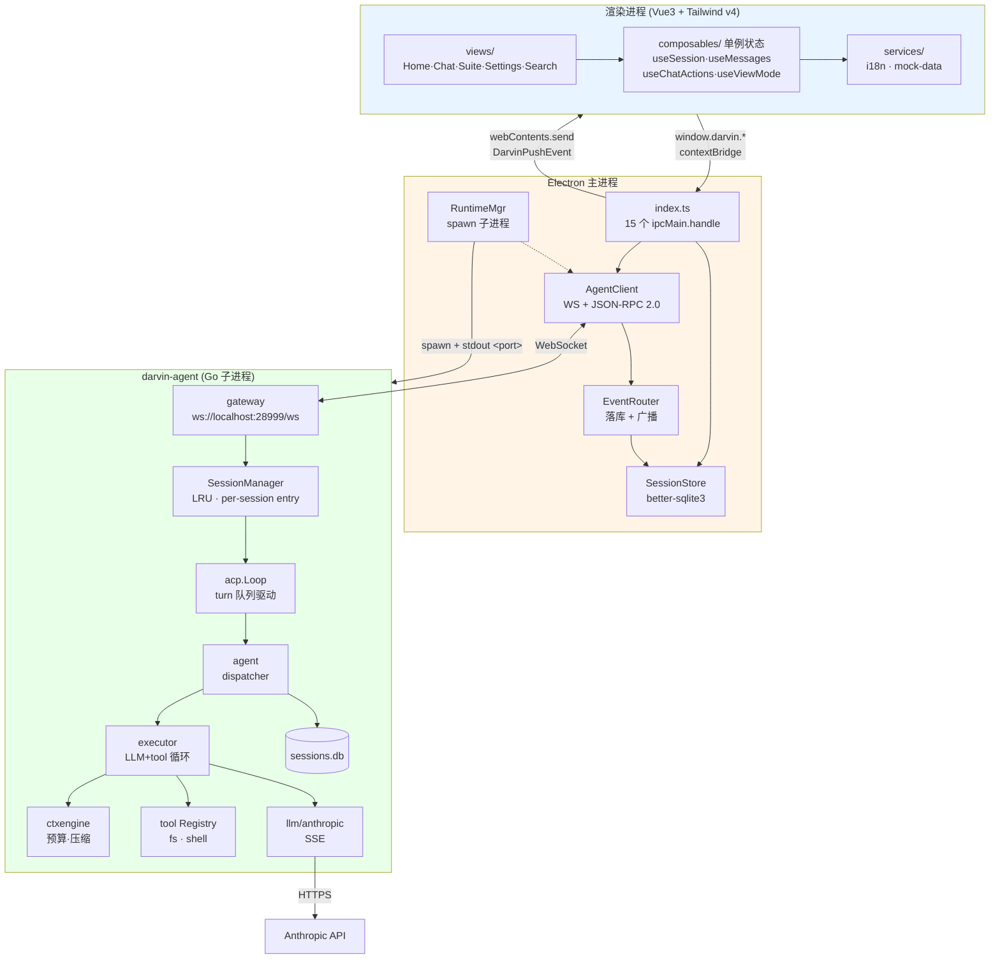
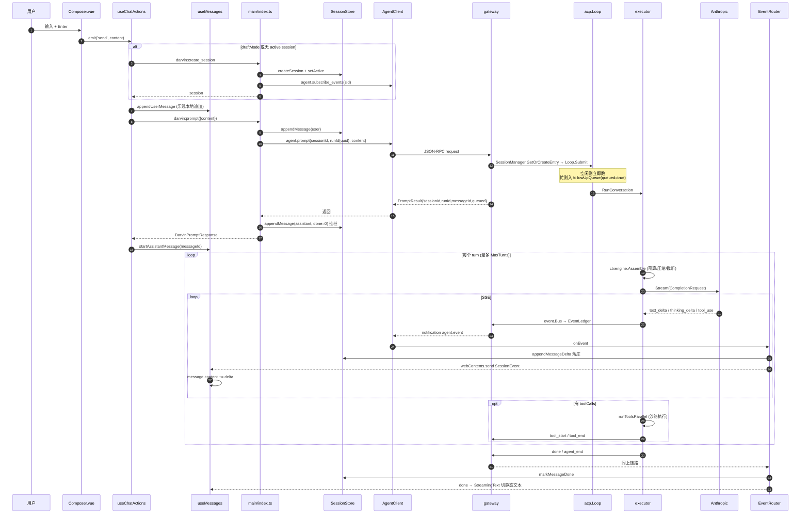
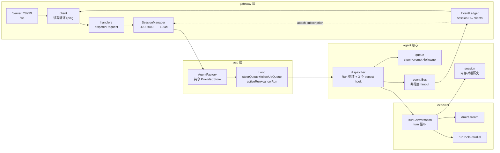
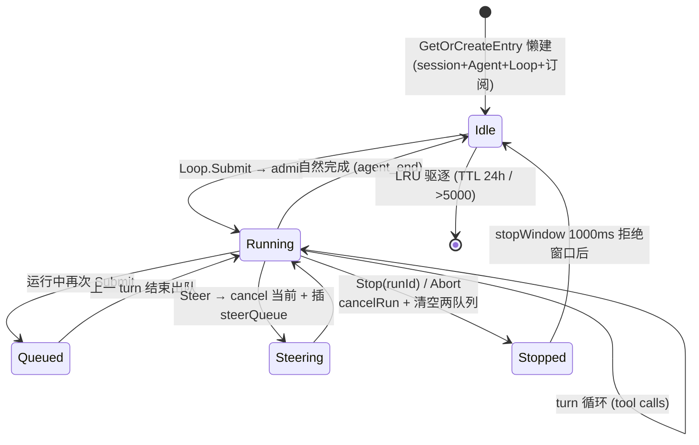
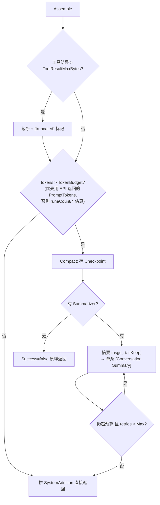
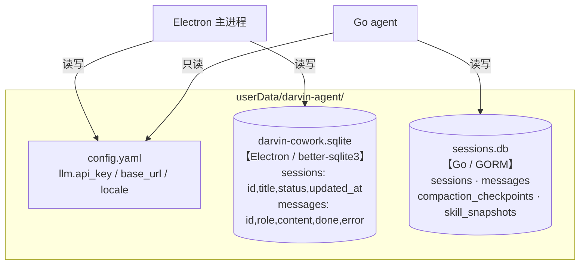
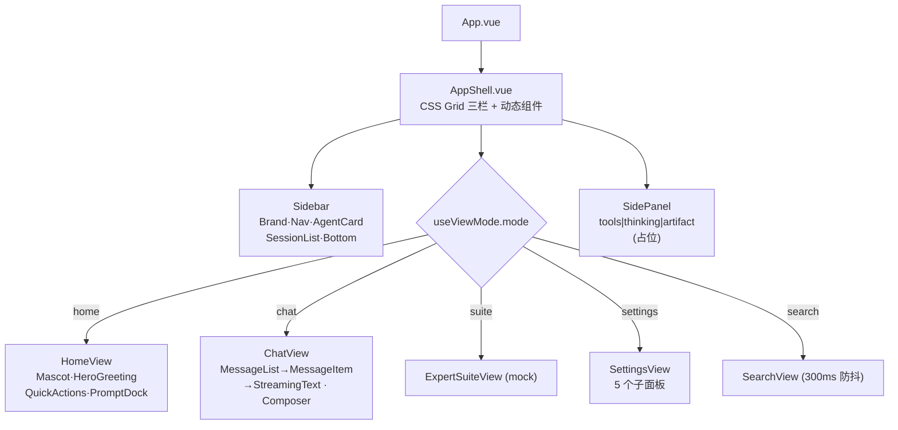
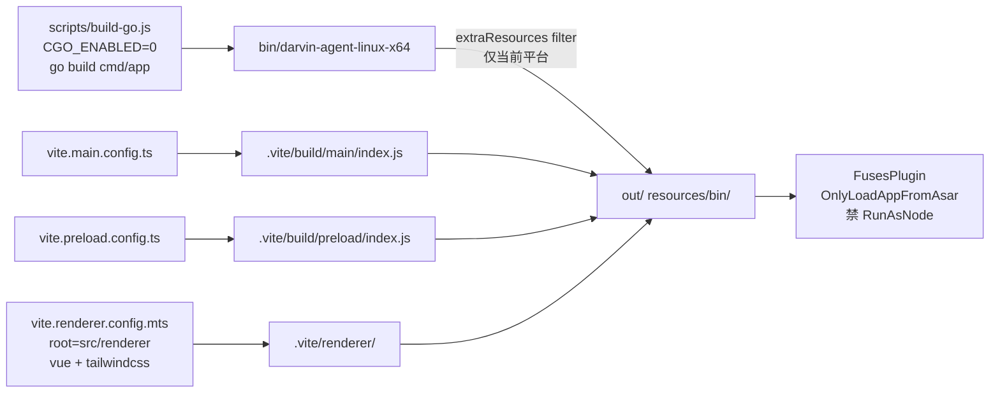

# 源码现状（as-built）

> 快照基准：commit `d496547`（2026-08-01）
>
> 本文描述**代码里真实存在的东西**，与 `docs/系统架构.md`（目标态蓝图，含 Dreaming / 8 Provider / Failover / MCP 等尚未落地的设计）互补。
> 两者冲突时，本文以源码为准；`AGENTS.md` 中关于 runtime、artifact 渲染器的描述已滞后，见文末「与文档不符之处」。

## 目录

- [一、项目做了什么](#一项目做了什么)
- [二、整体架构](#二整体架构)
- [三、核心数据流：发一条消息](#三核心数据流发一条消息)
- [四、Go Agent 内部架构](#四go-agent-内部架构)
- [五、持久化](#五持久化)
- [六、Renderer 组件与状态](#六renderer-组件与状态)
- [七、构建与打包](#七构建与打包)
- [八、已知问题与文档偏差](#八已知问题与文档偏差)

---

## 一、项目做了什么

一个**本地桌面 AI Agent 助手**（类 Claude Desktop 的对话壳），三进程架构：Electron 主进程做壳与编排，Vue3 渲染层做 UI，Go 二进制 `darvin-agent` 做真正的 Agent 运行时（LLM 调用 / 工具执行 / 上下文压缩 / 持久化）。

**代码规模**：Go 8038 行（非测试）+ 37 个 `_test.go`；Electron 侧 TS 1835 行；Renderer 3383 行。重心在 Go。

### 已落地功能清单

| 域 | 能力 | 状态 |
|---|---|---|
| 会话 | 创建 / 切换 / 重命名 / 删除 / 搜索（标题 + 消息内容 LIKE）、懒创建（draftMode） | ✅ |
| 对话 | 流式输出（`text_delta` / `thinking_delta`）、多轮 tool loop、abort | ✅ |
| 并发 | **per-session 独立 Agent + Loop**，多会话同时跑；后台会话完成发系统通知 | ✅ |
| 排队 | steer > prompt > followup 三级优先队列 | ✅ |
| 工具 | `read_file` / `write_file` / `edit_file` / `list_dir` / `shell`（白名单 + 路径沙箱） | ✅ |
| LLM | Anthropic Messages API（SSE 流式），工厂注册可扩展 provider | ✅ 仅 anthropic |
| 上下文 | token 预算估算、超限触发摘要压缩（保留尾部 N 条）、工具结果截断 | ✅ |
| 持久化 | 双 SQLite：Electron 侧 `darvin-cowork.sqlite`、Go 侧 `sessions.db` | ✅（有冗余） |
| 设置 | API Key / baseURL 配置（写 yaml 后重启 Go 子进程）、主题、语言 zh/en | ✅ |
| UI | 首页 / 对话 / 专家套件 / 设置 / 搜索 五视图 | 专家套件是 mock |
| Artifact 沙箱 | `AGENTS.md` 有详细规范 | ❌ **未实现**，`services/` 下无该目录 |
| MCP / Skills | 有 `skill_snapshots` 表、`MCPServerInfo` 类型 | ❌ 骨架未接线 |
| Subagent | `PrepareSubagentSpawn` | ❌ 返回 `ErrSubAgentUnsupported` |
| Memory / Dreaming | — | ❌ 未开始 |
| Failover / 熔断 | — | ❌ 未开始 |

---

## 二、整体架构



### 进程间协议

| 边界 | 协议 | 细节 |
|---|---|---|
| Renderer ↔ Main | Electron IPC | `invoke` 15 个 `darvin:*` channel；`on` 3 个 `darvin:push:*` |
| Main ↔ Go | **WebSocket + JSON-RPC 2.0** | `ws://localhost:28999/ws`，自增整数 id 关联请求响应 |
| Main → Go 启动 | spawn + stdout 握手 | Go 打印 `<port>28999</port>\n`，Main 正则捕获后连 WS；5s 超时 SIGKILL |
| Go → LLM | HTTPS SSE | Anthropic Messages API |

### 关键文件定位

| 职责 | 文件 |
|---|---|
| IPC handler 全集 | `src/main/index.ts` |
| Go 子进程生命周期 | `src/main/runtime/manager.ts` |
| WS JSON-RPC 客户端 | `src/main/runtime/client.ts` |
| 事件落库 + 广播 | `src/main/store/EventRouter.ts` |
| Electron 侧 SQLite | `src/main/store/SessionStore.ts` |
| 跨进程类型契约 | `src/shared/darvin-api.ts` |
| Go 入口 | `src/darvin-agent/cmd/app/main.go` |
| JSON-RPC 路由 | `src/darvin-agent/internal/gateway/handlers.go` |
| turn 循环 | `src/darvin-agent/internal/agent/executor/executor.go` |

---

## 三、核心数据流：发一条消息



### 关键设计点

1. **乐观 UI**：用户消息先本地 push，再走 IPC；失败时主进程回滚已落库的 user message。
2. **messageId 三方对齐**：Go 生成 21 字符 nanoid → 返回 Main → Main 建 assistant 桩 → Renderer 用同一 id 接 delta。
3. **事件全量广播**：`EventRouter` **不按 active session 过滤**，所有窗口都收，Renderer 按 `sessionId` 自己分桶（`useMessages.messagesBySessionId`）——这是多会话并发的基础。
4. **未读 / 运行态**：后台 session 的事件会打 `unreadSessionIds` + `streamingSessionIds`，侧栏据此显示状态；`done` 时若窗口不在前台则发系统通知。

---

## 四、Go Agent 内部架构



### JSON-RPC 方法表

| method | 参数 | 返回 |
|---|---|---|
| `agent.prompt` | `{content, sessionId, runId}` | `{sessionId, runId, messageId, queued}` |
| `agent.abort` | `{sessionId, runId}` | `{aborted}` |
| `agent.steer` | `{content}` | 打断当前 run 并插队 |
| `agent.subscribe_events` | `{sessionId}` | `{subscribed}` |
| `agent.list_sessions` | — | session 列表 |
| `agent.get_messages` | `{sessionId, limit, offset}` | 消息列表 |

反向 notification 只有一个：`agent.event`。

### Session / Run 状态机



### 事件序列

一次 turn：

```
turn_start → llm_start → (text_delta | thinking_delta)* → llm_end
          → (tool_start → tool_end)*  [并行]
          → turn_end
```

外层还有 `prompt_received` / `run_start` / `run_end` / `agent_end` / `agent_error` / `compaction`。

Electron 侧只消费 7 种（`text_delta` / `thinking_delta` / `tool_start` / `tool_end` / `done` / `error` / `agent_end`，见 `src/shared/darvin-api.ts` 的 `DarvinEvent`），其余生命周期事件在 `client.ts` 里静默丢弃。

### ctxengine 压缩流程



`ContextEngine` 接口共 10 个方法，其中 `Bootstrap` / `Maintain` / `Dispose` / `AfterTurn` 当前是 no-op，`Ingest` 只记时间戳（fact extraction 未实现），实际起作用的只有 `Assemble` 和 `Compact`。

### 工具系统

| 工具 | 参数 | 约束 |
|---|---|---|
| `read_file` | `path, limit?, offset?` | 路径沙箱（`fsSandbox.Resolve` 拒绝逃出 workdir） |
| `write_file` | `path, content` | 同上 |
| `edit_file` | `path, old_text, new_text, replace_all?` | 同上 |
| `list_dir` | `path, max_depth?` | 同上 |
| `shell` | `command, args, cwd?, timeout_ms?` | 命令白名单（`ls/cat/grep/sed/awk/...` 约 32 条） |

工具并行执行，单个工具 panic 会被 recover 转成 `Result{IsError:true}`，不影响整轮。

---

## 五、持久化



路径由 `src/main/libs/user-paths.ts` 统一解析；Go 侧通过环境变量 `DARVIN_SESSIONS_DSN` / `DARVIN_CONFIG` 接收。

> ⚠️ **双库冗余**是当前架构最明显的债：会话与消息在两侧各存一份，schema 不同、id 体系不同、无同步机制。UI 展示走 Electron 库，Agent 上下文走 Go 库，长期会漂移（Go 侧压缩后的历史与 Electron 侧完整历史不一致）。`agent.list_sessions` / `agent.get_messages` 这两个 RPC 目前基本没被 UI 用到，正是这个冗余的体现。

---

## 六、Renderer 组件与状态



**无 Vue Router、无 Pinia**——视图靠 `useViewMode` 的 ref 切换（`<component :is>`），状态靠模块级 ref 单例：

| composable | 职责 | 持久化 |
|---|---|---|
| `useSession` | sessions 列表 / activeSessionId / draftMode | 主进程为唯一真源，订阅推送 |
| `useMessages` | `messagesBySessionId` 分桶、streaming/unread 集合、事件归并 | 内存 |
| `useChatActions` | 发送统一入口（含懒建会话） | — |
| `useViewMode` / `useSidebar` / `useSidePanel` / `useTheme` / `useModel` | UI 状态 | localStorage |
| `useFloatingPanel` | 浮层互斥 + Esc 关闭 | — |

样式全部走 `src/renderer/styles/theme.css` 的 `@theme` token（品牌色 `--color-primary: #FF5722`，dark 主题由 `html.dark` 覆盖）；i18n 是平铺字典 + Vue `ref` 响应式，zh/en 双份且开发期 `assertSameKeys` 校验。

---

## 七、构建与打包



- `prestart` / `premake` 钩子会先编 Go。
- `npm run smoke` 走 `scripts/smoke.sh`：直接 spawn 二进制 → 等 `<port>` 行 → `ws-smoke-client.js` 跑 JSON-RPC 断言 → SIGTERM 验优雅退出，**不依赖 Electron**。

---

## 八、已知问题与文档偏差

### 代码层面

1. **双 SQLite 冗余**（见第五节），无同步机制。
2. **Go 子进程无崩溃重启**：`manager.ts` 在进程退出后只打日志，UI 会一直 `offline`，需重启 App。
3. **`steerAgent` 是孤儿单例**：`cmd/app/main.go` 建了一个 `session.NewSession("steer-placeholder")` 的 Agent，只给 `SteerControl` 持有，不被任何 Loop 驱动、不订阅事件——UI 当前不发 steer，实际是死代码路径。
4. **model 选择未透传**：`useModel` 选的模型只存 localStorage，`window.darvin.prompt()` 没带 `model` 字段，Go 侧始终用 config 里的固定模型。
5. **测试覆盖不对称**：Go 侧 37 个 `_test.go`，TS 侧零测试、无 test runner。
6. **`ExpertSuiteView` 全 mock**：数据来自 `services/mock-data.ts`，无后端。

### 与既有文档不符之处

| 文档位置 | 描述 | 实际 |
|---|---|---|
| `AGENTS.md` 架构要点 | `startAgentRuntime()` 仅 `console.log` | 已实现 spawn + 端口握手 + 优雅停止 |
| `AGENTS.md` 架构要点 | `createAgentClient()` 抛 `Not Implemented` | 已实现完整 WS JSON-RPC 客户端 |
| `AGENTS.md` 编码风格 | Artifact 渲染器在 `services/artifact-renderer/` | **该目录不存在**，`services/` 下只有 `i18n.ts` 和 `mock-data.ts` |
| `AGENTS.md` 字符串常量 | IPC 通道尚未落地 | 已落地，见 `DarvinPushEvent` 与 `darvin:*` channel |
| `docs/系统架构.md` 顶层图 | 状态管理用 Pinia | 无 Pinia，用模块级 ref 单例 |
| `docs/系统架构.md` 实现状态表 | Vue3 / Tailwind / preload / Provider Layer 全部 ❌ | 均已落地 |
| `docs/系统架构.md` 数据库归属 | 主进程库名 `lobsterai.db` | 实际 `darvin-cowork.sqlite` |
