# Darvin-cowork 系统架构

## 项目描述

这是一个工作桌面 agent，适用于日常工作，包括创作、数据分析、PPT 制作、视频制作、日常文件处理等问题，是个人的贴心助手，配置个人工作流使用。

## 技术选型

| 维度 | 决策 |
|------|------|
| 桌面框架 | Electron |
| 前端框架 | Vue3 + Tailwind CSS v4 |
| Agent Runtime | Go（子进程） |
| 通信协议 | **WebSocket + JSON-RPC**（替代 stdio） |
| HTTP API | 需要（远程场景预留） |
| Subagent | 支持 |
| Provider | 8 个全支持（Anthropic / OpenAI / Mistral / OpenAI-Responses / Azure / Gemini / Vertex / Bedrock） |
| Memory | Dreaming 三阶段（Light / Deep / REM） |
| Dreaming 调度 | **智能调度**（下次开机/联网时执行，支持手动触发） |
| Skills | OpenClaw 四层全实现（Workspace + Bundled + Session + Plugin） |
| MCP | STDIO + HTTP 双传输 |
| ORM | GORM |
| 数据库 | SQLite |
| Failover | 主备模型链 + 重试 + 熔断器 |

---

## 顶层架构图

根据 OpenClaw 架构，Darvin-cowork 采用以下分层设计：

1. **Gateway 层**（独立进程或 Main 进程内）：接收外部请求，路由到会话
2. **ACP 层**（Go Agent 内）：会话生命周期管理，Turn 执行
3. **Agent Runtime 层**（Go Agent 内）：核心推理引擎

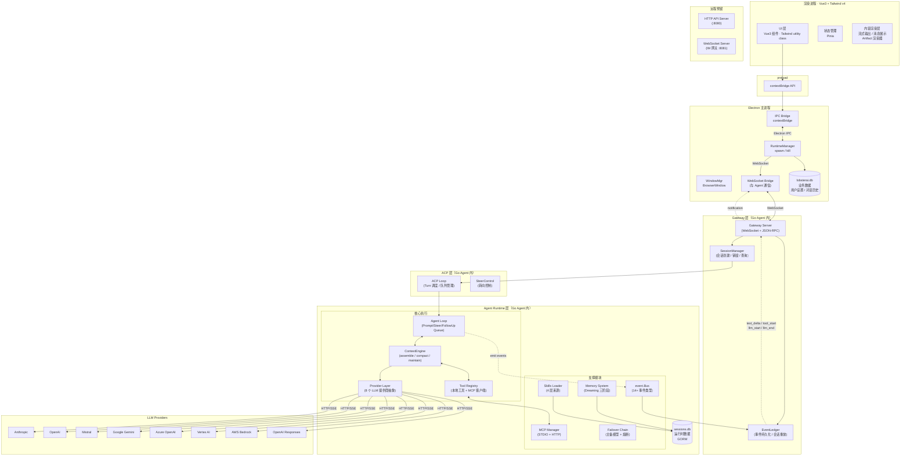

### WebSocket 通信说明

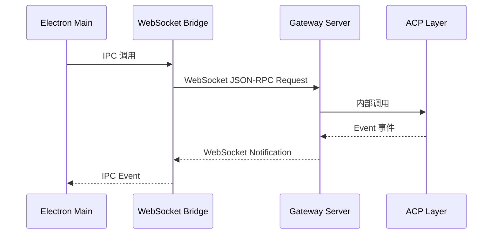

主进程通过 WebSocket Bridge 与 Go Agent 的 Gateway Server 通信，采用 JSON-RPC 2.0 格式。

---

## 三层通信矩阵

| 链路 | 协议 | 格式 | 方向 | 流式 | 说明 |
|------|------|------|------|------|------|
| Renderer ↔ Main | Electron IPC | 结构化对象 | 双向 | ✅ IPC event | contextBridge 暴露的受控 API |
| Main ↔ Agent | WebSocket | JSON-RPC 2.0 | 双向 | ✅ Notification | WebSocket Bridge ↔ Gateway |
| Gateway ↔ ACP | 内部调用 | Go interface | 单向 | — | Gateway 路由到 ACP |
| Agent ↔ LLM | HTTP/SSE | OpenAI/Anthropic 协议 | 双向 | ✅ SSE | Provider 层抽象 |
| Agent ↔ Tools | 函数调用 | JSON | 单向 | ❌ | Tool Registry 内部分发 |
| Agent ↔ MCP-STDIO | child process | JSON-RPC | 双向 | ❌ | 本地 MCP 服务 |
| Agent ↔ MCP-HTTP | HTTP | JSON-RPC | 双向 | ✅ SSE（可选） | 远程 MCP 服务 |

---

## 数据流向图

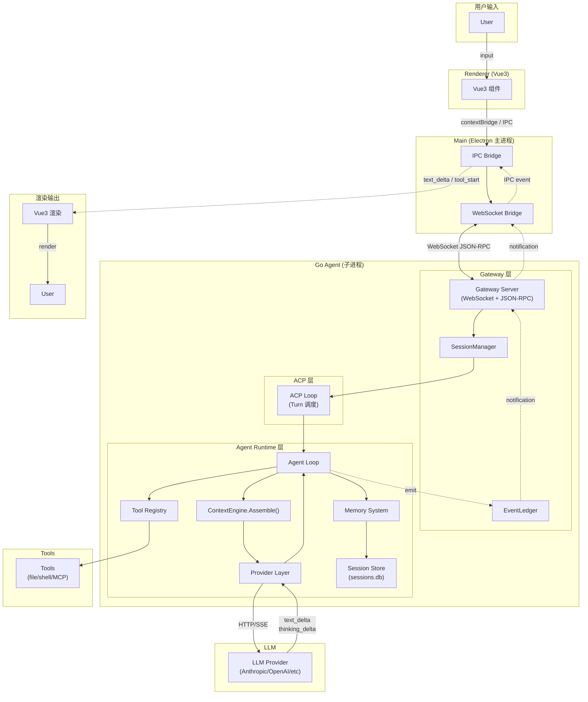

---

## Agent 内部模块架构

Go Agent 内部包含 **Gateway 层**、**ACP 层** 和 **Agent Runtime 层**：

### 1. Gateway 层（独立模块）

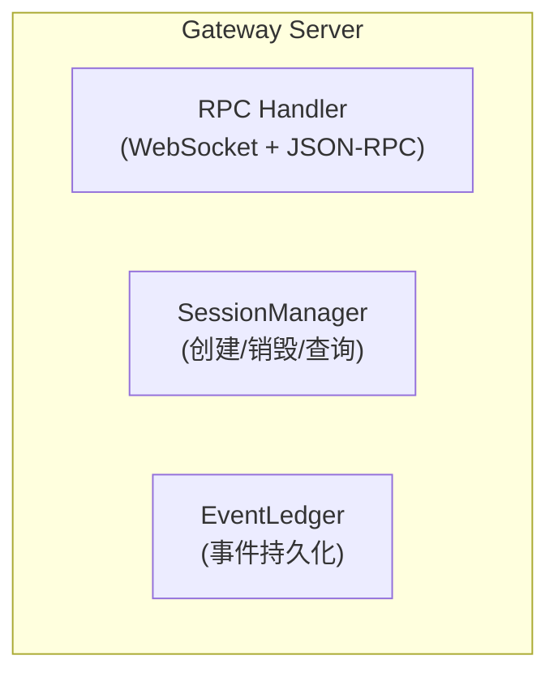

**职责**：
- 接收外部请求（WebSocket JSON-RPC）
- 会话管理（创建、销毁、查询）
- 事件流推送（text_delta、tool_start 等）
- 请求路由到对应的 ACP 会话

### 2. ACP 层（会话管理）

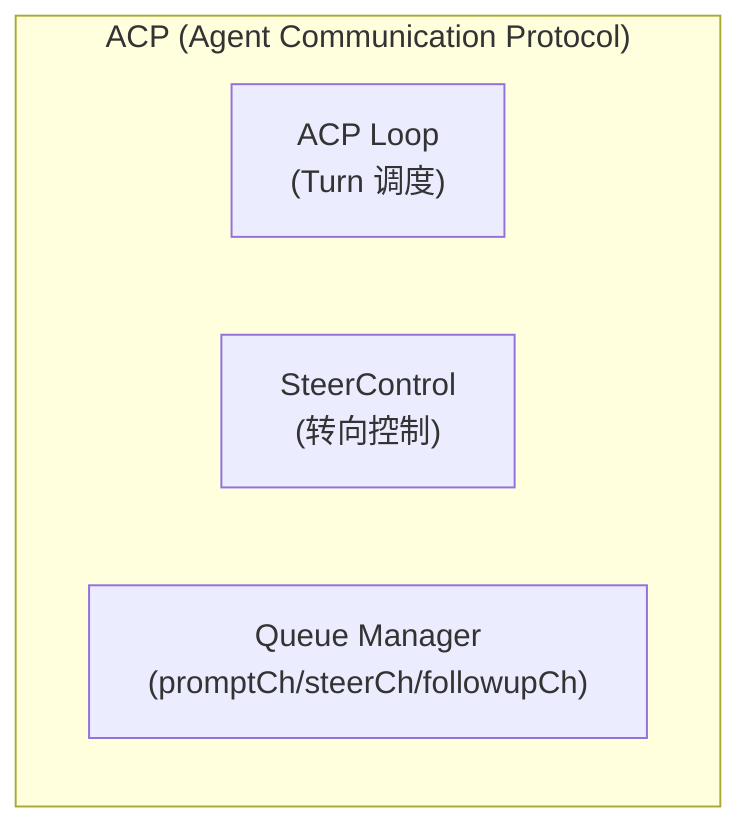

**职责**：
- 会话生命周期管理
- Turn 执行调度
- Steer（转向）控制
- 队列管理（Prompt/Steer/FollowUp）

### 3. Agent Runtime 层（核心执行）

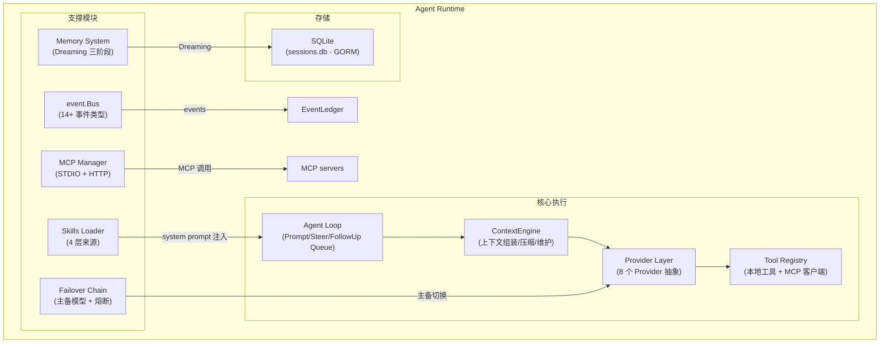

**职责**：
- Agent Loop：主循环，处理 Prompt/Steer/FollowUp
- ContextEngine：上下文组装、压缩、维护
- Provider Layer：LLM 调用抽象
- Tool Registry：工具注册和执行
- event.Bus：事件发布订阅
- Memory System：记忆管理和 Dreaming
- Skills Loader：Skills 四层加载
- MCP Manager：MCP STDIO/HTTP 传输
- Failover Chain：主备模型和熔断

---

## ContextEngine 接口设计

ContextEngine 负责管理对话上下文，负责消息摄入、组装、压缩和维护。

```go
type ContextEngine interface {
    // Bootstrap 初始化引擎状态，加载 session history 和 memory
    Bootstrap(sessionId string, sessionKey string) error

    // Ingest 将消息摄入到 session
    Ingest(msg *llm.Message) error

    // Assemble 根据 token 预算组装 prompt
    Assemble(tokenBudget int) ([]*llm.Message, error)

    // Compact 压缩上下文，force 表示是否强制压缩
    Compact(force bool) error

    // AfterTurn turn 后的维护工作
    AfterTurn(messages []*llm.Message) error

    // Maintain 维护工作：DAG 修复、孤儿消息清理
    Maintain() error
}
```

### 压缩策略（Compact）

当上下文超过 token 预算时，按以下顺序尝试压缩：

1. **软压缩**：移除 oldest tool result（保留 user message）
2. **中压缩**：对早期对话生成摘要，插入压缩点
3. **硬压缩**：强制保留最近 N 条消息，丢弃更早的

---

## SessionStore 表设计（GORM 模型）

```go
// Session 会话记录
type Session struct {
    ID        string    `gorm:"primaryKey"`           // 唯一标识
    Key       string    `gorm:"index"`                 // 会话密钥
    AgentID   string    `gorm:"index"`                // 关联 Agent ID
    Status    string    `gorm:"default:active"`       // active / archived / suspended
    CreatedAt time.Time `gorm:"autoCreateTime"`
    UpdatedAt time.Time `gorm:"autoUpdateTime"`
}

// Message 消息记录
type Message struct {
    ID         string    `gorm:"primaryKey"`           // 唯一标识
    SessionID  string    `gorm:"index"`               // 关联 Session ID
    Role       string    `gorm:"index"`                // user / assistant / tool
    Content    string    `gorm:"type:text"`           // 消息内容（JSON）
    ToolCalls  string    `gorm:"type:text"`            // tool_calls JSON（nullable）
    Timestamp  int64     `gorm:"index"`               // 时间戳
    StopReason string    `gorm:"default:stop"`        // stop / aborted / max_turns
    ParentID   string    `gorm:"index"`               // DAG 父消息 ID
}

// CompactionCheckpoint 压缩检查点
type CompactionCheckpoint struct {
    ID            string    `gorm:"primaryKey"`        // 唯一标识
    SessionID     string    `gorm:"index"`            // 关联 Session ID
    Summary       string    `gorm:"type:text"`        // 摘要内容
    TokensBefore  int       `gorm:"not null"`         // 压缩前 token 数
    TokensAfter   int       `gorm:"not null"`         // 压缩后 token 数
    FirstKeptID   string    `gorm:"not null"`         // 保留的首条消息 ID
    CreatedAt     time.Time `gorm:"autoCreateTime"`
}

// SkillSnapshot Skill 快照
type SkillSnapshot struct {
    ID        string    `gorm:"primaryKey"`           // 唯一标识
    SessionID string    `gorm:"index"`               // 关联 Session ID
    SkillName string    `gorm:"not null"`           // Skill 名称
    LoadedAt  time.Time `gorm:"autoCreateTime"`     // 加载时间
    Source    string    `gorm:"not null"`           // workspace / bundled / session / plugin
}
```

### 数据库归属

| 数据库 | 进程 | 存储内容 |
|--------|------|----------|
| `lobsterai.db` | Electron 主进程 | 业务数据：用户设置、IM 配置、MCP 配置、Agent 配置 |
| `sessions.db` | Go Agent 子进程 | 运行时数据：Session、Message、Checkpoint、SkillSnapshot |

---

## Provider 抽象层设计

### 接口定义

```go
type Provider interface {
    // ID 返回 Provider 唯一标识
    ID() string

    // Stream 流式调用 LLM
    Stream(ctx context.Context, req *Request) (<-chan Event, error)

    // ResolveCost 计算请求费用
    ResolveCost(usage Usage) Cost
}

type Request struct {
    Model         string        // 模型名称
    Messages      []*llm.Message // 消息列表
    Tools         []Tool        // 工具定义
    ThinkingLevel string        // off / low / medium / high
    CacheKey      string        // 缓存键
}

type Event interface {
    Type() string
    // text_delta    - 文本增量
    // thinking_delta - 思考增量
    // toolcall_delta - 工具调用增量
    // done           - 完成
    // error          - 错误
}

type Usage struct {
    InputTokens  int
    OutputTokens int
    CacheTokens  int // 命中缓存的 token 数
}

type Cost struct {
    InputCost  float64
    OutputCost float64
    CacheBenefit float64 // 缓存节省
}
```

### 8 个 Provider 实现

| Provider | 模型示例 | 协议 | 特殊能力 |
|----------|---------|------|----------|
| `anthropic` | claude-sonnet-4, claude-opus-4 | Anthropic | 思考模式 |
| `openai` | gpt-4o, gpt-4o-mini | OpenAI | 函数调用 |
| `mistral` | mistral-large, mistral-small | OpenAI-compatible | — |
| `openai-responses` | gpt-4o-reasoning | OpenAI Responses | 原生工具调用 |
| `azure` | azure-gpt-4o | OpenAI-compatible | 企业级 |
| `gemini` | gemini-2.5-flash, gemini-pro | Google AI | 上下文缓存 |
| `vertex` | gemini-2.5-flash, claude-3 | Google Vertex | GCP 集成 |
| `bedrock` | claude-3, llama-3 | AWS | AWS IAM 集成 |

---

## Failover 链设计

```yaml
providers:
  - id: anthropic-main
    model: claude-sonnet-4-20250514
    thinking:
      enabled: true
      budget: 3000
    fallbacks:
      - id: openai-main
        model: gpt-4o-2024-08-06
      - id: deepseek-main
        model: deepseek-chat
    retry:
      max_attempts: 3
      backoff: exponential
      initial_delay: 1s
      max_delay: 30s
    circuit_breaker:
      failure_threshold: 5      # 连续失败 5 次后熔断
      success_threshold: 2       # 连续成功 2 次后恢复
      cooldown: 10m             # 熔断冷却时间
```

### 熔断器状态机

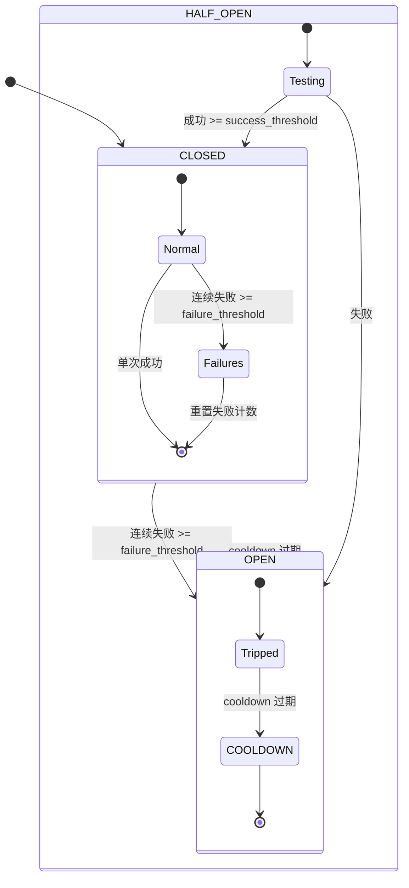

---

## Dreaming 三阶段详细流程

Dreaming 是记忆整理任务，考虑到**用户不可能凌晨三点电脑运行，也不可能时刻联网**，采用**智能调度策略**。

### 调度策略

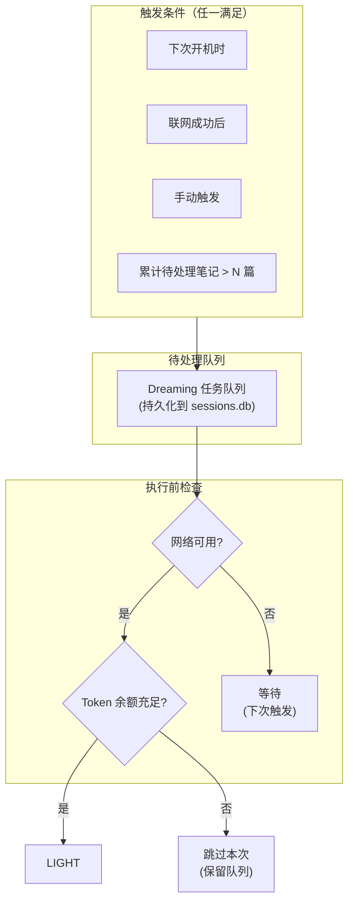

### 智能调度规则

| 触发条件 | 说明 | 优先级 |
|----------|------|--------|
| **下次开机** | 电脑唤醒/开机时执行 | 最高 |
| **联网成功** | 检测到网络可用时执行 | 高 |
| **手动触发** | 用户在 UI 手动点击"整理记忆" | 中 |
| **积压阈值** | 累计待处理笔记 > 5 篇时强制执行 | 中 |
| **定时触发** | 仅在电脑处于运行状态时才尝试（可配置关闭） | 低 |

### 离线队列机制

为了支持离线场景，Dreaming 任务队列**持久化到 sessions.db**：

```go
type DreamingTask struct {
    ID          string    `gorm:"primaryKey"`
    Phase       string    `gorm:"not null"`  // light / deep / rem
    ScheduledAt time.Time `gorm:"not null"`  // 计划执行时间
    Status      string    `gorm:"default:pending"` // pending / running / done / skipped
    Notes       string    `gorm:"type:text"`  // 待处理的每日笔记列表
    CreatedAt   time.Time `gorm:"autoCreateTime"`
    UpdatedAt   time.Time `gorm:"autoUpdateTime"`
}
```

### 三阶段执行流程

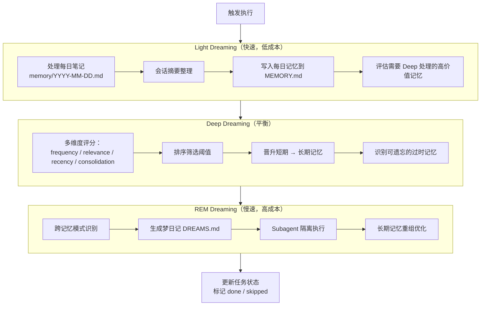

### Dreaming 输入输出

| 阶段 | 输入 | 输出 |
|------|------|------|
| Light | 每日笔记、会话摘要 | MEMORY.md 更新 |
| Deep | MEMORY.md、历史会话 | 记忆评分、晋升/降级决策 |
| REM | 所有长期记忆 | DREAMS.md（叙事性摘要） |

### 断网处理

1. **执行中断网**：任务标记为 `pending`，下次联网/开机时继续
2. **Token 不足**：跳过 REM 阶段，只执行 Light + Deep
3. **积压过多**：优先执行 Light 阶段，高级阶段可延后

---

## Skills 四层加载机制

| 层 | 位置 | 加载时机 | 优先级 | 示例 |
|----|------|---------|--------|------|
| Bundled | `internal/skills/bundled/` | 启动时 | 最低 | 内置文件处理、代码审查 |
| Workspace | `${workspaceDir}/skills/` | 会话初始化 | 中 | 用户自定义 workspace skills |
| Plugin | `${pluginDir}/skills/` | 插件加载时 | 中 | 第三方插件 skill |
| Session | 内存动态创建 | 用户/Agent 触发 | 最高 | 动态生成的临时 skill |

### 注入策略

根据 `exposure.mode` 决定是否写入 system prompt：

| Mode | 行为 |
|------|------|
| `always` | 总是注入到 system prompt |
| `auto` | Agent 根据上下文自行决定 |
| `manual` | 用户手动调用 |

---

## MCP 双传输实现

### STDIO 传输（本地）

适用场景：本地文件系统、Git、Shell 工具

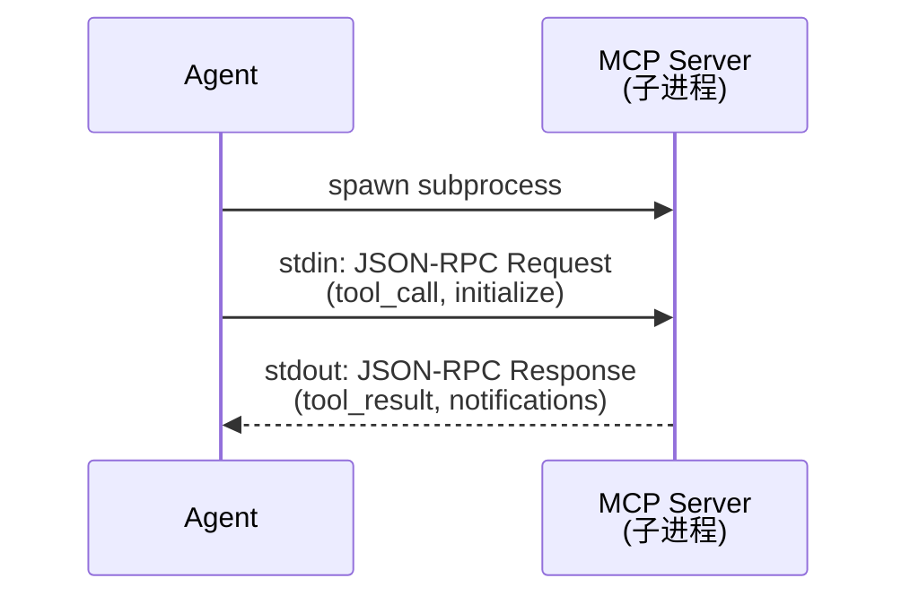

### HTTP 传输（远程）

适用场景：远程 GitHub API、Notion API 等 SaaS 服务

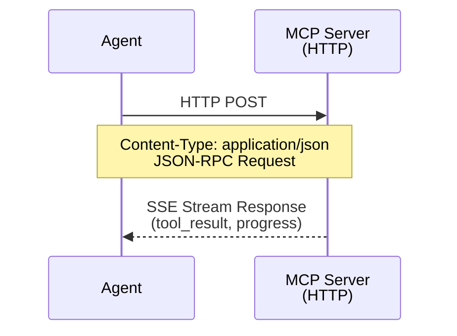

### OAuth 支持（延后）

OAuth 认证暂不在 M1-M2 范围，M3+ 再考虑集成。

---

## 事件总线契约

### 14+ 事件类型

| 事件 | 触发时机 | payload |
|------|----------|---------|
| `prompt_received` | Run 的 dequeue 取到入队消息 | `Content, Mode` |
| `run_start` | Run 入口 | `SessionID` |
| `run_end` | 每条入队消息消费完成 | `Turns` |
| `turn_start` | 每个 turn 入口 | `TurnID, TurnIndex` |
| `turn_end` | 每个 turn 出口 | `TurnIndex, StopReason` |
| `llm_start` | provider.Stream 之前 | `Model` |
| `llm_end` | provider.DoneEvent 之后 | `Assistant Message, Usage` |
| `text_delta` | 透传 provider 的每个 delta | `Delta` |
| `thinking_delta` | 透传 provider 的思考增量 | `Delta` |
| `tool_start` | 每个 tool goroutine 启动 | `TurnID, CallID, Name, Arguments` |
| `tool_end` | 每个 tool goroutine 完成 | `CallID, Result, DurationMS` |
| `compaction_start` | 上下文压缩开始 | `SessionID, Reason` |
| `compaction_end` | 上下文压缩完成 | `TokensBefore, TokensAfter` |
| `agent_end` | Run defer | `SessionID, TotalTurns, TotalUsage` |
| `agent_error` | error 路径 | `Err`（含 `ErrAborted` / `ErrMaxTurns`） |

### 订阅策略

事件订阅 buffer 满时按 **drop-oldest** 策略（不阻塞 Agent 核心循环）。

---

## HTTP API 设计（远程场景预留）

### 端点定义

```
GET    /sessions                 # 列出所有会话
POST   /sessions                 # 创建新会话
GET    /sessions/{id}            # 获取会话详情
DELETE /sessions/{id}            # 删除会话
POST   /sessions/{id}/prompt     # 提交 prompt
POST   /sessions/{id}/abort      # 中止当前运行
GET    /sessions/{id}/events     # SSE 事件流

GET    /skills                   # 列出所有 skills
POST   /skills/{name}/invoke     # 手动调用 skill

GET    /memory                   # 检索记忆
POST   /memory                   # 写入记忆

GET    /providers                # 列出可用 providers
GET    /providers/{id}/health    # Provider 健康检查
```

### 认证

HTTP API 使用 Bearer Token 认证，Token 在首次启动时生成，存储在 `lobsterai.db` 中。

---

## 架构决策说明

### 为什么选择 WebSocket + JSON-RPC 作为通信协议？

1. **实时性好**：WebSocket 支持双向通信，事件推送更及时
2. **隔离性好**：Agent 运行在独立进程，与 Electron 主进程隔离
3. **调试友好**：WebSocket 可以用浏览器 DevTools 或 ws 客户端直接测试
4. **扩展性强**：M3+ 的远程 IM 网关可以复用同一 WebSocket 连接

### 为什么使用 GORM 而不是原生 SQL？

1. **开发效率**：GORM 提供简洁的 API，减少样板代码
2. **迁移友好**：GORM AutoMigrate 支持表结构自动迁移
3. **类型安全**：GORM 的模型与 Go 类型系统结合紧密
4. **生态成熟**：GORM 在 Go 社区广泛使用，问题易排查

### 为什么 Dreaming 调度选择凌晨 3 点？

1. **避开工作时间**：用户活跃时段不占用系统资源
2. **足够间隔**：距离上次使用有一定时间积累
3. **早鸟用户**：3 点对于大多数用户已入睡，但尚未到凌晨高峰

---

## 实现状态

| 模块 | 状态 | 说明 |
|------|------|------|
| Electron 主进程 | ✅ | 基础框架完成，窗口创建 |
| Go Agent 基础 | ✅ | logger/config/database 初始化 |
| Go Agent 业务 | ❌ | agent 循环、工具调用等未实现 |
| IPC 协议（JSON-RPC） | ❌ | 待实现 |
| ContextEngine | ❌ | 待实现 |
| Provider Layer | ❌ | 待实现 |
| Memory System / Dreaming | ❌ | 待实现 |
| Skills System | ❌ | 待实现 |
| MCP System | ❌ | 待实现 |
| Failover Chain | ❌ | 待实现 |
| HTTP API Server | ❌ | 预留接口，待实现 |
| preload | ❌ | 空占位，待 contextBridge |
| Vue3 前端 | ❌ | 尚未接入，仍为 Hello World |
| Tailwind CSS v4 | ❌ | 尚未接入（目标栈） |
| Artifact 渲染器 | ❌ | 待实现（目标栈） |

---

