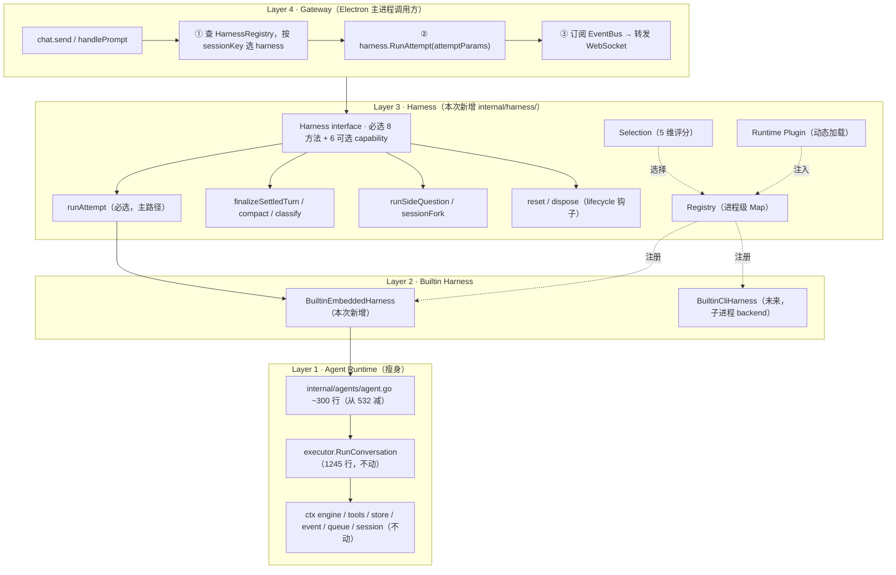
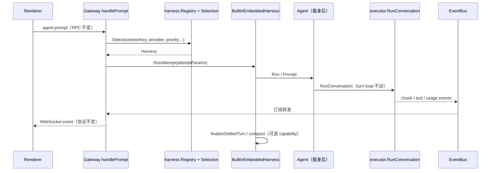

# 00 — Harness Architecture 总览

> 状态: 草案 v2 · 2026-08-04(Phase 1 实施后回写)
> 范围: 整个 `internal/agents/` 包 + `internal/agentloop/` 包 + `internal/gateway/`
> 目标: 将 darvin-cowork 的 agent runtime 重构为 OpenClaw 风格的 harness 架构

## 1. 为什么改造

darvin-cowork 当前 agent runtime 的根本问题:**Agent 类过胖 + 没有 backend 抽象**。

### 1.1 现状审计

- `internal/agents/agent.go` (532 行) + `dispatcher.go` (427 行) + `agent_mini_loop.go` (51 行) = **1010 行集中在 1 个 Agent 类型**
- 30+ public 方法:`Run` / `Prompt` / `Steer` / `FollowUp` / `Abort` / `RunSkillSession` / `Subscribe` / `Emit` / 9 个 permission / 5 个 ctx engine / 3 个 messageID bridge / ...
- LLM / Tools / 持久化 / 事件总线 / ctx engine / permission gate / 消息 ID 桥 / 5 种 transient state 全部塞在 1 个 `*Agent` struct 里
- 没有"切换 backend"的能力:`gateway.handlePrompt` 写死 `entry.Acp.Loop.Submit()`,完全不能换成另一个 agent 实现
- OpenClaw 把同样的事拆成 4 层 80+ 文件,我们全压 1 个文件

### 1.2 与 OpenClaw 架构的对比

| 维度 | OpenClaw (TS) | darvin-cowork (Go) 当前 | 差距 |
|---|---|---|---|
| Agent 主类 | `src/agents/embedded-agent-runner/`(190 文件, ~20k 行, 拆出 run/ attempt/ compaction/ tools/ 等子包) | `internal/agents/agent.go` (532 行) | 19x 浓缩 |
| Backend 抽象 | `src/agents/harness/` 9-capability interface + Registry + Selection | 无 | 完全缺失 |
| Selection | `selection.ts` 847 行,支持 supports/ priority/ contextEngineHost/ deliveryDefaults/ modelRouteAuth 5 维度评分 | 无 | 完全缺失 |
| Plugin 系统 | `runtime-plugin.ts` 310 行,支持动态注册 harness factory | 无 | 完全缺失 |
| Lifecycle | `lifecycle.ts` ~600 行,带 pre/post hook + diagnostics + trace | 散在 Agent.Run 内部 | 散乱 |
| ctx engine 接入 | `embedded-agent-runner/run/` 接通 Assembler + Compact + Compaction hooks | AssemblerEnabled = false, 走 legacy `d.Session().Messages()` 路径 | 半实现 |
| Tool 桥接 | `tool-surface-bridge.ts` + `tool-result-middleware.ts` 独立包 | tools 直接挂在 Agent 上 | 散乱 |

### 1.3 改造的 5 个具体收益

1. **可换 backend**:未来要加 Claude CLI 子进程 / OpenAI Codex CLI / 本地 llama-server backend,只需加一个 `*Harness` 实现,不用改 gateway
2. **Agent 瘦身**:从 30+ public 方法 → 10 个,职责单一,易测试
3. **capability 边界明确**:permission / ctx engine / compact / sideQuestion 全部独立模块,不再混在 Agent struct 里
4. **ctx engine 真接通**:目前 Assembler 是死代码,改造后 TokenBudget / Compact / Summarize 全部生效
5. **plugin 系统**:`runtime-plugin` 允许未来用户加第三方 harness(类似 OpenClaw 装 acpx plugin)

## 2. 改造后的 4 层架构

### 2.1 一次 prompt 的调用链

## 3. 与 OpenClaw 的逐文件对应

| OpenClaw | darvin-cowork 新位置 | 工作量 |
|---|---|---|
| `src/agents/harness/types.ts` (340) | `internal/harness/types.go` | 424 行 ✅ |
| `src/agents/harness/registry.ts` (108) | `internal/harness/registry.go` | 135 行 ✅ |
| `src/agents/harness/selection.ts` (847) | `internal/harness/support.go`(Rank)+ `selection.go`(spec 03) | 137 行 ✅ + ~450 行待做 |
| `src/agents/harness/lifecycle.ts` (~600) | `internal/harness/lifecycle.go` | 166 行 ✅ |
| `src/agents/harness/policy.ts` (220) | `internal/harness/policy.go` | 71 行 ✅ |
| `src/agents/harness/support.ts` (274) | 并入 `internal/harness/support.go` | ✅ |
| `src/agents/harness/builtin-openclaw.ts` (82) | `internal/harness/builtin_embedded.go` | 112 行 ✅ |
| `src/agents/harness/runtime-plugin.ts` (310) | `internal/harness/plugin/` | ~180 行 |
| `src/agents/harness/tool-surface-bridge.ts` (234) | `internal/harness/tool-surface-bridge.go` | ~150 行 |
| `src/agents/harness/tool-result-middleware.ts` (556) | `internal/harness/tool-result-middleware.go` | ~280 行 |
| `src/agents/embedded-agent-runner/` 内部拆分 | `internal/agents/` 重新组织 | ~600 行新组织 + 现有 9164 行中 600 行搬迁 |

不平移的两项:

- **`Symbol.for` 全局注册表** — Go 单二进制里 package 级 var 本身就是进程单例,Symbol 是 Node 多份模块实例的解法,这里不存在这个问题。
- **`RuntimeArtifact` / `AuthBinding` capability + `PrepareAuthSupport` / `PrepareRouteSupport`** — 本仓库没有 artifact binding 与 auth profile 层,等对应 spec 落地再补。

**总规模估算**: +3000 ~ +4000 行 Go,迁移/重构 ~600 行,删除 ~400 行。Phase 1 实测 1045 行实现 + 1071 行测试。

## 4. 7 个子 spec 索引

| # | 文件 | 关注点 | 依赖 |
|---|---|---|---|
| 00 | `2026-08-04-harness-architecture-design.md` (本文) | 总览 + 架构图 | - |
| 01 | `2026-08-04-harness-core-interface.md` | Harness interface + Registry + Policy + Lifecycle | 00 |
| 02 | `2026-08-04-agent-refactor.md` | Agent 内部职责拆分 | 01 |
| 03 | `2026-08-04-selection-and-plugin.md` | Selection + Runtime Plugin | 01 |
| 04 | `2026-08-04-gateway-integration.md` | Gateway 调用链改造 | 01, 02, 03 |
| 05 | `2026-08-04-tool-surface-bridge.md` | Tool 桥接 + 中间件 | 01, 02 |
| 06 | `2026-08-04-ctx-engine-binding.md` | Assembler 启用 + Compact | 02, 05 |

实施顺序: **00 → 01 → (02 ∥ 03) → (05 ∥ 06) → 04** (04 必须最后)

## 5. 关键不变式(任何阶段都不能破坏)

1. **gateway RPC 协议稳定**:`agent.prompt` / `agent.abort` / `agent.subscribe_events` / `agent.steer` 等所有 RPC 名称 + 参数 + 响应不变
2. **WebSocket event 协议稳定**:event 类型 + EventCommon 字段 + RunID / MessageID / SessionID 关联语义不变
3. **数据库 schema 不变**:sessions / messages / app_state / imported_files 表结构不动
4. **`internal/llm/` / `internal/tools/` / `internal/skills/` / `internal/mcp/` 接口不变**:这些是 capability 包,被 harness 和 agent 共用
5. **executor.go 内部算法不变**:RunConversation 的 turn loop 逻辑不动,只调整它的调用方

## 6. 风险评估

| 风险 | 概率 | 影响 | 缓解 |
|---|---|---|---|
| 7 个 spec 同时写同时实现,中间状态无法合并 | 中 | 大 | 严格分阶段:每写 1 个 spec → 1 个 commit → 测试绿 → 写下一个 |
| Agent 重构时漏掉边界 case(permission / messageID / 持久化) | 中 | 中 | 重构前后用 `go test` 覆盖率对比,必须保持 ≥ 现有 |
| Selection 评分逻辑太复杂,反不如写死 | 中 | 中 | 第一阶段只做 provider/priority 二维评分,后扩展 |
| Plugin 动态注册破坏 cold start 性能 | 低 | 低 | Plugin 列表在 main.go 启动时同步加载,失败直接 fail-fast |
| ctx engine 启用后 LLM 调用变慢/出错 | 中 | 大 | 06 spec 单独 spec,独立可回滚,启用前 100% 测试覆盖 |
| `agentloop.AgentFactory` 改成 harness 后,既有的 event ledger 找不到事件 | 中 | 中 | EventBus 单例保持,harness 跟 Agent 共用同一个 bus |

## 7. 实施分期(每期一个 git commit 闭环)

| 期 | 动作 | spec | 风险 |
|---|---|---|---|
| Phase 0 | 写 8 个 spec + CHECKLIST + README | 全部 | 0 (文档) ✅ |
| Phase 1 | 加 `internal/harness/`:types + Registry + Policy + Support + Lifecycle + Embedded(钩子注入) | 01 | 低 (不接入) ✅ |
| Phase 1.5 | 对照 OpenClaw 复核后的 13 处修正,P0 四项阻塞 Phase 3 | 07 | 低 (仍无 import 方) |
| Phase 2 | `agent.Agent` 重构,内部职责拆出 5 个子模块 | 02 | 中 (大改 Agent) |
| Phase 3 | Selection + Plugin 实现 | 03 | 中 |
| Phase 4 | Tool bridge + middleware | 05 | 中 |
| Phase 5 | ctx engine 真正接通 | 06 | 高 (要测覆盖) |
| Phase 6 | Gateway 改造:handlePrompt 走 harness | 04 | 高 (全栈) |
| Phase 7 | 加 BuiltinCliHarness demo(可选,验证 selection 工作) | 03 + 01 | 低 |

## 8. 验收标准

每期必须满足:

1. `go build ./...` 通过
2. `go vet ./...` 通过
3. `go test -count=1 -short ./...` 通过,且**新增测试 ≥ 新增代码的 70%**
4. 既有 RPC 集成测试通过(`internal/gateway/*_test.go` 不需要改)
5. 既有 `agentloop.Loop` 集成测试通过(`internal/agentloop/loop_test.go` 保持 PASS)
6. 性能:smoke test 从 `client.prompt` 到 LLM 第一 chunk 延迟增加 < 5%
7. 内存:Phase 1-4 总增加 < 10MB(Plugin / Registry 不会显著增加)

## 9. 与现有 spec 的关系

本 spec 依赖:

- `specs/features/agent-loop` (现存的"agent turn loop"实现细节) — 不冲突,本 spec 是上层包装
- `specs/features/agent-context-engine` (现存的 ctx engine 设计) — 本 spec 06 段直接接管
- `specs/features/agent-gateway-server` (现存的 gateway 协议) — 本 spec 04 段直接接管
- `specs/features/agent-e2e-integration` (端到端) — 本 spec 完成后端到端测试路径不变
- `specs/features/agent-llm-encapsulation` (LLM 抽象) — 不动

不依赖 / 不冲突:

- `specs/features/agent-sessions-store` — 数据库 schema 不变
- `specs/features/agent-acp-loop` (注:这是 darvin-cowork 内部 turn loop,不是 OpenClaw 真 ACP) — 本 spec 完全替代
- `specs/features/agent-output-rendering` — 渲染层不动

## 10. 命名约定

为了与 OpenClaw 一致,新增包用以下命名:

| OpenClaw (TS) | darvin-cowork (Go) | 说明 |
|---|---|---|
| `src/agents/harness/` | `internal/harness/` | 新建,顶级包,与 agents/ 平级 |
| `src/agents/embedded-agent-runner/` | `internal/agents/` | 保留(不拆子包,内部重组) |
| `AgentHarness` (interface) | `Harness` (interface) | 去 `Agent` 前缀,因为已经在 harness 包里 |
| `createOpenClawAgentHarness` | `NewEmbedded` (constructor) | Go 风格 |
| `harness.runAttempt()` | `Harness.RunAttempt()` | Go 风格 |
| `HarnessRegistry` | 包级函数 `Register` / `Get` / `List` | 已在 harness 包里,`RegisterHarness` 结巴 |
| `agent-runtime-plugin` | `internal/harness/plugin/` | 子包 |

文件名一律用下划线(`builtin_embedded.go`),跟仓库既有的 `agent_mini_loop.go` / `text_delta_hook.go` 一致,不用 OpenClaw 的连字符。

## 11. 后续工作(本 spec 不覆盖)

- BuiltinCliHarness(子进程 backend) — 需要后续 spec
- sessionFork 完整实现 — spec 01 留接口,后续 spec 补实现
- multiSession 并发调度 — Phase 1-6 不动,后续 spec
- 真正的 OpenClaw ACP 协议(stdio ndjson) — 本 spec **不**做,见 `agent-acp-loop` spec 的判断
