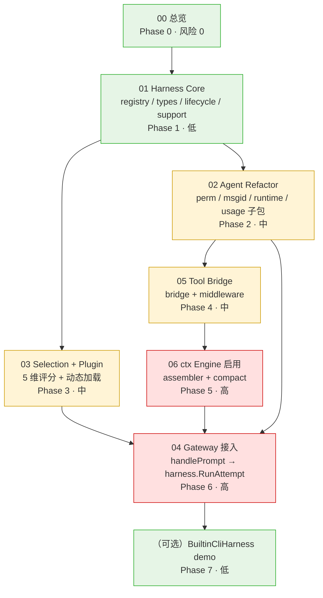

# Harness Architecture — README

> 7 个 spec 的总索引 + 实施顺序 + 依赖关系

## 1. 文件列表

| # | 文件 | 关注点 | 状态 |
|---|---|---|---|
| 00 | `2026-08-04-harness-architecture-design.md` | 总览 + 架构图 | 草案 v1 |
| 01 | `2026-08-04-harness-core-interface.md` | Harness interface + Registry | 草案 v1 |
| 02 | `2026-08-04-agent-refactor.md` | Agent 拆分 | 草案 v1 |
| 03 | `2026-08-04-selection-and-plugin.md` | Selection + Plugin | 草案 v1 |
| 04 | `2026-08-04-gateway-integration.md` | Gateway 接入 | 草案 v1 |
| 05 | `2026-08-04-tool-surface-bridge.md` | Tool bridge + middleware | 草案 v1 |
| 06 | `2026-08-04-ctx-engine-binding.md` | ctx engine 启用 | 草案 v1 |
| - | `CHECKLIST.md` | 实施 checklist | 草案 v1 |

## 2. 实施顺序

`Phase 0 → Phase 1 (01) → Phase 2/3 (02 ∥ 03) → Phase 4 (05) → Phase 5 (06) → Phase 6 (04) → Phase 7 (可选 cli demo)`

实际节奏:**Phase 1 → Phase 2/3 (可同 PR 拆分) → Phase 4 → Phase 5 → Phase 6**。Phase 6 必须最后,因为它把所有前面接好。完整依赖见下方 §3。

## 3. 依赖关系图

## 4. 与现有 spec 的关系

### 复用(完全不动)
- `specs/features/agent-loop` — 旧"agent turn loop"实现的细节,本 spec 是它的**上层包装**
- `specs/features/agent-llm-encapsulation` — LLM 抽象
- `specs/features/agent-sessions-store` — 数据库 schema
- `specs/features/agent-e2e-integration` — 端到端(改造后路径不变)

### 接管(本 spec 替代其设计)
- `specs/features/agent-acp-loop` — **本 spec 完成后可标 DEPRECATED**
  - 因为 `internal/acp/Loop` 还在,但内部走 harness;`internal/acp/AcpSession` 变成 harness 的 thin wrapper
  - 未来 spec 可整体 rename 到 `internal/agentloop/`,但本 spec 不做

### 依赖(本 spec 实现后,这些 spec 自动生效)
- `specs/features/agent-context-engine` — ctx engine 06 spec 接管
- `specs/features/agent-gateway-server` — gateway 04 spec 接管

### 不冲突(完全独立)
- `specs/features/agent-output-rendering` — 渲染层不动
- `specs/features/agent-ui-shell` — UI shell 不动
- `specs/features/artifact-*` — 独立 spec

## 5. 关键不变式

任何 Phase 都不能破坏:

1. **WebSocket RPC 协议稳定**:`agent.prompt` / `agent.abort` / `agent.subscribe_events` / `agent.steer` / `agent.compact_context` / `agent.list_sessions` 等所有方法名 + 参数 + 响应不变
2. **EventBus 协议稳定**:event 类型 + EventCommon 字段 + RunID / MessageID / SessionID 关联语义不变
3. **数据库 schema 不变**:`sessions` / `messages` / `app_state` / `imported_files` 表结构不动
4. **`internal/llm/` / `internal/tools/` / `internal/skills/` / `internal/mcp/` 接口不变**:这些是 capability 包
5. **executor.go 算法不变**:RunConversation 的 turn loop 逻辑不动(只多 1 个 ResultTransformer 钩子)

## 6. 风险等级总览

| Phase | 风险 | 缓解 |
|---|---|---|
| 1 | 低(纯新加,不动旧) | 既有 test 0 改动 |
| 2 | 中(大改 Agent) | 既有 test 必须 0 失败,字段一一对应迁移 |
| 3 | 中(Selection 评分复杂) | 测试覆盖 negative case |
| 4 | 低(轻改动 executor) | ResultTransformer optional,nil 时跟现在一样 |
| 5 | **高**(ctx engine 真启用) | 独立 spec,独立可回滚,启用前 100% 测试 |
| 6 | **高**(全栈改动) | 既有 test 0 失败,新增集成 test |

## 7. 成功度量

| 度量 | 目标 | 测量方法 |
|---|---|---|
| Public API 数 | Agent 30+ → ≤ 19 | grep `^func (a \*Agent) [A-Z]` |
| Agent.go 行数 | 532 → ≤ 300 | wc -l |
| Test 覆盖率 | 新增 ≥ 80% | go test -cover |
| Test 总数 | 既有 70+ → ≥ 130 | go test -v |
| `lint-agents-boundaries` | PASS | make lint-agents-boundaries |
| 启动延迟增加 | < 5% | smoke test 前后对比 |
| 内存增量 | < 10MB | pprof heap diff |

## 8. 后续 spec(本 spec 不覆盖,留作未来)

1. **`internal/agentloop/` rename** — 把 `internal/acp/` 整体改名为 `internal/agentloop/`,因为它已经不是"ACP"(协议)而是"agent loop"(turn queue 抽象)
2. **BuiltinCliHarness** — 真 CLI 子进程 backend,类似 OpenClaw codex harness
3. **`sessionFork` capability** — OpenClaw 的 session fork 完整实现
4. **multi-session 并发调度** — 跨 session 的 lane controller
5. **harness.runSideQuestion** — 单独的回答小问题(不跑完整 turn loop)

## 9. 联系方式

- Spec owner: darvin
- Spec reviewer: 待定
- 实施 owner: 待定
- 跟踪: 通过 `git log --grep "harness"` 找相关 commit
